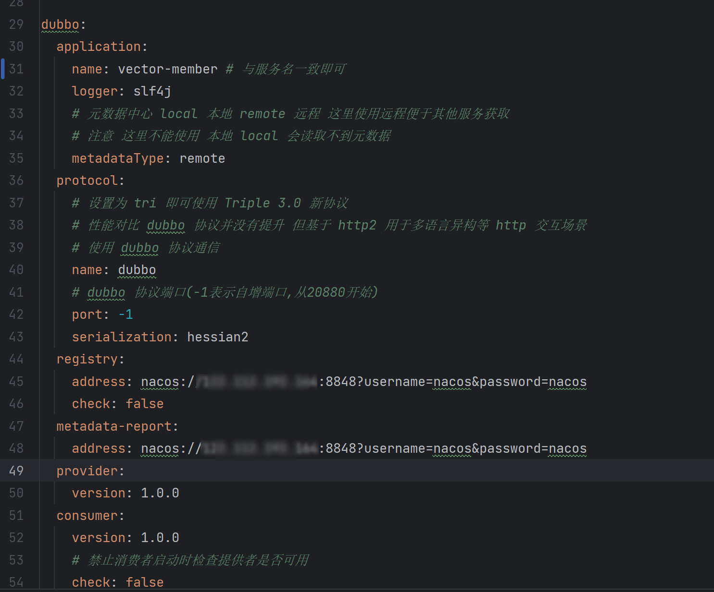
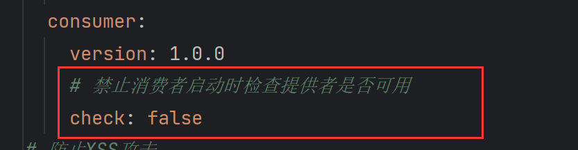
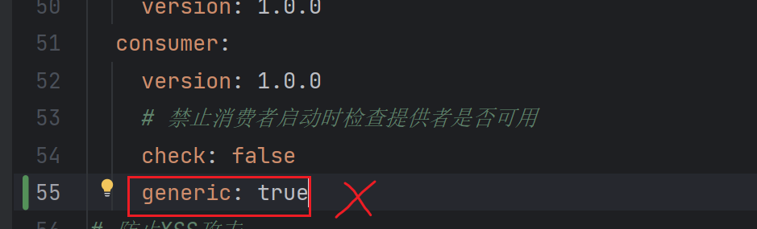
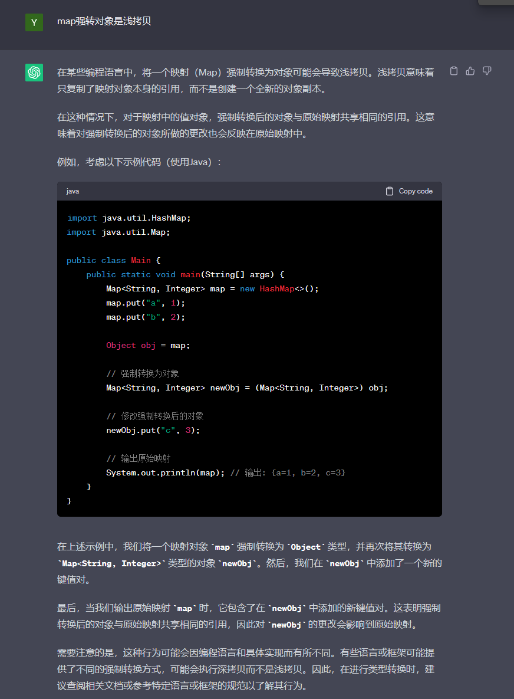

# dubbo问题解决

[[TOC]]

---
## 前言
**dubbo和openfeign的区别是**:
**dubbo** 是真正的rpc框架.支持多种通信协议.能面对更多的调用场景,而且跨语言. 它的思路是-->服务暴露自己的方法,注册到注册中心.   消费端则从注册中心调用服务暴露的方法.
**openfeign** 目的是让开发者调用更简约,因此它是http通信框架.  它的思路是-->服务指定url接口.直接调用目标模块的接口.

我的dubbo提供端和消费端配置


```yaml
dubbo:
  application:
    name: vector-member # 与服务名一致即可
    logger: slf4j
    # 元数据中心 local 本地 remote 远程 这里使用远程便于其他服务获取
    # 注意 这里不能使用 本地 local 会读取不到元数据
    metadataType: remote
  protocol:
    # 设置为 tri 即可使用 Triple 3.0 新协议
    # 性能对比 dubbo 协议并没有提升 但基于 http2 用于多语言异构等 http 交互场景
    # 使用 dubbo 协议通信
    name: dubbo
    # dubbo 协议端口(-1表示自增端口,从20880开始)
    port: -1
    serialization: hessian2
  registry:
    address: nacos://localhost:8848?username=nacos&password=nacos
    check: false
  metadata-report:
    address: nacos://localhost:8848?username=nacos&password=nacos
  provider:
    version: 1.0.0
  consumer:
    version: 1.0.0
    # 禁止消费者启动时检查提供者是否可用
    check: false
```

## 一. 未发现提供者
`No provider available for the service.dubbo xxxxxxxx`
解决方法:   如下图dubbo在启动时会默认检测`@DubboReference标注的提供端服务是否可用`,不可用则抛出No provider available for the service.dubbo xxxxxxxx. 因此我们只要在consumer禁用检查即可.
`这也是两个业务模块互相调用的配置项`



---
## 二. 类型转化异常和找不到类
`java.lang.ClassCastException: class java.util.HashMap cannot be cast to class com.vector.score.vo.ArtistVO (java.util.HashMap is in module java.base of loader 'bootstrap'; com.vector.score.vo.ArtistVO is in unnamed module of loader 'app')`

1.这个原因可能是配置了允许序列化泛化调用配置引起的.



2.这个错误也可能是dubbo返回变成HashMap一般是生产者与消费者的两个对象不一致导致.没用泛化调用引起的.期间会产生警告:

dubbo会将返回对象变为map. 而map想要操作成对象要深拷贝,不能强转.否则会报错
原因如下:


---
## 三.序列化报错
`This serialization only supports google protobuf objects, current object class is: java.lang.Long
`
可以通过debug 观察远程调用结果了解. 该错误是强制类型转化错误. dubbo默认hession2序列化.基本类型不变.但对象传输会变为k-v形式.应该转为map.

倘若使用protobuf 也是不支持对象传输.需要转为map并引入

```xml
        <dependency>
            <groupId>org.apache.dubbo</groupId>
            <artifactId>dubbo-metadata-definition-protobuf</artifactId>
            <version>2.7.15</version>
        </dependency>
```
