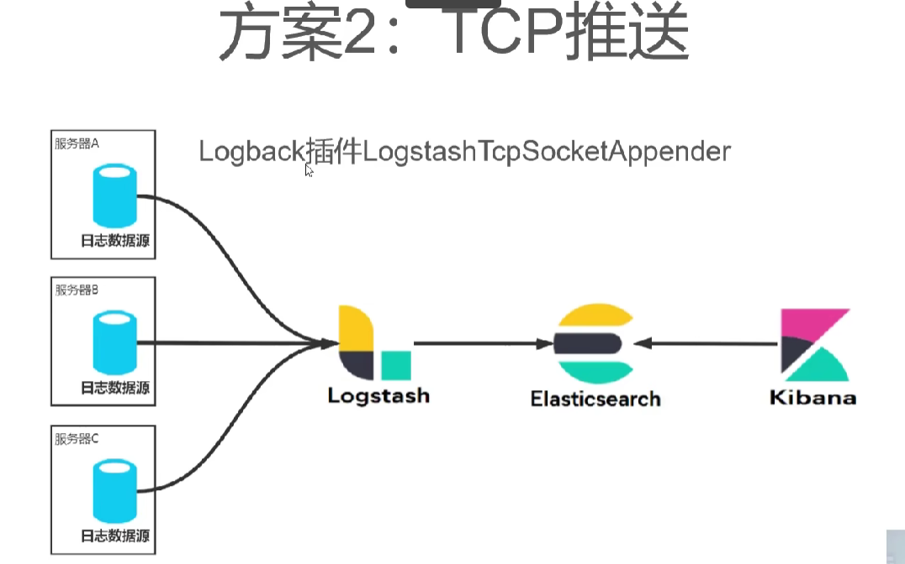

# logstash+elasticsearch+Kibana(ELK)日志收集

[[TOC]]

---

`不要一股脑执行以下语句,请观察修改要修改的地方`
`注意给logstash,elasticsearch,kibana释放端口,云服务器提供商和系统的端口`

## 一.安装elasticsearch

```bash
# 安装es
docker pull elasticsearch:7.17.3
mkdir -p /mydata/elasticsearch/config
mkdir -p /mydata/elasticsearch/data
echo "http.host: 0.0.0.0" >> /mydata/elasticsearch/config/elasticsearch.yml
chmod -R 777 /mydata/elasticsearch/

docker run --name elasticsearch -p 9200:9200 -p 9300:9300 \
-e "discovery.type=single-node" \
-e ES_JAVA_OPTS="-Xms512m -Xmx512m" \
--restart=always --privileged=true \
-v /mydata/elasticsearch/config/elasticsearch.yml:/usr/share/elasticsearch/config/elasticsearch.yml \
-v /mydata/elasticsearch/data:/usr/share/elasticsearch/data \
-v /mydata/elasticsearch/plugins:/usr/share/elasticsearch/plugins \
-d elasticsearch:7.17.3
```

1.1进入到es挂载目录elasticsearch.yml的挂载目录，添加以下内容

```bash
http.host: 0.0.0.0
http.cors.enabled: true
http.cors.allow-origin: "*"
http.cors.allow-headers: Authorization
xpack.security.enabled: true
# Enable encryption and mutual authentication between cluster nodes
xpack.security.transport.ssl.enabled: true
# Enable encryption for HTTP API client connections, such as Kibana, Logstash, and Agents
xpack.security.http.ssl.enabled: false
```

1.2 重启es容器并进入es容器
1.3 进入容器后执行以下命令  傻瓜式设置账号密码

```bash
./bin/elasticsearch-setup-passwords interactive
```

1.4 重启es容器

---

## 二. 安装kibana

```bash
# 安装es可视化工具kibana
docker pull kibana:7.17.3

docker run -d -p 5601:5601 \
--restart=always \
-v /mydata/kibana/kibana.yml:/usr/share/kibana/config/kibana.yml \
--name kibana \
kibana:7.4.2
```

`2.1 配置kibana连接es`
进入挂载文件 /mydata/kibana/kibana.yml

```bash
server.port: 5601 
#主机地址，可以是ip,主机名
server.host: 0.0.0.0
elasticsearch.hosts: ["http://127.0.0.1:9200"]
xpack.monitoring.ui.container.elasticsearch.enabled: true
elasticsearch.username: "es账号"
elasticsearch.password: "es密码"
i18n.locale: "zh-CN"
```

2.2 访问 http://ip:9200,http://ip:5601看es,kibana是否安装完成

## 三.配置logstash

```bash
# logstash安装
 docker run -d --name logstash \
 -p 5043:5043 -p 5044:5044  --privileged=true \
 -v /mydata/logstash/logstash.conf:/usr/share/logstash/pipeline/logstash.conf \
 -v /mydata/logstash/logstash.yml:/usr/share/logstash/config/logstash.yml \
 logstash:7.17.3
```

3.1 进入logstash容器执行以下命令:

```bash
docker exec -it logstash /bin/bash

/usr/share/logstash/bin/logstash-plugin install logstash-codec-json_lines
```

3.2 重启logstash
3.3 进入logstash容器的挂载目录logstash.conf

```bash
input {
  stdin { }

  tcp {
      mode => "server"
      host => "0.0.0.0"
      port => 5043
      codec => json_lines
  }
}

output {
  stdout {
    codec => rubydebug
  }
  elasticsearch {
    hosts => "192.168.1.1:9200"
    index => "springboot-%{+YYYY.MM.dd}"
    user => "es账号"
    password => "es密码"
  }
}
```

`这里认证明文不安全.可以参考如下链接:` [密文](https://www.elastic.co/guide/en/logstash/current/keystore.html)

## 四.springboot整合logstash

`1.pom.xml`

```xml
<dependency>
   <groupId>ch.qos.logback</groupId>
   <artifactId>logback-classic</artifactId>
</dependency>
<dependency>
   <groupId>net.logstash.logback</groupId>
   <artifactId>logstash-logback-encoder</artifactId>
   <version>7.3</version>
</dependency>
```

`2. application.yml`

```bash
server:
  port: 10500

spring:
  profiles:
      active: dev
  application:
    name: vector-search
  thymeleaf:
    cache: false
  # jackson时间格式化
  jackson:
    time-zone: GMT+8
  # elasticsearch
    date-format: yyyy-MM-dd HH:mm:ss

logging:
  level:
    root: info

```

`3.application-dev.yml`

```bash
logstash:
  host: 127.0.0.1
  port: 5043
  # 定义日志文件的存储地址 勿在 LogBack 的配置中使用相对路径
  path: /mydata/logstash
es:
  host: 127.0.0.1
  port: 9200
  username: 11111
  password: 11111
```

`4.在resources文件夹下，创建logback-spring.xml而不是logback.xml.该配置放在公共模块,当依赖导入其他微服务模块即可实现多模块收集日志到logstash中.`



```xml
<?xml version="1.0" encoding="UTF-8"?>
<configuration scan="true" scanPeriod="60 seconds" debug="false">
    <include resource="org/springframework/boot/logging/logback/base.xml"/>
    <include resource="org/springframework/boot/logging/logback/defaults.xml"/>

    <!--获取springboot的yml配置信息-->
    <springProperty scope="context" name="applicationName" source="spring.application.name" defaultValue="default"/>
    <springProperty scope="context" name="LOGSTASH_HOST" source="logstash.host" defaultValue="default"/>
    <springProperty scope="context" name="LOGSTASH_PORT" source="logstash.port" defaultValue="default"/>
    <springProperty scope="context" name="LOG_HOME" source="logstash.path" defaultValue="default"/>

    <!--输出到控制台-->
    <appender name="console" class="ch.qos.logback.core.ConsoleAppender">
        <filter class="ch.qos.logback.classic.filter.ThresholdFilter">
            <level>INFO</level>
        </filter>
        <withJansi>false</withJansi>
        <encoder>
            <!--<pattern>%d %p (%file:%line)- %m%n</pattern>-->
            <!--格式化输出：%d:表示日期    %thread:表示线程名     %-5level:级别从左显示5个字符宽度  %msg:日志消x`x`息    %n:是换行符-->
            <pattern>%d{yyyy-MM-dd HH:mm:ss} %highlight(%-5level) -- %boldMagenta([%thread]) %boldCyan(%logger) :
                %msg%n
            </pattern>
            <charset>UTF-8</charset>
        </encoder>
    </appender>

    <springProfile name="dev,test">
        <!--  日志发送至logstash  -->
        <appender name="LOGSTASH" class="net.logstash.logback.appender.LogstashTcpSocketAppender">
            <destination>${LOGSTASH_HOST:- }:${LOGSTASH_PORT:- }</destination>
            <!-- encoder is required -->
            <encoder charset="UTF-8" class="net.logstash.logback.encoder.LogstashEncoder">
                <!-- 在elasticsearch的index中追加applicationName字段  -->
                <customFields>{"applicationName":"${applicationName}"}</customFields>

            </encoder>
        </appender>
    </springProfile>

    <!-- 按照每天生成日志文件 -->
    <appender name="FILE" class="ch.qos.logback.core.rolling.RollingFileAppender">
        <rollingPolicy class="ch.qos.logback.core.rolling.TimeBasedRollingPolicy">
            <!--日志文件输出的文件名-->
            <FileNamePattern>${LOG_HOME}/TestWeb.log.%d{yyyy-MM-dd}.log</FileNamePattern>
            <!--日志文件保留天数-->
            <MaxHistory>30</MaxHistory>
        </rollingPolicy>
        <encoder charset="UTF-8" class="ch.qos.logback.classic.encoder.PatternLayoutEncoder">
            <!--格式化输出：%d表示日期，%thread表示线程名，%-5level：级别从左显示5个字符宽度%msg：日志消息，%n是换行符-->
            <pattern>%d{yyyy-MM-dd HH:mm:ss.SSS} [%thread] %-5level %logger{50} - %msg%n</pattern>
        </encoder>
        <!--日志文件最大的大小-->
        <triggeringPolicy class="ch.qos.logback.core.rolling.SizeBasedTriggeringPolicy">
            <MaxFileSize>10MB</MaxFileSize>
        </triggeringPolicy>
    </appender>

    <!-- 日志输出级别 -->
    <!-- 线上环境，日志配置 -->
    <springProfile name="prod">
        <root level="INFO">
            <appender-ref ref="LOGSTASH"/>
        </root>
    </springProfile>

    <!-- 本地、开发环境，日志配置 可以写logback支持的所有节点 -->
    <springProfile name="dev,test">
        <root level="INFO">
            <appender-ref ref="LOGSTASH"/>
            <appender-ref ref="console"/>
        </root>
    </springProfile>

</configuration>
```

## 五.spring整合Elastic Search

[详见本篇文章](https://blog.csdn.net/m0_50913327/article/details/125874329)


## 六. 定时清理

使用es新版客户端

```java
@Component
@Slf4j
public class SystemLog {

    private ElasticsearchClient elasticsearchClient;
    private static final String SYSTEM_LOG_INDEX_PREFIX_MATCH = SystemLogConstants.SYSTEM_LOG_INDEX_PREFIX + "*";
    public SystemLog(ElasticsearchClient elasticsearchClient) {
        this.elasticsearchClient = elasticsearchClient;
    }

    /**
     * 每月1号删除一个月前的日志
     *
     * @throws IOException
     */
    @Scheduled(cron = "0 0 0 1 * ?")
    public void systemLog() throws IOException {
        Set<String> systemLogIndexLists = searchSystemLogIndex();
        if(systemLogIndexLists.isEmpty()){
            log.info("没有找到索引{}", systemLogIndexLists);
            return;
        }
        LocalDateTime oneMonthBefore = LocalDateTime.now().minusMonths(1);
        StringBuilder oneMonthFormat = new StringBuilder(oneMonthBefore.format(DateTimeFormatter.ISO_DATE));
        oneMonthFormat.insert(0, SystemLogConstants.SYSTEM_LOG_INDEX_PREFIX);
        //删除一个月前的索引
        List<String> ids = systemLogIndexLists.stream()
                .filter(currentIndexDate -> {
                    // 2020-03-25 > 2020-02-25 true
                    return oneMonthFormat.toString().compareTo(currentIndexDate) > 0;
                })
                .collect(Collectors.toList());

        if (ids.isEmpty()) {
            log.info("没有需要删除的索引{}", ids);
            return;
        }
        DeleteIndexResponse result = elasticsearchClient.indices().delete(DeleteIndexRequest.of(id -> id
                .index(ids)));
        log.info("删除索引{}，结果：{}", ids, result.toString());
    }

    /**
     * 查询所有SystemLog索引
     *
     * @return
     * @throws IOException
     */
    private Set<String> searchSystemLogIndex() throws IOException {
        // 查询yiqichang-*的索引
        GetIndexResponse response = elasticsearchClient.indices()
                .get(GetIndexRequest.of(idx -> idx.index(SYSTEM_LOG_INDEX_PREFIX_MATCH)));
        Set<String> result = response.result().keySet();
        log.info("查询到的索引：{}", result);
        return result;
    }

}

```