# MySQL高性能及性能优化技巧


| 更新次数     | 更新时间                                                     |
| ------------ | ------------------------------------------------------------ |
| 首发         | 2021.10.25                                                   |
| 第一次更新   | 2021.10.26 1.删除了书中大量不必要的存储引擎类型  2.摘要完毕Mysql架构与历史部分 |
| 第二次更新   | 2021.10.29 1.摘要基准测试内容 2.删除了大量对概念的举例.      |
| 第三次更新   | 2021.11.4 1.简化服务器性能剖析                               |
| 第四次更新   | 2021.11.18 摘要完毕Schema与数据类型优化                      |
| 第五次更新   | 2022.8.30 索引篇以及性能优化高级篇部分                       |
| 第六次更新   | 2022.8.31 索引篇以及性能优化高级篇部分内容优化               |
| 第七次更新   | 2022.9.2 性能优化高级篇新增order by之后语句优化              |
| 第八次更新   | 2022.9.4 1.锁机制更新 2.对引用的'尚硅谷MySQL数据库高级'原理内容研判 3.更新事务内容 4. 重构锁内容 |
| 第九次更新   | 2022.11.16 1.更新为什么mysql选择b+树  2.b+树数据结构内容优化 |
| 第十次更新   | 2022.11.18 1.索引底层原理:如为什么要遵循最左前缀原则         |
| 第十一次更新 | 2022.11.22 1.发现网上大量其他变种b+树拿来讲mysql底层. 强调mysql的b+树叶子节点之间是双向循环链表 |
| 第十二次更新 | 2023.1.24 1.补充b+树3-4层的数据量 2.mysql8.0新特性跳跃扫描对最左前缀查询的影响 |
| 第十三次更新 | 2023.5.30 1 !=和<>到底走不走索引? 2.!=和<>对主键有没有影响?  |
| 第十四次更新 | 2023.5.31 sql分析工具optimizer trace                         |

---


[[TOC]]


---


# 前言

<font color=#999AAA > 作者研读学习了Mysql的高性能优化和架构设计.写这篇文章为了日后复习巩固和帮助后来者提炼mysql精华! 还请各位读者及时勘误联系作者.本章节将持续更新!阅读本文章,需要有一定的数据库基础.为了避免重复造轮子,本章筛选了各位领域大佬的文章并注明了出处.目的只有两个复习和总结知识共同学习. 笔者主要参考文献为mysql官方文档,<<mysql高性能>>,<<innodb技术内幕>>,<<java开发手册华山版>>,<<MySQL是怎样运行的：从根儿上理解MySQL>>,"尚硅谷MySQL数据库高级","DBA高级实战进阶班 MySQL8.0 姜承尧-腾讯数据库总监","MySQL数据库教程天花板，mysql安装到mysql高级，强！硬！".

mysql8.0 比mysql5.0性能提高10~100+倍
</font>

```bash
1.影响性能考虑点包括:【这里可以从访问顺序来作为链路进行性能调优】
	
	数据库、应用程序、中间件（ tomact、gateway、Nginx、）、网络（带宽）和操作系统等方面
	
2.首先考虑自己的应用属于CPU密集型还是Io密集型，根据jvisualvm查看应用健康情况
	CPU：计算、排序、过滤、整合【集群】
	IO：网络、磁盘、数据库、redis【内存+缓存+固态+提高网卡的传输效率】

3.监控执行时中间件CPU、内存使用量
docker stats：查看cpu占用、内存使用量、
```

| 主流两大存储引擎的文件结构 | innodb                                   | MyISAM           |
| -------------------------- | ---------------------------------------- | ---------------- |
|                            | 共享表空间 ibdata1(管理innodb所有表空间) | .MYI，存储索引   |
|                            | 日志文件组 redo日志                      | .MYD，存储数据   |
|                            | 表数据结构 .frm                          | .frm，存储表定义 |
|                            | 独占表空间文件 .ibd (数据索引)           |                  |


<hr style=" border:solid; width:100px; height:1px;" color=#000000 size=1">


<font color=#999AAA >提示：以下是本篇文章正文内容，下面案例可供参考

# 一、java开发之路的基石mysql组件的架构简介

## 1.1.1 Mysql的逻辑架构

<font size=5 color=red>MySQL的最重要,最与众不同的特性:存储引擎架构.</font>
这种架构的设计将查询处理及其他系统任务和数据的存储/提取相分离.这种架构模式我们可以在不同环境,不同需求下自由选择数据存储的方式.


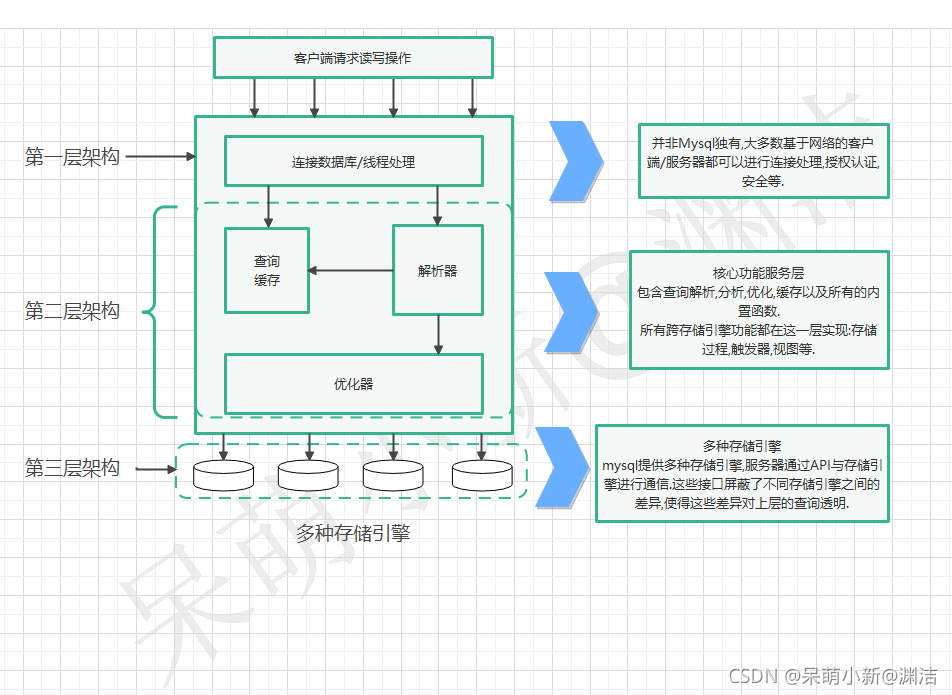

### 1.1.2 连接管理与安全

💗每个客户端连接服务器进程中是安全的.都具有独立的线程.服务器会负责缓存线程.

### 1.1.3 优化与执行

mysql: 1.解析查询  2. 创建内部数据结构 3.对sql语句优化.

## 1.2 锁的并发控制

💗只要有多个查询需要在同一时刻修改数据,都会产生并发控制的问题.

### 1.2.1 锁粒度

`数据的隔离性由锁来体现`

1.锁粒度即衡量锁定的数据量.
2.研究锁粒度为了平衡锁的开销和数据的安全性. 而MySQL则提供了多种选择。每种MySQL存储引擎都可以实现自己的锁策略和锁粒度.提供了面对不同场景的灵活解决方案.以下介绍两种最重要的锁策略.

并发事务访问相同记录的情况大致可以划分为3种：

- 读-读情况，即并发事务相继读取相同的记录。读取操作本身不会对记录有任何影响，并不会引起什么问题，所以允许这种情况的发生。
- 在这种情况下会发生`脏写`的问题，任何一种隔离级别都不允许这种问题的发生。所以在多个未提交事务相继对一条记录做改动时，需要让它们排队执行，这个排队的过程其实是通过锁来实现的。
- 读-写或写-读，即一个事务进行读取操作，另一个进行改动操作。这种情况下可能发生`脏读、不可重复读、幻读`的问题。
  各个数据库厂商对SQL标准的支持都可能不一样。比如MySQL在`REPEATABLE READ`隔离级别上就已经解决了`脏读、不可重复读、幻读`问题。

### 1.2.2 怎么解决`脏读、不可重复读、幻读`这些问题呢？其实有两种可选的解决方案：

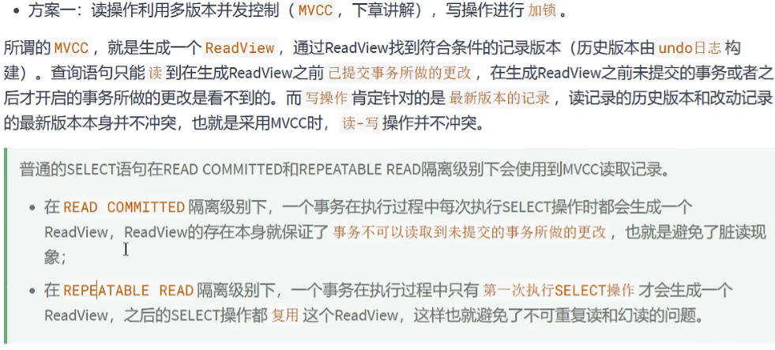

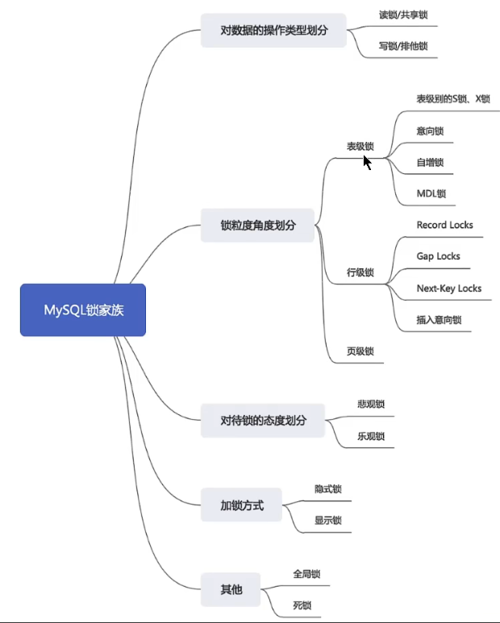

###  1.2.3从数据操作的类型划分: 读写锁

- 读锁：也称为`共享锁`、英文用S表示。针对同一份数据，多个事务的读操作可以同时进行而不会互相影响，相互不阻塞的。
- 写锁：也称为`排他锁`、英文用X表示。当前写操作没有完成前，它会阻断其他写锁和读锁。这样就能确保在给定的时间里，只有一个事务能执行写入，并防止其他用户读取正在写入的同一资源。

`需要注意的是对于InnoDB引擎来说，读锁和写锁可以加在表上，也可以加在行上。`


```sql
#对读取的记录加S锁：
SELECT ... LOCK IN SHARE MODE
#或
SELECT ... FOR SHARE;#(8.B新增语法)

#对读取的记录加X锁：
SELECT ... FOR UPDATE;
```

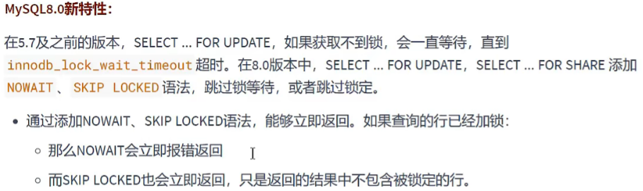
平常所用到的写操作无非是DELETE、UPDATE、INSERT这三种：

- ==DELETE==:
  对一条记录做DELETE操作的过程其实是先在B+树中定位到这条记录的位置，然后获取这条记录的X锁，再执行`delete mark`操作。我们也可以把这个定位待删除记录在B+树中位置的过程看成是一个获取X锁的锁定读。
- ==UPDATE==:在对一条记录做JPDATE:操作时分为三种情况：
    - 情况1：未修改该记录的键值，并且被更新的列占用的存储空间在修改前后未发生变化。则先在B+树中定位到这条记录的位置，然后再获取一下记录的X锁，最后在原记录的位置进行修改操作。我们也可以把这个定位待修改记录在B+树中位置的过程看成是一个获取X锁的锁定读。
    - 情况2：未修改该记录的键值，并且至少有一个被更新的列占用的存储空间在修改前后发生变化。
      则先在B+树中定位到这条记录的位置，然后获取一下记录的X锁，将该记录彻底删除掉（就是把记录彻底移入垃圾链表)，最后再插入一条新记录。这个定位待修改记录在B+树中位置的过程看成是一个获取X锁的锁定读，新插入的记过录由INSERT操作提供的隐式锁进行保护。
    - 情况3：修改了该记录的键值，则相当于在原记录上做DELETE操作之后再来一次INSERT操作，加锁操作就需要按照DELETE和INSERT的规则进行了。
- ==INSERT==:
  一般情况下，新插入一条记录的操作并不加锁，通过一种称之为`隐式锁`的结构来保护这条新插入的记录在本事务提交前不被别的事务访问。

### 1.2.4从锁的粒度划分: 表级锁,行级锁,页锁

#### 1.2.4.1表锁 (不依赖存储引擎)

1.表锁是MySQL中最基本的锁策略，并且是开销最小的策略,并发能力低。类似于读写锁.
💗2.存储引擎可以管理自己的锁，但MySQL服务器层还是会使用各种有效的表锁来实现不同的目的。
由于表级锁一次会将整个表锁定，所以可以很好的避免死锁问题。当然，锁的粒度大所带来最大的负面影响就是出现锁资源争用的概率也会最高，导致并发率大打折扣。

`使用innodb存储引擎的话,它支持行锁.因此我们更多使用粒度更小的行级锁.`

#### 1.2.4.2表级别的读写锁:

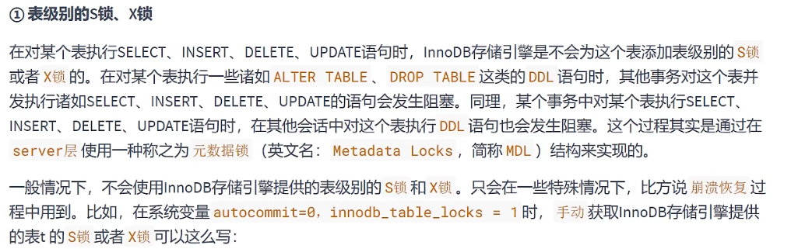

```sql
# InnoDB存储擎会对表t加表级别的S锁。
LOCK TABLES t READ;
# InnoDB存储引擎会对表t加表级别的X锁.
LOCK TABLES t WRITE;
```


#### 1.2.4.3 意向锁


意向锁分为两种:

```sql
# 意向共享锁
--事务要获取某些行的S锁，必须先获得表的IS锁。
SELECT column FROM table ... LOCK IN SHARE MODE;

# 意向排他锁
-- 事务要获取某些行的X锁，必须先获得表的IX锁。
SELECT column FROM table ... FOR UPDATE;
```

#### 1.2.4.4  自增锁

在使用MySQL过程中，我们可以为表的某个列添加AUTO_INCREMENT属性。举例：

```sql
CREATE TABLE teacher(
`id` int NOT NULL AUTO_INCREMENT,
`name` varchar(255)NOT NULL,
PRIMARY KEY (`id`)
)ENGINE=InnoDB DEFAULT CHARSET=utf8mb4 COLLATE=utf8mb4_Unicode_ci;
```

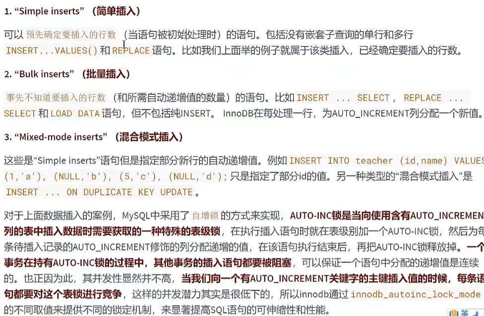
innodb_autoinc_lock_mode有三种取值，分别对应与不同锁定模式：

```sql
innodb_autoinc_1ock_mode=0 #(“传统"锁定模式)
innodb_autoinc_1ock_mode=1 #(“连续"锁定模式)
innodb_autoinc_1ock_mode=2 #(“交错"锁定模式)
```


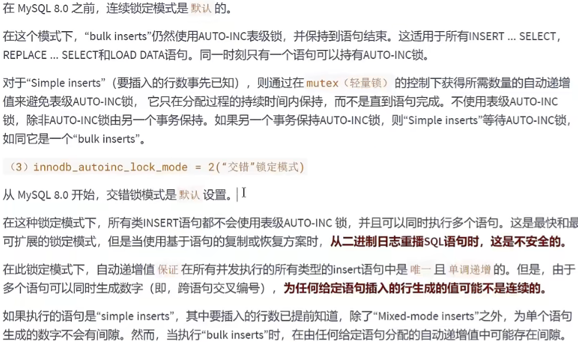

#### 1.2.4.5 元数据锁

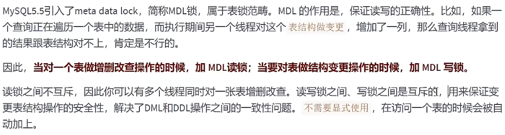

### 1.2.5 行锁

1.行级锁可以最大程度地支持并发处理（同时也带来了最大的锁开销，加锁会比较慢，容易出现死锁情况）.
💗2. 行级锁只在存储引擎层实现，而MySQL服务器层没有实现。innodb实现.

#### 1.2.5.1 记录锁

```sql
#对读取的记录加S锁：
SELECT ... LOCK IN SHARE MODE
#或
SELECT ... FOR SHARE;#(8.B新增语法)

#对读取的记录加X锁：
SELECT ... FOR UPDATE;
```

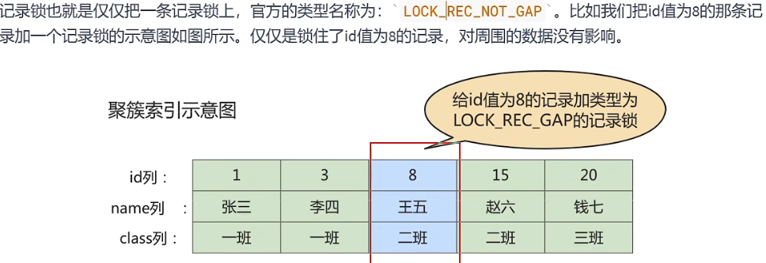


#### 1.2.5.2 间隙锁

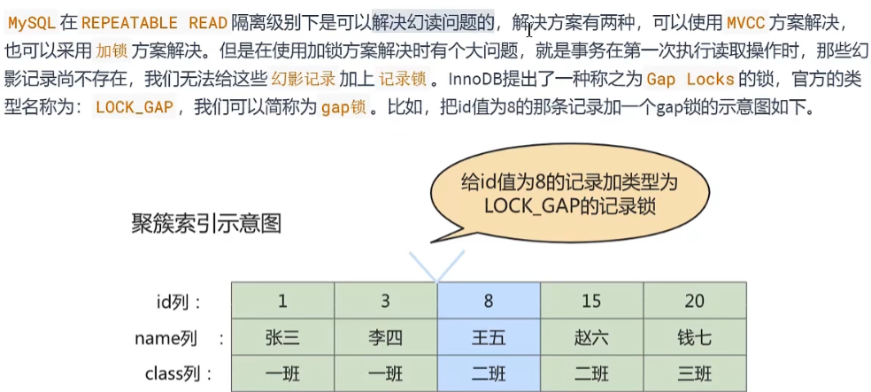


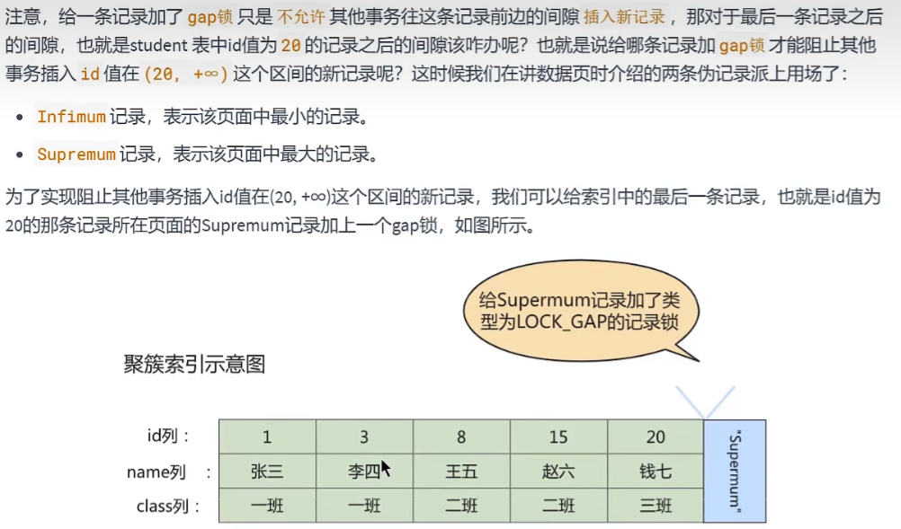
当然间隙锁也容易产生死锁:
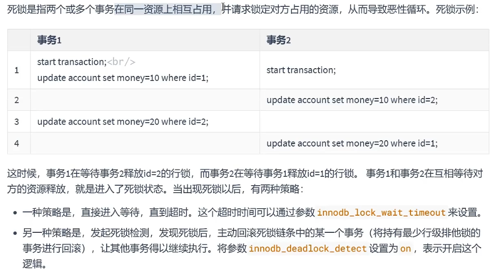

#### 1.2.5.3 临键锁

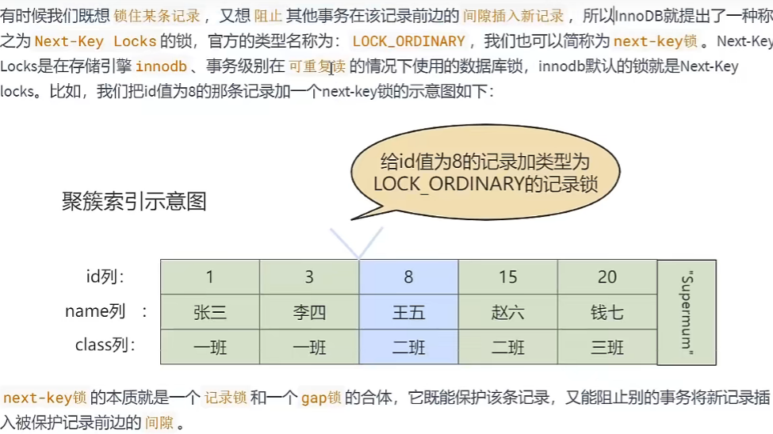

#### 1.2.5.4 插入意向锁

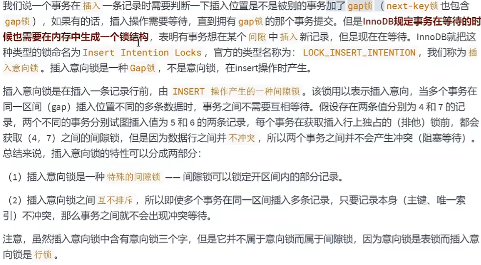

### 1.2.6 页锁

页锁就是在页的粒度上进行锁定，锁定的数据资源比行锁要多，因为一个页中可以有多个行记录。当我们使用页锁的时候，会出现数据浪费的现象，但这样的浪费最多也就是一个页上的数据行。`页锁的开销介于表锁和行锁之间，会出现死锁。锁定粒度介于表锁和行锁之间，并发度一般。`每个层级的锁数量是有限制的，因为锁会占用内存空间，锁空间的大小是有限的。当某个层级的锁数量超过了这个层级的阈值时，就会进行锁升级。锁升级就是用更大粒度的锁替代多个更小粒度的锁，比如IoDB中行锁升级为表锁，这样做的好处是占用的锁空间降低了，但同时数据的并发度也下降了。


## 1.3 事务(熟悉ACID可跳过)

`数据的一致性,原子性,持久性由事务体现`
💗事务内的语句，要么全部执行成功，要么全部执行失败。这是为了保证数据信息的安全性.
一个运行良好的事务处理系统， 必须具备这些标准特征:

|        |                                                              |
| ------ | ------------------------------------------------------------ |
| 原子性 | 一个事务必须被视为一个不可分割的最小工作单元，整个事务 中的所有操作要么全部提交成功，要么全部失败回滚，对于一个事务来说，不可能只执行其中的一部分操作，这就是事务的原子性。 |
| 一致性 | 数据库总是从一个一致性的状态转换到另外一个一致性的状态。     |
| 隔离性 | 一个事务所做的修改在最终提交以前，对其他事务是不可见的。     |
| 持久性 | 一旦事务提交，则其所做的修改就会永久保存到数据库中。此时即使系统崩溃，修改的数据也不会丢失。 |

### 1.3.1 隔离级别

需要强调的是InnoDB和XtraDB存储引 擎通过多版本并发控制（MVCC，Multiversion Concurrency Control）`在REPEATABLE READ（可重复读）`解决了`幻读`的问题。稍后在多版本并发控制（MVCC)中详细讨论.

[详见这位博主 什么是脏读、不可重复读(提交读),幻读](https://blog.csdn.net/lonely_bin/article/details/96175384?ops_request_misc=%257B%2522request%255Fid%2522%253A%2522163516373416780262563358%2522%252C%2522scm%2522%253A%252220140713.130102334.pc%255Fall.%2522%257D&request_id=163516373416780262563358&biz_id=0&utm_medium=distribute.pc_search_result.none-task-blog-2~all~first_rank_ecpm_v1~rank_v31_ecpm-1-96175384.pc_search_result_cache&utm_term=%E5%B9%BB%E8%AF%BB&spm=1018.2226.3001.4187)

### 1.3.2 死锁

1.如果凑巧，两个事务都执行了第一条UPDATE 语句,会出现互相锁定,然后两个事务都等待对方释放锁， 同时又持有对方需要的锁，则陷入死循环。(除非有外部因素介入才可能 解除死锁。)
💗为了解决这种问题，数据库系统实现了各种死锁检测和死锁超时机制。越复杂的系统，比如InnoDB存储引擎，越能检测到死锁的循环依赖，并立即返回一个错误。这种解决方式很有效，否则死锁会导致出现非常慢的查询。InnoDB目前处理死锁的方法是，`将持有最少行级排他锁的事务进行回滚`（这是相对比较简单的死锁回滚算法）。

3.死锁的原因:(1)真正的数据冲突 (2)存储引擎的实现方式导致的.

### 1.3.3 事务日志

- 而事务的原子性、一致性和持久性由事务的redo日志和undo日志来保证。
- REDO LOG称为`重做日志`，提供再写入操作，恢复提交事务修改的页操作，用来保证事务的持久性。
- UND0LOG称为`回滚日志`，回滚行记录到某个特定版本，用来保证事务的原子性、一致性。

redo log:是存储引擎层innodb)生成的日志，记录的是`物理级别`上的页修改操作，比如页号xxx、偏移量yyy写入了'zzz`数据。主要为了保证数据的可靠性；

undo log:是存储引擎层(innodb)生成的日志，记录的是`逻辑操作`日志，比如对某一行数据进行了INSERT语句操作，那么undo log就记录一条与之相反的DELETE操作。主要用于`事务的回滚`(undo log记录的是每个修改操作的逆操作)和`一致性非锁定读`(undo log回滚行记录到某种特定的版本MVCC,即多版本并发控制。

#### 1.3.3.1 为啥需要redo日志

InnoDB存储引擎是以页为单位来管理存储空间的。在真正访问页面之前，需要把在磁盘上的页缓存到内存中的Buffer Pool之后才可以访问。所有的变更都必须先更新缓冲池中的数据，然后缓冲池中的脏页会以一定的频率被刷入磁盘（checkPoint机制)，通过缓冲池来优化CPU和磁盘之间的鸿沟，这样就可以保证整体的性能不会下降太快。

一方面，缓冲池可以帮助我们消除CPU和磁盘之间的鸿沟，checkpointi机制可以保证数据的最终落盘，然而由于checkpoint并`不是每次变更的时候就触发`的，而是master线程隔一段时间去处理的。所以最坏的情况就是事务提交后，刚写完缓冲池，数据库宕机了，那么这段数据就是丢失的，无法恢复。
另一方面，事务包含持久性的特性，就是说对于一个已经提交的事务，在事务提交后即使系统发生了崩溃，这个事务对数据库中所做的更改也不能丢失。那么如何保证这个持久性呢？一个简单的做法：在事务提交完成之前把该事务所修改的所有页面都刷新到磁盘，但是这个简单粗暴的做法有些问题：

- 修改量与刷新磁盘工作量严重不成比例
  有时候我们仅仅修改了某个页面中的一个字节，但是我们知道在IoDB中是以页为单位来进行磁盘1O的，也就是说我们在该事务提交时不得不将一个完整的页面从内存中刷新到磁盘，我们又知道一个页面默认是16KB大小，只修改一个字节就要刷新16KB的数据到磁盘上显然是太小题大做了。
- 随机IO刷新较慢
  一个事务可能包含很多语句，即使是一条语句也可能修改许多页面，假如该事务修改的这些页面可能并不相邻，这就意味着在将某个事务修改的Buffer Pool中的页面刷新到磁盘时，需要进行很多的随机I0,随机IO比顺序O要慢，尤其对于传统的机械硬盘来说。

`另一个思路redo: `它只记录修改的数据.事务日志可以帮助提高事务的效率。事务日志采用的是`追加写`的方式，因此写日志的操作是磁盘上一小块区域内的顺序I/O.我们通常称之为预写式日志（Write-Ahead Logging），修改数据需要写两次磁盘。如果数据的修改已经记录到事务日志并持久化，但数据本身还没有写回磁盘，此时系统崩溃，存储引擎在重启时能够自动恢复这部分修改的数据。具体的恢复方式则视存储引擎而定。InnoDB引擎的事务采用了WAL技术(Write-Ahead Logging),`这种技术的思想就是先写日志，再刷盘`，只有日志写入成功，才算事务提交成功，这里的日志就是redo log。当发生宕机目数据未刷到磁盘的时候，可以通过redo log来恢复，保证ACID中的D,这就是redo log的作用。

redo log可以简单分为以下两个部分：

- 1.重做日志的缓冲(redo log buffer),保存在内存中，是易失的
  在服务器启动时就向操作系统申请了一大片称之为redo log buffert的`连续内存空间`，翻译成中文就是redo日志缓冲区。这片内存空间被划分成`若干个连续的redo log block`。一个redo log block占用`512字节`大小。
  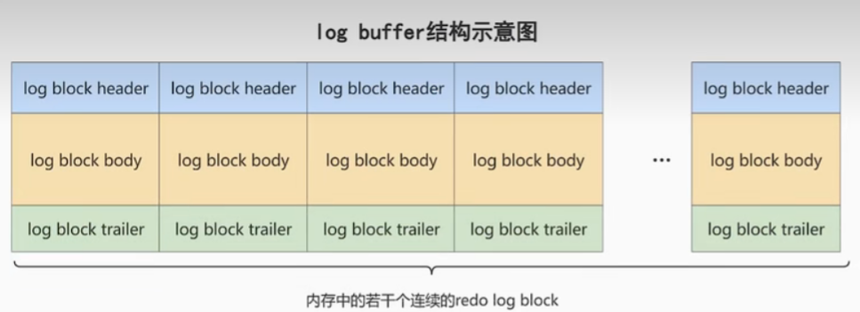
  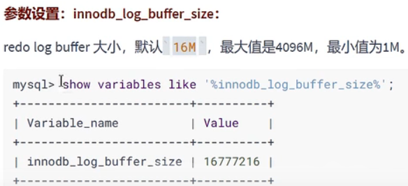

- 2.重做日志文件(redo log file),保存在硬盘中，是持久的。
  保存文件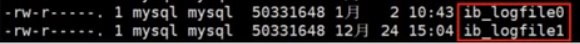

#### 1.3.3.2 redo log刷盘策略:

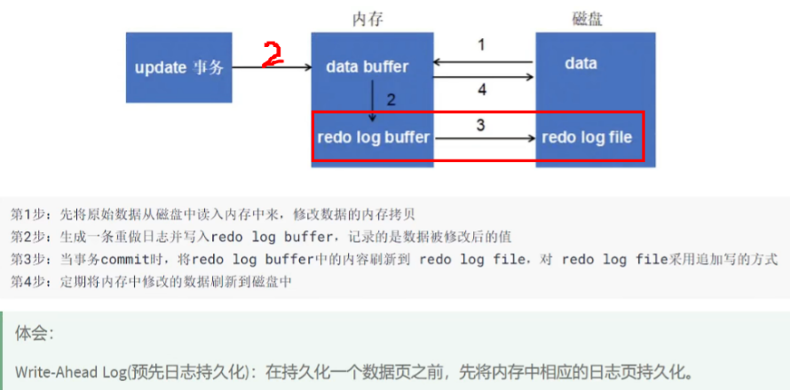

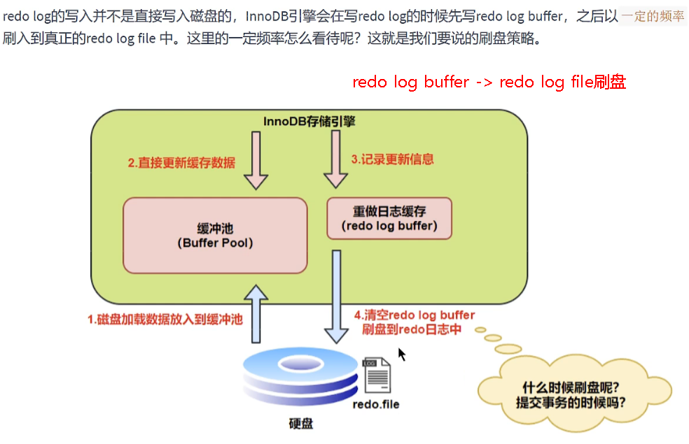
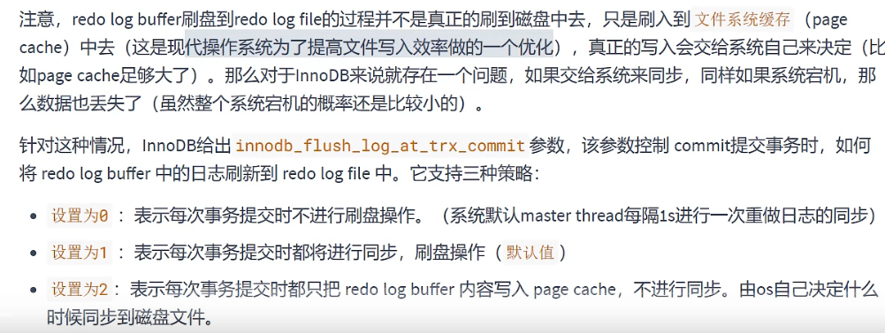


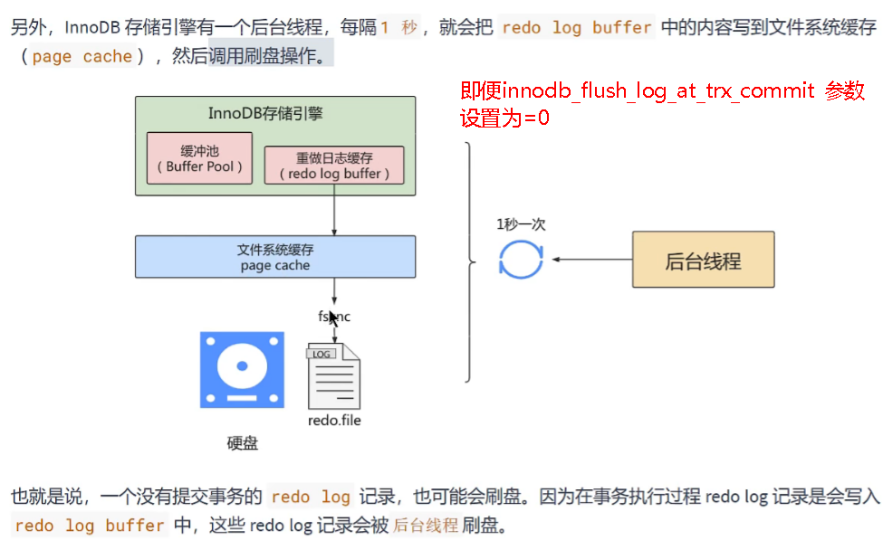

#### 1.3.3.3 redo log写入策略:

MySQL把对底层页面中的一次原子访问的过程称之为一个`Mini-Transaction`,简称`mtr`,比如，向某个索引对应的B+树中插入一条记录的过程就是一个Mini-Transaction。一个所谓的mtr可以包含一组redo日本，在进行崩溃恢复时这一组redo日志作为一个不可分割的整体。

#### 1.3.3.4 undo日志

redo log是事务持久性的保证，`undo log是务原子性的保证`。在事务中`修改数据`的`前置操作`其实是要先写入一个undo log。

事务需要保证原子性，也就是事务中的操作要么全部完成，要么什么也不做。但有时候事务执行到一半会出现一些情况，比如：

- 情况一：事务执行过程中可能遇到各种错误，比如服务器本身的错误，操作系统错误，甚至是突然断电导致
  的错误。
- 情况二：程序员可以在事务执行过程中手动输入ROLLBACK语句结束当前事务的执行。以上情况出现，我们需要把数据改回原先的样子，这个过程称之为回滚，这样就可以造成一个假象：这个事务看起来什么都没做，所以符合原子性要求。

每当我们要对一条记录做改动时（这里的改动可以指INSERT、DELETE、UPDATE),都需要"留一手"一一把回
滚时所需的东西记下来。比如：

- 你插入一条记录时，至少要把这条记录的主键值记下来，之后回滚的时候只需要把这个主键值对应的记录删
  掉就好了。（对于每个NSERT,InnoDB存储引擎会完成一个DELETE)
- 你删除了一条记录，至少要把这条记录中的内容都记下来，这样之后回滚时再把由这些内容组成的记录插入
  到表中就好了。（对于每个DELETE,InnoDB存储引擎会执行一个NSERT)
- 你修改了一条记录，至少要把修改这条记录前的旧值都记录下来，这样之后回滚时再把这条记录更新为旧值就好了。（对于每个UPDATE,InnoDB存储引擎会执行一个相反的UPDATE,将修改前的行放回去）MySQL把这些为了回滚而记录的这些内容称之为撤销日志或者回滚日志（即undo log)。注意，由于查询操作(SELECT)并不会修改任何用户记录，所以在查询操作执行时，并不需要记录相应的undo日志。
  此外，undo log会产生redo log,也就是undo log的产生会伴随着redo log的产生，这是因为undo log也需要持久性的保护。

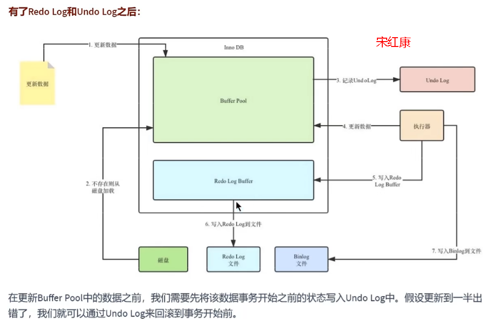


**undo 日志的作用:**

- 作用1：回滚数据
  用户对undo日志可能有误解：undo用于将数据库物理地恢复到执行语句或事务之前的样子。但事实并非如此。undo是逻辑日志，因此只是将数据库逻辑地恢复到原来的样子。所有修改都被逻辑地取消了，`但是数据结构和页本身在回滚之后可能大不相同`。这是因为在多用户并发系统中，可能会有数十、数百甚至数干个并发事务。数据库的主要任务就是协调对数据记录的并发访问。比如，一个事务在修改当前一个页中某几条记录，同时还有别的事务在对同一个页中另几条记录进行修改。因此，不能将一个页回滚到事务开始的样子，因为这样会影响其他事务正在进行的工作。

- 作用2：MVCC
  undo的另一个作用是MVCC,即在InnoDB存储引擎中MVCC的实现是通过undo来完成。当用户读取一行记录时，若该记录已经被其他事务占用，当前事务可以通过undo读取之前的行版本信息，以此实现非锁定读取。 MVCC将在后续章节详细介绍.


### 1.3.4 mysql中的事务

MySQL提供了两种事务型的存储引擎：InnoDB和NDB Cluster。

#### 设置提交模式和隔离级别

值为 0 和值为 OFF：关闭事务自动提交。如果关闭自动提交，用户将会一直处于某个事务中，只有提交或回滚后才会结束当前事务，重新开始一个新事务。
值为 1 和值为 ON：开启事务自动提交。如果开启自动提交，则每执行一条 SQL 语句，事务都会提交一次。

```sql
-- 修改提交模式
set session autocommit=0; //会话的事务提交模式
show session variables like 'autocommit';

set global autocommit=0; //全局的事务提交模式
show global variables like 'autocommit';

ROLLBACK;
COMMIT;

//隔离级别操作
//mysql5.7及之后版本
show variables like 'transaction_isolation';或者select @@transaction_isolation;
//mysql5.7之前版本
show variables like 'tx_isolation';或者select @@tx_isolation;
//设置read uncommitted级别：
set session transaction isolation level read uncommitted;

//设置read committed级别：
set session transaction isolation level read committed;

//设置repeatable read级别：
set session transaction isolation level repeatable read;

//设置serializable级别：
set session transaction isolation level serializable;
```

#### 在事务中混合使用存储引擎

MySQL服务器层不管理事务，事务是由下层的存储引擎实现的。 所以在同一个事务中，使用多种存储引擎是不可靠的。事务需要回滚，非事务型的表上的变更就无法撤销，这会 导致数据库处于不一致的状态，这种情况很难修复，事务的最终结果将 无法确定。所以，为每张表选择合适的存储引擎非常重要。

#### 隐式和显式锁定

💗InnoDB采用的是两阶段锁定协议（two-phase locking protocol）。在事务执行过程中，随时都可以执行锁定，锁只有在执行COMMIT 或者ROLLBACK 的时候才会释放，并且所有的锁是在同一时刻被释放。InnoDB会根据隔离级别在需要的时候自动加锁。

💗LOCK TABLES 和事务之间相互影响的话，情况会变得非常复杂，在某些MySQL版 本中甚至会产生无法预料的结果。除了事务中禁用了AUTOCOMMIT ，可以使用LOCK TABLES 之外，其他任何时候都不要显式地执行LOCK TABLES ，不管使用的是什么存储引擎.

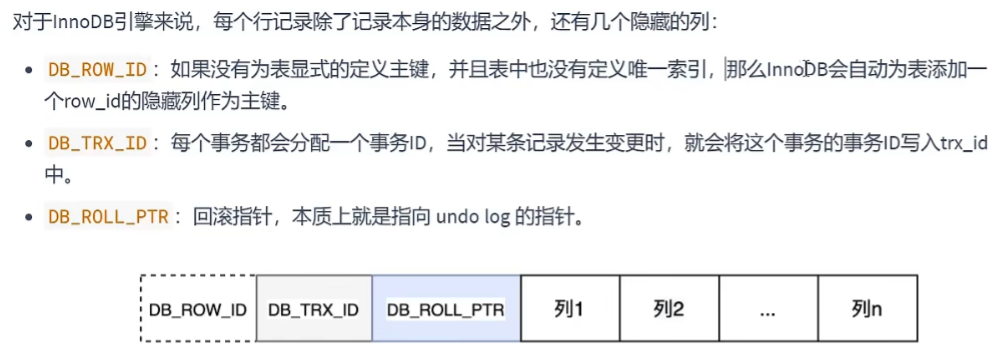
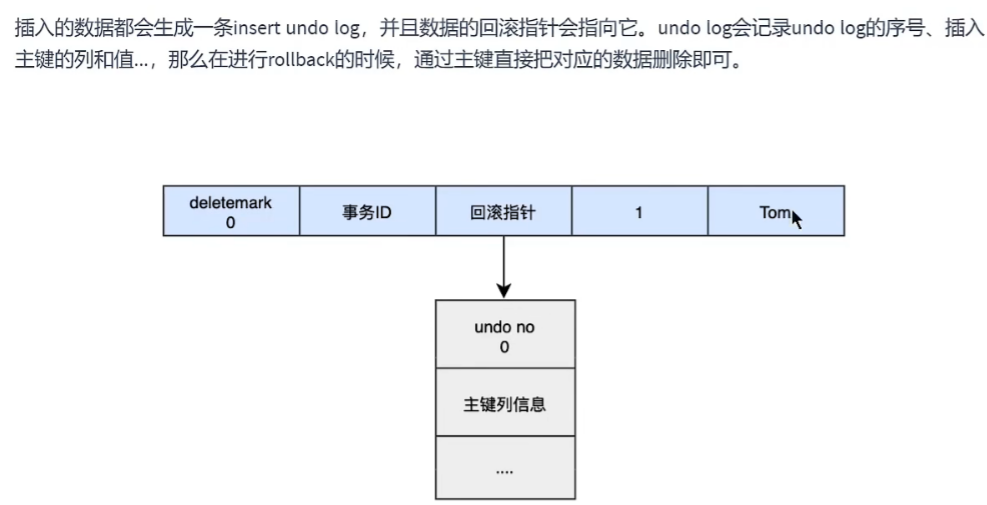


## 1.4多版本并发控制

大多数数据库的大多数事务型存储引擎实现的都不是简单的行级锁。基 于提升并发性能的考虑，它们一般都同时实现了多版本并发控制 （MVCC）。MVCC是行级锁的一个变种,大都实现了非阻塞的读操作，写操作也只锁定必要的行,因此开销更低。
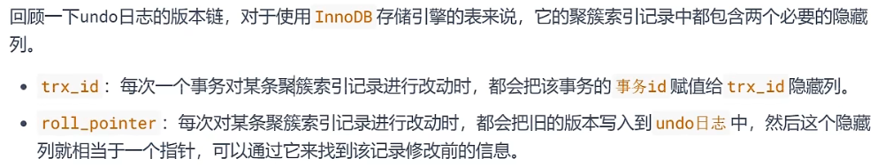

	💗MVCC的实现，是通过保存数据在某个时间点的快照来实现的。不同存储引擎的MVCC实现是不同的.InnoDB的MVCC，是通过在每行记录后面保存`两个隐藏的列`来实现 的。这两个列，一个保存了行的创建时间，一个保存行的过期时间（或 删除时间）。当然存储的并不是实际的时间值，而是系统版本号.
	下面看一下在REPEATABLE READ 隔离 级别下，MVCC具体是如何操作的。 

> 		SELECT InnoDB会根据以下两个条件检查每行记录： 
> 												a. InnoDB只查找版本早于当前事务版本的数据行（也就是，行的系统版本号小于或等于事务的系统版本号），这样可以确保事务读取的行，要么是在事务开始前已经存在 的，要么是事务自身插入或者修改过的。
>
> 	b. 行的删除版本要么未定义，要么大于当前事务版本号。这 可以确保事务读取到的行，在事务开始之前未被删除。
> 	只有符合上述两个条件的记录，才能返回作为查询结果。

>  INSERT
>  InnoDB为新插入的每一行保存当前系统版本号作为行版本号。

> DELETE
> InnoDB为删除的每一行保存当前系统版本号作为行删除标识。

> UPDATE  
> 	InnoDB为插入一行新记录，保存当前系统版本号作为行版本 号，同时保存当前系统版本号到原来的行作为行删除标识

💗保存这两个额外系统版本号，使大多数读操作都可以不用加锁。这 样设计使得读数据操作很简单，性能很好，并且也能保证只会读取到符合标准的行。不足之处是每行记录都需要额外的存储空间，需要做更多的行检查工作，以及一些额外的维护工作.

💗MVCC在mysql下只在REPEATABLE READ 和READ COMMITTED 两个隔离级别下工作.其他两个隔离级别都和MVCC不兼容  ，因为READ UNCOMMITTED 总是读取最新的数据行，而不是符合当前事务版本的数据行.而SERIALIZABLE 则会对所有读取的行都加锁.

## 1.5 MySQL的存储引擎

***关于存储引擎我将大量引用mysql高性能一书的原文,它太过于重要和基础.***
不同的存储引擎保存数据和索引的方式是不 同的，但表的定义则是在MySQL服务层统一处理的。这样屏蔽了不同平台的语言差异.
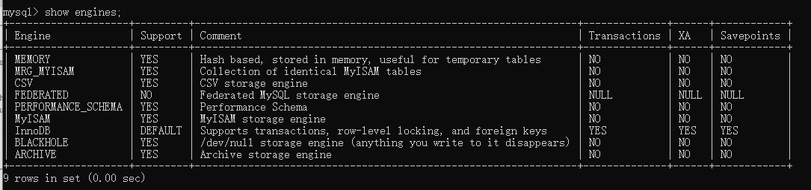


```sql
//查询表结构
SHOW TABLE STATUS LIKE 'members'
```

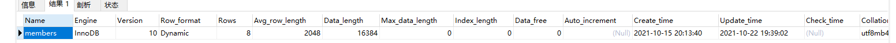
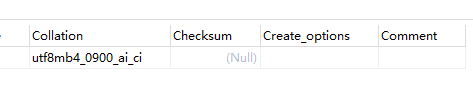

### ✔1.5.1 InnoDB引擎

[mysql8.0与mysql5.7的区别](https://www.php.cn/mysql-tutorials-464447.html)
💗<font color=red size=5>InnoDB是MySQL的默认事务型引擎，也是最重要、使用最广泛的存储引擎。
它被设计用来处理大量的短期（short-lived）事务，短期事 务大部分情况是正常提交的，很少会被回滚。InnoDB的性能和自动崩 溃恢复特性，使得它在非事务型存储的需求中也很流行。除非有非常特别的原因需要使用其他的存储引擎，否则应该优先考虑InnoDB引擎。值得钻研.</font>

#### InnoDB概览

**InnoDB的数据存储在表空间（tablespace）中**，表空间是由InnoDB 管理的一个黑盒子，由一系列的数据文件组成。在MySQL 4.1以后的版 本中，InnoDB可以将每个表的数据和索引存放在单独的文件中。 InnoDB也可以使用裸设备作为表空间的存储介质，但现代的文件系统 使得裸设备不再是必要的选择。
InnoDB采用MVCC来支持高并发，并且实现了四个标准的隔离级 别。其默认级别是REPEATABLE READ （可重复读），并且通过间隙锁 （next-key locking）策略防止幻读的出现。间隙锁使得InnoDB不仅仅锁 定查询涉及的行，还会对索引中的间隙进行锁定，以防止幻影行的插 入。
**InnoDB表是基于聚簇索引建立的**，我们会在后面的章节详细讨论聚簇索引。InnoDB的索引结构和MySQL的其他存储引擎有很大的不 同，聚簇索引对主键查询有很高的性能。不过它的二级索引（secondary index，非主键索引）中必须包含主键列，所以如果主键列很大的话， 其他的所有索引都会很大。因此，若表上的索引较多的话，主键应当尽 可能的小。InnoDB的存储格式是平台独立的，也就是说可以将数据和 索引文件从Intel平台复制到PowerPC或者Sun SPARC平台。
**InnoDB内部做了很多优化**，包括从磁盘读取数据时采用的可预测 性预读，能够自动在内存中创建hash索引以加速读操作的自适应哈希索 引（adaptive hash index），以及能够加速插入操作的插入缓冲区（insert buffer）等。本书后面将更详细地讨论这些内容。
**InnoDB的行为是非常 复杂的，不容易理解。**如果使用了InnoDB引擎，笔者强烈建议阅读官 方手册中的“InnoDB事务模型和锁”一节。如果应用程序基于InnoDB构 建，则事先了解一下InnoDB的MVCC架构带来的一些微妙和细节之处是 非常有必要的。存储引擎要为所有用户甚至包括修改数据的用户维持一 致性的视图，是非常复杂的工作。
**作为事务型的存储引擎，InnoDB通过一些机制和工具支持真正的 热备份**，Oracle提供的MySQL Enterprise Backup、Percona提供的开源的 XtraBackup都可以做到这一点。MySQL的其他存储引擎不支持热备份， 要获取一致性视图需要停止对所有表的写入，而在读写混合场景中，停止写入可能也意味着停止读取。


#### MyISAM存储引擎

在MySQL 5.1及之前的版本，MyISAM是默认的存储引擎。 **MyISAM提供了大量的特性**，包括全文索引、压缩、空间函数（GIS）
等，但**MyISAM不支持事务和行级锁**，而且有一个毫无疑问的缺陷就是 **崩溃后无法安全恢复**。正是由于MyISAM引擎的缘故，即使MySQL支持 事务已经很长时间了，在很多人的概念中MySQL还是非事务型的数据 库。**尽管MyISAM引擎不支持事务、不支持崩溃后的安全恢复，但它绝 不是一无是处的。对于只读的数据，或者表比较小、可以忍受修复 （repair）操作，则依然可以继续使用MyISAM（但请不要默认使用 MyISAM，而是应当默认使用InnoDB）。**

**存储**
`MyISAM会将表存储在两个文件中：数据文件和索引文件，分别 以.MYD 和.MYI 为扩展名。MyISAM表可以包含动态或者静态（长度固 定）行`。MySQL会根据表的定义来决定采用何种行格式。MyISAM表可 以存储的行记录数，一般受限于可用的磁盘空间，或者操作系统中单个 文件的最大尺寸。 在MySQL 5.0中，MyISAM表如果是变长行，则默认配置只能处理 256TB的数据，因为指向数据记录的指针长度是6个字节。而在更早的 版本中，指针长度默认是4字节，所以只能处理4GB的数据。而所有的 MySQL版本都支持8字节的指针。要改变MyISAM表指针的长度（调高 或者调低），可以通过修改表的MAX_ROWS 和AVG_ROW_LENGTH 选项的值 来实现，两者相乘就是表可能达到的最大大小。修改这两个参数会导致 重建整个表和表的所有索引，这可能需要很长的时间才能完成。

#### MyISAM特性

作为MySQL最早的存储引擎之一，MyISAM有一些已经开发出来很 多年的特性，可以满足用户的实际需求。

**加锁与并发**
MyISAM对整张表加锁，而不是针对行。读取时会对需要读到 的所有表加共享锁，写入时则对表加排他锁。但是在表有读取查询 的同时，也可以往表中插入新的记录（这被称为并发插入， CONCURRENT INSERT）。

**修复**
对于MyISAM表，MySQL可以手工或者自动执行检查和修复操 作，但这里说的修复和事务恢复以及崩溃恢复是不同的概念。执行 表的修复可能导致一些数据丢失，而且修复操作是非常慢的。可以 通过CHECK TABLE mytable 检查表的错误，如果有错误可以通过执 行REPAIR TABLE mytable 进行修复。另外，如果MySQL服务器已 经关闭，也可以通过myisamchk 命令行工具进行检查和修复操作。

**索引特性**
对于MyISAM表，即使是BLOB和TEXT等长字段，也可以基于其前500个字符创建索引。MyISAM也支持全文索引，这是一种基 于分词创建的索引，可以支持复杂的查询。
**延迟更新索引键（Delayed Key Write）**
创建MyISAM表的时候，如果指定了DELAY_KEY_WRITE 选项，
在每次修改执行完成时，不会立刻将修改的索引数据写入磁盘，而 是会写到内存中的键缓冲区（in-memory key buffer），只有在清理 键缓冲区或者关闭表的时候才会将对应的索引块写入到磁盘。这种 方式可以极大地提升写入性能，但是在数据库或者主机崩溃时会造 成索引损坏，需要执行修复操作。延迟更新索引键的特性，可以在 全局设置，也可以为单个表设置。

#### MyISAM压缩表

如果表在创建并导入数据以后，不会再进行修改操作，那么这样的 表或许适合采用MyISAM压缩表。 可以使用myisampack 对MyISAM表进行压缩（也叫打包pack）。压 缩表是不能进行修改的（除非先将表解除压缩，修改数据，然后再次压 缩）。压缩表可以极大地减少磁盘空间占用，因此也可以减少磁盘 I/O，从而提升查询性能。压缩表也支持索引，但索引也是只读的。 以现在的硬件能力，对大多数应用场景，读取压缩表数据时的解压 带来的开销影响并不大，而减少I/O带来的好处则要大得多。压缩时表 中的记录是独立压缩的，所以读取单行的时候不需要去解压整个表（甚 至也不解压行所在的整个页面）。

#### MyISAM性能

MyISAM引擎设计简单，数据以紧密格式存储，所以在某些场景下 的性能很好。MyISAM有一些服务器级别的性能扩展限制，比如对索引
键缓冲区（key cache）的Mutex锁，MariaDB基于段（segment）的索引 键缓冲区机制来避免该问题。但MyISAM最典型的性能问题还是表锁的 问题，如果你发现所有的查询都长期处于“Locked”状态，那么毫无疑问表锁就是罪魁祸首。

### 1.5.3Mysql内建的其他主要存储引擎简要介绍

#### Archive引擎

1.Archive存储引擎只支持INSERT 和SELECT 操作.
2.Archive引擎会缓存所有的写并利用zlib对插入的行进行压缩，所以 比MyISAM表的磁盘I/O更少。但是每次SELECT查询都需要执行全表扫 描。所以Archive表适合日志和数据采集类应用.
3.Archive引擎支持行级锁和专用的缓冲区，所以可以实现高并发的插入。
4.Archive引擎是一个针对高速插入和压缩做了优化的简单引擎。

#### CSV引擎

1.可以将普通的CSV文件（逗号分割值的文件）作为MySQL 的表来处理，但这种表不支持索引。
2.可以将Excel等电子表格软件中的数据存储为CSV文件.
3.CSV引擎可以作为一种数据交 换的机制，非常有用.

#### Memory引擎

1.如果需要快速地访问数据，并且这些数据不会被修改，重启以后丢 失也没有关系，那么使用Memory表（以前也叫做HEAP表）是非常有用 的。Memory表至少比MyISAM表要快一个数量级，因为所有的数据都 保存在内存中，不需要进行磁盘I/O。Memory表的结构在重启以后还会 保留，但数据会丢失。
2.Memory表支持Hash索引，因此查找操作非常快。
3.Memroy表是表级 锁，因此并发写入的性能较低。它不支持BLOB 或TEXT 类型的列，并且 每行的长度是固定的.

> Memroy表在很多场景可以发挥好的作用：  
> 用于查找（lookup）或者映射（mapping）表，例如将邮编和州名 映射的表。
> 用于缓存周期性聚合数据（periodically aggregated data）的结果。  
> 用于保存数据分析中产生的中间数据.

#### NDB集群引擎

NDB集群存储引擎，作为SQL和NDB原生协议之间的接口。MySQL服务器、NDB集群存储引擎，以及分布式的、share-nothing 的、容灾的、高可用的NDB数据库的组合，被称为MySQL集群 （MySQL Cluster）。后续会有章节专门来讨论MySQL集群。

### 1.5.4 第三方存储引擎

#### OLTP类引擎

💗**XtraDB**可以作为InnoDB的一个完全的替代 产品，甚至可以兼容地读写InnoDB的数据文件，并支持InnoDB的所有查询。
它的改进点主要集中在性能、可测量性和操作灵活性方面。

💗**PBXT存储引擎**.它支持引擎级别的复制、外键约束，并且以一 种比较复杂的架构对固态存储（SSD）提供了适当的支持，还对较大的 值类型如BLOB也做了优化。支持 ACID事务和MVCC。PBXT是一款社区支持的存储引擎， MariaDB包含了该引擎。

#### 面向列的存储引擎

MySQL默认是面向行的，每一行的数据是一起存储的，服务器的 查询也是以行为单位处理的。而在大数据量处理时，面向列的方式可能 效率更高。如果不需要整行的数据，面向列的方式可以传输更少的数 据。如果每一列都单独存储，那么压缩的效率也会更高。
**Infobright**是最有名的面向列的存储引擎。在非常大的数据量（数十TB）时，该引擎工作良好。
数据高度压缩，按照块进行排序，每个块都对应有一组元数据.在处理查询时，访问元数据可决定跳过该块，甚至可能只需要元数据即 可满足查询的需求。但该引擎不支持索引.

### 1.5.5 选择合适的引擎

<font size=5 color=red >除非 需要用到某些InnoDB不具备的特性，并且没有其他办法可以替代，否 则都应该优先选择InnoDB引擎!</font>
例如，如果要用到全文索引，建议优 先考虑InnoDB加上Sphinx的组合，而不是使用支持全文索引的 MyISAM。当然，如果不需要用到InnoDB的特性，同时其他引擎的特性 能够更好地满足需求，也可以考虑一下其他存储引擎。举个例子，如果 不在乎可扩展能力和并发能力，也不在乎崩溃后的数据丢失问题，却对 InnoDB的空间占用过多比较敏感，这种场合下选择MyISAM就比较合适。
<font size=5 color=red>不建议混合使用多种存储引擎!!</font>
应用需要不同的存储引擎需要考虑以下因素:
**事务**
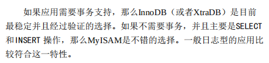

**备份**


**崩溃恢复**


**特有的特性**
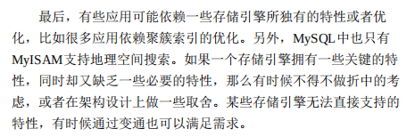
你不需要现在就做决定。接下来会提供很多关于各种存储引擎优缺点的详细描述，也会讨论一些架构设计的技巧。

**日志型应用**:  MyISAM或者Archive存储引擎对这类应用比较合适，因为它们 开销低，而且插入速度非常快。
**只读或者大部分情况下只读的表**  如果不介意 MyISAM的崩溃恢复问题，选用MyISAM引擎是合适的。不要低估崩溃恢复问题的重要性.(一个值得推荐的方式，是在性能测试环境模拟真实的环境，运行应用，然后拔下电 源模拟崩溃测试。对崩溃恢复的第一手测试经验是无价之宝，可以避免真的碰到崩溃时手足无措)
**订单处理**  InnoDB是订单处理类应用的最佳选择.
**电子公告牌和主题讨论论坛**
当设计上述类型的应用时，建议采用InnoDB。MyISAM引擎在一开 始可能没有任何问题，但随着应用压力的上升，则可能迅速恶化。各种 锁争用、崩溃后的数据丢失等问题都会随之而来。
**大数据量** 如果数据量继续增长到10TB以上的级别，可能就需要建立数据仓 库。Infobright是MySQL数据仓库最成功的解决方案。也有一些大数据 库不适合Infobright，却可能适合TokuDB。


### 1.5.6 转换表的引擎

**创建与查询（CREATE和SELECT）**

该转换的技术综合了ALTER TABLE语法的高效和导出与导入方法的安全.不需要导出整个表的数据，而是先创建一个新的存储引擎的表，然后利 用INSERT…SELECT 语法来导数据：

```sql
CREATE TABLE innodb_table LIKE myisam_table;
ALTER TABLE innodb_table ENGINE=InnoDB;
INSERT INTO innodb_table SELECT * FROM myisam_table;
```

数据量不大的话，这样做工作得很好。如果数据量很大，则可以考 虑做分批处理，针对每一段数据执行事务提交操作，以避免大事务产生 过多的undo。假设有主键字段id ，重复运行以下语句（最小值x 和最大 值y 进行相应的替换）将数据导入到新表：

```sql
START TRANSACTION;
INSERT INTO innodb_table SELECT * FROM myisam_table 
-> WHERE id BETWEEN x AND y;
 COMMIT;
```

这样操作完成以后，新表是原表的一个全量复制，原表还在，如果 需要可以删除原表。如果有必要，可以在执行的过程中对原表加锁，以 确保新表和原表的数据一致。 Percona Toolkit提供了一个pt-online-schema-change 的工具（基于 Facebook的在线schema变更技术），可以比较简单、方便地执行上述过 程，避免手工操作可能导致的失误和烦琐。

## 1.6 Mysql架构部分总结

[Mysql白皮书,版本更新历程](https://www.mysql.com/why-mysql/white-papers/)
MySQL拥有分层的架构。上层是服务器层的服务和查询执行引擎，下层则是存储引擎。虽然有很多不同作用的插件API，但存储引擎 API还是最重要的。如果能理解MySQL在存储引擎和服务层之间处理查 询时如何通过API来回交互，就能抓住MySQL的核心基础架构的精髓。
MySQL最初基于ISAM构建（后来被MyISAM取代），其后陆续添 加了更多的存储引擎和事务支持。MySQL有一些怪异的行为是由于历 史遗留导致的。例如，在执行ALTER TABLE 时，MySQL提交事务的方式 是由于存储引擎的架构直接导致的，并且数据字典也保存在.frm 文件中 （这并不是说InnoDB会导致ALTER变成非事务型的。对于InnoDB来 说，所有的操作都是事务）。
当然，存储引擎API的架构也有一些缺点。有时候选择多并非好 事，而在MySQL 5.0和MySQL 5.1中有太多的存储引擎可以选择。 InnoDB对于95％以上的用户来说都是最佳选择，所以其他的存储引擎 可能只是让事情变得复杂难搞，当然也不可否认某些情况下某些存储引 擎能更好地满足需求。
Oracle一开始收购了InnoDB，之后又收购了MySQL，在同一个屋檐 下对于两者都是有利的。InnoDB和MySQL服务器之间可以更快地协同 发展。MySQL依然基于GPL协议开放全部源代码，社区和客户都可以获 得坚固而稳定的数据库，MySQL正在变得越来越可扩展和有用。

# 第二章.MySQL基准测试

基准测试（benchmark）是MySQL新手和专家都需要掌握的一项基本技能。基准测试是针对系统设计的一种压力测试。
本章将讨论MySQL和基于MySQL的应 用的基准测试的重要性,策略和工具。

## 2.1 为什么需要基准测试?

基准测试可以完成以下工作，或者更多：

> 1.验证基于系统的一些假设，确认这些假设是否符合实际情况。
> 2.重现系统中的某些异常行为，以解决这些异常。
> 3.测试系统当前的运行情况。如果不清楚系统当前的性能，就无法确认某些优化的效果如何。也可以利用历史的基准测试结果来分析诊断一些无法预测的问题。
> 4.模拟比当前系统更高的负载，以找出系统随着压力增加而可能遇到 的扩展性瓶颈。
>
> 5. 规划未来的业务增长。基准测试可以评估在项目未来的负载下，需要什么样的硬件，需要多大容量的网络，以及其他相关资源。这有
     >    6.助于降低系统升级和重大变更的风险。
     >    7.测试应用适应可变环境的能力。例如，通过基准测试，可以发现系统在随机的并发峰值下的性能表现，或者是不同配置的服务器之间 的性能表现。基准测试也可以测试系统对不同数据分布的处理能力。
     >    8.测试不同的硬件、软件和操作系统配置。比如RAID 5还是RAID 10 更适合当前的系统？如果系统从ATA硬盘升级到SAN存储，对于随机写性能有什么帮助？Linux 2.4系列的内核会比2.6系列的可扩展性 更好吗？升级MySQL的版本能改善性能吗？为当前的数据采用不同的存储引擎会有什么效果？所有这类问题都可以通过专门的基准 测试来获得答案。
     >     9.证明新采购的设备是否配置正确。笔者曾经无数次地通过基准测试来对新系统进行压测，发现了很多错误的配置，以及硬件组件的失 效等问题。因此在新系统正式上线到生产环境之前进行基准测试是一个好习惯，永远不要相信主机提供商或者硬件供应商的所谓系统 已经安装好，并且能运行多快的说法。如果可能，执行实际的基准测试永远是一个好主意。

注意:
基准测试还可以用于其他目的，比如为应用创建单元测试套件。
基准测试的一个主要问题在于其不是真实压力的测试。
大部分压力测试工具不支持对压力进行复杂的控制。务必要记住，测试工具自身的局限也会影响到结果的有效性。
结论就是，我们只能进行大概的测试，来确定系统大致的余量有多少。

## 2.2 基准测试的策略

基准测试有两种主要的策略：
1.针对整个系统的整体测试.
2.单独测试MySQL.
这两种策略也被称为集成式（full-stack）以及单组 件式（single-component）基准测试。

**针对整个系统做集成式测试，而不 是单独测试MySQL的原因主要有以下几点：**

> 1.测试整个应用系统，包括Web服务器、应用代码、网络和数据库是 非常有用的，因为用户关注的并不仅仅是MySQL本身的性能，而是应用整体的性能。
> 2.MySQL并非总是应用的瓶颈，通过整体的测试可以揭示这一点。
> 3.只有对应用做整体测试，才能发现各部分之间的缓存带来的影响。
> 4.整体应用的集成式测试更能揭示应用的真实表现，而单独组件的测 试很难做到这一点。

另外一方面，应用的整体基准测试很难建立，甚至很难正确设置。
基于以下情况，可以选择只测试 MySQL：

> 需要比较不同的schema或查询的性能。
> 针对应用中某个具体问题的测试。
> 为了避免漫长的基准测试，可以通过一个短期的基准测试，做快速的“周期循环”，来检测出某些调整后的效果。

### 2.2.1 测试何种指标

请考虑以下指标，看看如何满足测试的需求。

**吞吐量**

> 吞吐量指的是单位时间内的事务处理数。这一直是经典的数据 库应用测试指标。一些标准的基准测试被广泛地引用，如TPC-C（参考http://www.tpc.org ）。这类基准测试主要针对在线事务处理（OLTP）的吞吐量，非常适用于多用户的交互式应用。常用的测 试单位是每秒事务数（TPS），有些也采用每分钟事务数 （TPM）

**响应时间或者延迟**

> 这个指标用于测试任务所需的整体时间。通常可以使用百分比响应时间 （percentile response time）来替代最大响应时间。

**并发性**

> 并发性指同一时刻用户向服务器发送的请求量.并发性测试通常不是为了 测试应用能达到的并发度，而是为了测试应用在不同并发下的性
> 能。当然，数据库的并发性还是需要测量的。可以通过sysbench 指 定32、64或者128个线程的测试，然后在测试期间记录MySQL数据库的Threads_running 状态值。在第11章将讨论这个指标对容量规 划的影响。

**可扩展性**

> 在系统的业务压力可能发生变化的情况下，测试可扩展性就非常必要了。可扩展性指的是，给系统增加一倍的工作，在理想情况下就能获得两倍的结果（即吞吐量增加一倍）。

归根结底，应该测试那些对用户来说最重要的指标。因此应该尽可 能地去收集一些需求，比如，什么样的响应时间是可以接受的，期待多 少的并发性，等等。然后基于这些需求来设计基准测试，避免目光短浅 地只关注部分指标，而忽略其他指标.

## 2.3 基准测试方法

### 常见的错误

> 使用真实数据的子集而不是全集。例如应用需要处理几百GB的数 据，但测试只有1GB数据；或者只使用当前数据进行测试，却希望
> 模拟未来业务大幅度增长后的情况。

> 使用错误的数据分布。例如使用均匀分布的数据测试，而系统的真 实数据有很多热点区域（随机生成的测试数据通常无法模拟真实的 数据分布）。

>使用不真实的分布参数，例如假定所有用户的个人信息（profile） 都会被平均地读取.

>在多用户场景中，只做单用户的测试。

>在单服务器上测试分布式应用。

>与真实用户行为不匹配。例如Web页面中的“思考时间”。真实用户 在请求到一个页面后会阅读一段时间，而不是不停顿地一个接一个 点击相关链接。

>反复执行同一个查询。真实的查询是不尽相同的，这可能会导致缓 存命中率降低。而反复执行同一个查询在某种程度上，会全部或者 部分缓存结果。

>没有检查错误。如果测试的结果无法得到合理的解释，比如一个本 应该很慢的查询突然变快了，就应该检查是否有错误产生。否则可 能只是测试了MySQL检测语法错误的速度了。基准测试完成后， 一定要检查一下错误日志，这应当是基本的要求。

>忽略了系统预热（warm up）的过程。例如系统重启后马上进行测 试。有时候需要了解系统重启后需要多长时间才能达到正常的性能 容量，要特别留意预热的时长。反过来说，如果要想分析正常的性 能，需要注意，若基准测试在重启以后马上启动，则缓存是冷的、 还没有数据，这时即使测试的压力相同，得到的结果也和缓存已经装满数据时是不同的。

>使用默认的服务器配置。第3章将详细地讨论服务器的优化配置。

>测试时间太短。基准测试需要持续一定的时间。后面会继续讨论这个话题。

### 2.3.1 设计和规划基准测试

1.规划基准测试的第一步是提出问题并明确目标。
2.然后决定是采用标 准的基准测试，还是设计专用的测试。
如果采用标准的基准测试，应该确认选择了合适的测试方案。
如果是设计专用的基准测试:
1.首先 需要获得生产数据集的快照，并且该快照很容易还原，以便进行后续的测试。
2.然后，针对数据运行查询。可以建立一个单元测试集作为初步的测 试，并运行多遍。
3.详细地写下测试规划也是必需的。测试可能要多次反复运行，因此需要精确地重现测试过程。
4.应该建立将参数和结果文档化的规范，每一轮测试都必须进行详细记录。

### 2.3.2 基准测试应该运行多长时间

基准测试应该运行足够长的时间，这一点很重要。有时候无法确认测试需要运行多长的时间才足够。如果是这样，可 以让测试一直运行，持续观察直到确认系统已经稳定。

### 2.3.3 获取系统性能和状态

在执行基准测试时，需要尽可能多地收集被测试系统的信息。最好 为基准测试建立一个目录，并且每执行一轮测试都创建单独的子目录， 将测试结果、配置文件、测试指标、脚本和其他相关说明都保存在其 中。即使有些结果不是目前需要的，也应该先保存下来。多余一些数据 总比缺乏重要的数据要好，而且多余的数据以后也许会用得着。需要记 录的数据包括系统状态和性能指标，诸如CPU使用率、磁盘I/O、网络 流量统计、SHOW GLOBAL STATUS 计数器等。

### 2.3.4 获得准确的测试结果

1.获得准确测试结果的最好办法，是回答一些关于基准测试的基本问 题：是否选择了正确的基准测试？是否为问题收集了相关的数据？是否 采用了错误的测试标准？例如，是否对一个I/O密集型（I/O-bound）的 应用，采用了CPU密集型（CPU-bound）的测试标准来评估性能？
接着，确认测试结果是否可重复。
2.如果测试的过程会修改数据或者schema，那么每次测试前，需要利用快照还原数据。
3.要注意很多因素，包括外部的压力、性能分析和监控系统、详细的 日志记录、周期性作业，以及其他一些因素，都会影响到测试结果。
4.每次测试中，修改的参数应该尽量少。
5.一般情况下，都是通过迭代逐步地修改基准测试的参数，而不是每 次运行时都做大量的修改。
6.来做预测系统迁移后的性能的通常需要重新设计MySQL的schema和查询.
7.基于MySQL的默认配置的测试没有什么意义，因为默认配置是基于消耗很少内存的极小应用的。
8.如果测试中出现异常结果，不要轻易当作坏数据点而丢弃。 应该认真研究并找到产生这种结果的原因。

### 2.3.5 运行基准测试并分析结果

1.自动化测试

> 通常来说，自动化基准测试是个好主意。要尽可能地使 所有测试过程都自动化，包括装载数据、系统预热、执行测试、记录结果等.
>  (一旦设置了正确的自动化操作，基准测试将成为一步式操作。如果只是针对某些应用做一次性的快速验证测试，可能就没必要做自动化。但只要未来可能会引用到测试结果，建议都尽量地自动化。否则到时候可能就搞不清楚是如何获得这个结果的，也不记得采用了什么 参数，这样就很难再通过测试重现结果了。)

2.基准测试通常需要运行多次。
3.如何从数据中抽象出有意义的结果，依赖于如何收集数据。。通常需 要写一些脚本来分析数据，这不仅能减轻分析的工作量，而且和自动化 基准测试一样可以重复运行，并易于文档化。。假设MySQL数 据正在遭受“疯狂刷新（furious flushing）”的问题，在刷新落后于检查 点时会阻塞所有的活动，从而导致吞吐量严重下跌。95％的响应时间和 平均响应时间指标都无法发现这个问题，也就是说这两个指标掩盖了问 题。

### 2.3.6 绘图的重要性

或许你会坚持看 测试工具打印出来的平均值或其他汇总过的信息，但平均值有时候是没有用的，它会掩盖掉一些真实情况。

## 2.4 基准测试工具

[详情此处](https://blog.csdn.net/minxihou/article/details/97570737)

## 2.5 基准测试案例

[详情此处](https://zq99299.github.io/mysql-tutorial/high-performance/02/05.html)

数据采集

```sql
#!/bin/sh

INTERVAL=5
PREFIX=$INTERVAL-sec-status
RUNFILE=/home/benchmarks/running
mysql -e 'SHOW GLOBAL VARIABLES' >> mysql-variables
while test -e $RUNFILE; do
        file=$(date +％F_％I)
        sleep=$(date +％s.％N | awk "{print $INTERVAL - (\$1 ％ $INTERVAL)}")
        sleep $sleep
        ts="$(date +"TS ％s.％N ％F ％T")"
        loadavg="$(uptime)"
        echo "$ts $loadavg" >> $PREFIX-${file}-status
        mysql -e 'SHOW GLOBAL STATUS' >> $PREFIX-${file}-status &
        echo "$ts $loadavg" >> $PREFIX-${file}-innodbstatus
        mysql -e 'SHOW ENGINE INNODB STATUS\G' >> $PREFIX-${file}-innodbstatus &
        echo "$ts $loadavg" >> $PREFIX-${file}-processlist
        mysql -e 'SHOW FULL PROCESSLIST\G' >> $PREFIX-${file}-processlist &
        echo $ts
done
        echo Exiting because $RUNFILE does not exist

```

将采集的信息,分析其时间维度

```sql
#!/bin/sh
# This script converts SHOW GLOBAL STATUS into a tabulated format, one line
# per sample in the input, with the metrics divided by the time elapsed
# between samples.
awk 'BEGIN {
        printf "#ts date time load QPS";
        fmt = " %.2f";
        }
        /^TS/ { # The timestamp lines begin with TS.
        ts = substr($2, 1, index($2, ".") - 1);
        load = NF - 2;
        diff = ts - prev_ts;
        prev_ts = ts;
        printf "\n%s %s %s %s", ts, $3, $4, substr($load, 1, length($load)-1); }
        /Queries/ {
        printf fmt, ($2-Queries)/diff;
        Queries=$2 }' "$@"

```

## 2.6 总结

每个MySQL的使用者都应该了解一些基准测试的知识。基准测试 不仅仅是用来解决业务问题的一种实践行动，也是一种很好的学习方 法。学习如何将问题分解成可以通过基准测试来获得答案的方法，就和在数学课上从文字题目中推导出方程式一样。首先正确地描述问题，之 后选择合适的基准测试来回答问题，设置基准测试的持续时间和参数， 运行测试，收集数据，分析结果数据，这一系列的训练可以帮助你成为 更好的MySQL用户。

如果你还没有做过基准测试，那么建议至少要熟悉sysbench 。可以 先学习如何使用oltp 和fileio 测试。oltp 基准测试可以很方便地比较 不同系统的性能。另一方面，文件系统和磁盘基准测试，则可以在系统 出现问题时有效地诊断和隔离异常的组件。通过这样的基准测试，我们 多次发现了一些数据库管理员的说法存在问题，比如SAN存储真的出现 了一块坏盘，或者RAID控制器的缓存策略的配置并不是像工具中显示 的那样。通过对单块磁盘进行基准测试，如果发现每秒可以执行14000 次随机读，那要么是碰到了严重的错误，要么是配置出现了问题。

如果经常执行基准测试，那么制定一些原则是很有必要的。选择一 些合适的测试工具并深入地学习。可以建立一个脚本库，用于配置基准 测试，收集输出结果、系统性能和状态信息，以及分析结果。使用一种 熟练的绘图工具如gnuplot 或者R （不用浪费时间使用电子表格，它们既 笨重，速度又慢）。尽量早和多地使用绘图的方式，来发现基准测试和 系统中的问题和错误。你的眼睛是比任何脚本和自动化工具都更有效的 发现问题的工具。

# 服务器性能剖析

## 3.1 性能优化简介

我们将性能定义为完成某件任务所需要的时间度量，换句话说，**性能即响应时间，这是一个非常重要的原则。**
数据库服务 器的性能用查询的响应时间来度量，单位是每个查询花费的时间。
假如你认为性能优化是降低CPU利用率，那么 可以减少对资源的使用。但这是一个陷阱，资源是用来消耗并用来工作的，所以有时候消耗更多的资源能够加快查询速度。查询的响应时间则更能体现升级后的性能是不是变得更好。
如果把性能优化仅仅看成是提升每秒查询量，这其实只是吞 吐量优化。吞吐量的提升可以看作性能优化的副产品 (3) 。对查询的优 化可以让服务器每秒执行更多的查询，因为每条查询执行的时间更短了.
如果目标是降低响应时间，那么就需要理解为什么服务器执行 查询需要这么多时间，然后去减少或者消除那些对获得查询结果来说不必要的工作。
测量是一项很有挑战性的工作，并且分析结果也同样有 挑战性，测出时间花在哪里，和知道为什么花在那里，是两码事。需要合适的测量范围.有两种比较常见的情况会导致**不合适的测量**：

>在错误的时间启动和停止测量。
>测量的是聚合后的信息，而不是目标活动本身.

完成一项任务所需要的时间可以分成两部分：执行时间和等待时间。如果要优化任务的执行时间，最好的办法是通过测量定位不同的子 任务花费的时间，然后优化去掉一些子任务、降低子任务的执行频率或 者提升子任务的效率。而优化任务的等待时间则相对要复杂一些，因为 等待有可能是由其他系统间接影响导致，任务之间也可能由于争用磁盘或者CPU资源而相互影响。

### 3.1.1通过性能剖析进行优化

性能剖析一般 有两个步骤：(1)测量任务所花费的时间；(2)然后对结果进行统计和排序，将 重要的任务排到前面。
我们将实际地讨论两种类型的性能剖析：基于执行时间的分析和基 于等待的分析。基于执行时间的分析研究的是什么任务的执行时间最 长，而基于等待的分析则是判断任务在什么地方被阻塞的时间最长。

### 3.1.2 理解性能剖析

不幸的是，尽管性能剖析输出了排名、总计和平均值，但还是有 很多需要的信息是缺失的，如下所示。
**值得优化的查询（worthwhile query）**
性能剖析不会自动给出哪些查询值得花时间去优化。
**异常情况**
某些任务即使没有出现在性能剖析输出的前面也需要优化。
**未知的未知**
一款好的性能剖析工具会显示可能的“丢失的时间”。丢失的时 间指的是任务的总时间和实际测量到的时间之间的差。
**被掩藏的细节**
性能剖析无法显示所有响应时间的分布。只相信平均值是非常危险的，它会隐藏很多信息，而且无法表达全部情况。

还有一个重要的缺失，就是无法在更 高层次的堆栈中进行交互式的分析。也有一些办法可以解决这个 问题，比如给查询加上特殊的注释作为标签，可以标明其来源并据此做聚合，也可以在应用层面增加更多的测量点，这是下一节的主题。

##  3.2 对应用程序进行性能剖析

虽然性能问题大多数情况下都和数据库有关， 但应用导致的性能问题也不少。性能瓶颈可能有很多影响因素：

> 外部资源，比如调用了外部的Web服务或者搜索引擎。
> 应用需要处理大量的数据，比如分析一个超大的XML文件。
> 在循环中执行昂贵的操作，比如滥用正则表达式。
> 使用了低效的算法，比如使用暴力搜索算法（naïve search algorithm）来查找列表中的项。

建议在所有的新项目中都考虑包含性能剖析的代码。往已有的项目中加入性能剖析代码也许很困难，新项目就简单一些。

### MySQL企业监控器的查询分析功能

MySQL的企业监控器（Enterprise Monitor）也是值得考虑的工 具之一。这是Oracle提供的MySQL商业服务支持中的一部分。它可以 捕获发送给服务器的查询，要么是通过应用程序连接MySQL的库文件 实现，要么是在代理层实现（我们并不太建议使用代理层）。该工具 有设计良好的用户界面，可以直观地显示查询的剖析结果，并且可以 根据时间段进行缩放，例如可以选择某个异常的性能尖峰时间来查看状态图。也可以查看EXPLAIN出来的执行计划，这在故障诊断时非常有用。

## 3.3剖析MySQL查询

### 3.3.1剖析服务器负载

服务器端的剖析很有价值，因为在服务器端可以有效地审计效率低 下的查询。定位和优化“坏”查询能够显著地提升应用的性能，也能解决 某些特定的难题。还可以降低服务器的整体压力，这样所有的查询都将 因为减少了对共享资源的争用而受益（“间接的好处”）。降低服务器的 负载也可以推迟或者避免升级更昂贵硬件的需求，还可以发现和定位糟 糕的用户体验，比如某些极端情况。

**捕获MySQL的查询到日志文件中**
1.在MySQL 5.1及更新的版本中，慢日志的功能已经被加 强，可以通过设置long_query_time 为0来捕获所有的查询，而且查询 的响应时间单位已经可以做到微秒级。

在MySQL的当前版本中，慢查询日志是开销最低、精度最高的测 量查询时间的工具。如果还在担心开启慢查询日志会带来额外的I/O开 销，那大可以放心。我们在I/O密集型场景做过基准测试，慢查询日志 带来的开销可以忽略不计（实际上在CPU密集型场景的影响还稍微大一 些）。更需要担心的是日志可能消耗大量的磁盘空间。如果长期开启慢查询日志，注意要部署日志轮转（log rotation）工具。或者不要长期启 用慢查询日志，只在需要收集负载样本的期间开启即可。

2.MySQL还有另外一种查询日志，被称之为“通用日志”，但很少用于 分析和剖析服务器性能。通用日志在查询请求到服务器时进行记录，所 以不包含响应时间和执行计划等重要信息。

Percona Server的慢查询日志比MySQL官方版本记录了更多细节且 有价值的信息，如查询执行计划、锁、I/O活动等。

>有时因为某些原因如权限不足等，无法在服务器上记录查询。这样 的限制我们也常常碰到，所以我们开发了两种替代的技术，都集成到了 Percona Toolkit中的pt-query-digest 中。第一种是通过--processlist 选项不 断查看SHOW FULL PROCESSLIST 的输出，记录查询第一次出现的时间和 消失的时间。某些情况下这样的精度也足够发现问题，但却无法捕获所 有的查询。一些执行较快的查询可能在两次执行的间隙就执行完成了， 从而无法捕获到。

>第二种技术是通过抓取TCP网络包，然后根据MySQL的客户端/服 务端通信协议进行解析。可以先通过tcpdump 将网络包数据保存到磁 盘，然后使用pt-query-digest 的--type=tcpdump 选项来解析并分析查询。 此方法的精度比较高，并且可以捕获所有查询。还可以解析更高级的协 议特性，比如可以解析二进制协议，从而创建并执行服务端预解析的语 句（prepared statement）及压缩协议。另外还有一种方法，就是通过 MySQL Proxy代理层的脚本来记录所有查询，但在实践中我们很少这样做.

**分析查询日志**

强烈建议大家从现在起就利用慢查询日志捕获服务器上的所有查 询，并且进行分析。可以在一些典型的时间窗口如业务高峰期的一个小 时内记录查询。如果业务趋势比较均衡，那么一分钟甚至更短的时间内 捕获需要优化的低效查询也是可行的。 不要直接打开整个慢查询日志进行分析，这样做只会浪费时间和金 钱。首先应该生成一个剖析报告，如果需要，则可以再查看日志中需要 特别关注的部分。自顶向下是比较好的方式，否则有可能像前面提到的，反而导致业务的逆优化。

## 3.4诊断间歇性问题

间歇性的问题比如系统偶尔停顿或者慢查询，很难诊断。有些幻影 问题只在没有注意到的时候才发生，而且无法确认如何重现，诊断这样 的问题往往要花费很多时间，有时候甚至需要好几个月。在这个过程 中，有些人会尝试以不断试错的方式来诊断，有时候甚至会想要通过随机地改变一些服务器的设置来侥幸地找到问题。尽量不要使用试错的方式来解决问题。这种方式有很大的风险，因为结果可能变得更坏。
下面列举了我们认为已经解决的一些间歇性数据库性能问题的实际案例：

>    应用通过curl 从一个运行得很慢的外部服务来获取汇率报价的数据。
>    memcached 缓存中的一些重要条目过期，导致大量请求落到 MySQL以重新生成缓存条目。
>    DNS查询偶尔会有超时现象。
>    可能是由于互斥锁争用，或者内部删除查询缓存的算法效率太低的缘故，MySQL的查询缓存有时候会导致服务有短暂的停顿。
>    当并发度超过某个阈值时，InnoDB的扩展性限制导致查询计划的优化需要很长的时间。

### 3.4.1捕获诊断数据

在开始之前，需要搞清楚两件事：

1. 一个可靠且实时的“触发器”，也就是能区分什么时候问题出现的方法。
2. 一个收集诊断数据的工具。

**诊断触发器**
触发器非常重要。这是在问题出现时能够捕获数据的基础。有两个常见的问题可能导致无法达到预期的结果：误报（false positive）或者漏检（false negative）。误报是指收集了很多诊断数据，但期间其实没有发生问题，这可能浪费时间，而且令人沮丧。而漏检则指在问题出现 时没有捕获到数据，错失了机会，一样地浪费时间。所以在开始收集数据前多花一点时间来确认触发器能够真正地识别问题是划算的。
那么好的触发器的标准是什么呢？在出现问题时会比较敏感，而没有问题时则比较平稳。

**需要收集什么样的数据**
收集所有的数据听起来工作量很大。或许读者之前已经做过类似的 事情，但我们提供的工具可以提供一些帮助。这个工具名为pt-collect ， 也是Percona Toolkit中的一员。pt-collect 一般通过pt-stalk 来调用。因为 涉及很多重要数据的收集，所以需要用root 权限来运行。默认情况下， 启动后会收集30秒的数据，然后退出。
在服务器正常运行时捕获一些样本数据也很重要，而不只是在有问题时捕获数据。 这样可以帮助对比确认是否某些样本，或者样本中的某部分数据有异常。例如，在查看进程列 表（process list）中查询的状态时，可以回答一些诸如“大量查询处于正在排序结果的状态是不是正常的”的问题。


## 3.5 其他剖析工具

我们已经演示了很多剖析MySQL、操作系统及查询的方法。我们 也演示了那些我们觉得很有用的案例。当然，通过本书，我们还会展示 更多工具和技术来检查和测量系统。但是等一下，本章还有更多工具没介绍呢。
[详见此处](https://zq99299.github.io/mysql-tutorial/high-performance/03/04.html#%E5%8D%95%E6%9D%A1%E6%9F%A5%E8%AF%A2%E9%97%AE%E9%A2%98%E8%BF%98%E6%98%AF%E6%9C%8D%E5%8A%A1%E5%99%A8%E9%97%AE%E9%A2%98)

## 3.6总结

本章给出了一些基本的思路和技术，有助于你成功地进行性能优 化。正确的思维方式是开启系统的全部潜力和应用本书其他章节提供的 知识的关键。下面是我们试图演示的一些基本知识点：
@我们认为定义性能最有效的方法是响应时间。
@如果无法测量就无法有效地优化，所以性能优化工作需要基于高质量、全方位及完整的响应时间测量。
@测量的最佳开始点是应用程序，而不是数据库。即使问题出在底层 的数据库，借助良好的测量也可以很容易地发现问题。
@大多数系统无法完整地测量，测量有时候也会有错误的结果。但也 可以想办法绕过一些限制，并得到好的结果（但是要能意识到所使 用的方法的缺陷和不确定性在哪里）。
@完整的测量会产生大量需要分析的数据，所以需要用到剖析器。这 是最佳的工具，可以帮助将重要的问题冒泡到前面，这样就可以决 定从哪里开始分析会比较好。
@剖析报告是一种汇总信息，掩盖和丢弃了太多细节。而且它不会告 诉你缺少了什么，所以完全依赖剖析报告也是不明智的。
@有两种消耗时间的操作：工作或者等待。大多数剖析器只能测量因 为工作而消耗的时间，所以等待分析有时候是很有用的补充，尤其 是当CPU利用率很低但工作却一直无法完成的时候。
@优化和提升是两回事。当继续提升的成本超过收益的时候，应当停止优化。
@ 注意你的直觉，但应该只根据直觉来指导解决问题的思路，而不是 用于确定系统的问题。决策应当尽量基于数据而不是感觉。

# 第四章 Schema与数据类型优化

本章和聚焦在索引优化的下一章，覆盖了MySQL特有的schema设 计方面的主题。这一章关注的是MySQL数据库的设计，主要介绍的是MySQL数据库设 计与其他关系型数据库管理系统的区别。

本章内容是为接下来的两个章节做铺垫。在这三章中，我们将讨论 逻辑设计、物理设计和查询执行，以及它们之间的相互作用。这既需要 关注全局，也需要专注细节。还需要理解整个系统以便弄清楚各个部分 如何相互影响。如果在阅读完索引和查询优化章节后再回头来看这一 章，也许会发现本章很有用，很多讨论的议题不能孤立地考虑。

## 4.1 选择优化的数据类型

MySQL支持的数据类型非常多，选择正确的数据类型对于获得高性能至关重要。不管存储哪种类型的数据，下面几个简单的原则都有助于做出更好的选择。
**更小的通常更好。**
一般情况下，应该尽量使用可以正确存储数据的最小数据类型  。更小的数据类型通常更快，因为它们占用更少的磁盘、内存和 CPU缓存，并且处理时需要的CPU周期也更少。 但是要确保没有低估需要存储的值的范围，因为在schema中的 多个地方增加数据类型的范围是一个非常耗时和痛苦的操作。如果 无法确定哪个数据类型是最好的，就选择你认为不会超过范围的最小类型。
**简单就好**
简单数据类型的操作通常需要更少的CPU周期。例如，整型比 字符操作代价更低，因为字符集和校对规则（排序规则）使字符比较比整型比较更复杂。
**尽量避免NULL**
很多表都包含可为NULL （空值）的列，即使应用程序并不需 要保存NULL 也是如此，这是因为可为NULL 是列的默认属性。通常情况下最好指定列为NOT NULL ，除非真的需要存储NULL值。如果查询中包含可为NULL 的列，对MySQL来说更难优化，因 为可为NULL 的列使得索引、索引统计和值比较都更复杂。可 为NULL 的列会使用更多的存储空间，在MySQL里也需要特殊处 理。当可为NULL 的列被索引时，每个索引记录需要一个额外的字 节，在MyISAM里甚至还可能导致固定大小的索引（例如只有一个 整数列的索引）变成可变大小的索引。 通常把可为NULL 的列改为NOT NULL 带来的性能提升比较小， 所以（调优时）没有必要首先在现有schema中查找并修改掉这种情 况，除非确定这会导致问题。但是，如果计划在列上建索引，就应 该尽量避免设计成可为NULL 的列。 当然也有例外，例如值得一提的是，InnoDB使用单独的位 （bit）存储NULL 值，所以对于稀疏数据 (4) 有很好的空间效率。但这一点不适用于MyISAM。

### 4.1.1 整数类型

有两种类型的数字：整数（whole number）和实数（real number）。如果存储整数，可以使用这几种整数类型：TINYINT， SMALLINT，MEDIUMINT，INT，BIGINT 。分别使用8，16，24，32，64位 存储空间。 整数类型有可选的UNSIGNED 属性，表示不允许负值，这大致可以使正数的上限提高一倍。例如TINYINT UNSIGNED 可以存储的范围是0～ 255，而TINYINT的存储范围是−128～127。

因为需要额外的空间和计算开销，所以应该尽量只在对小数进行精确计算时才使用DECIMAL ——例如存储财务数据。但在数据量比较大的 时候，可以考虑使用BIGINT代替DECIMAL ，将需要存储的货币单位根据小数的位数乘以相应的倍数即可。假设要存储财务数据精确到万分之一 分，则可以把所有金额乘以一百万，然后将结果存储在BIGINT 里，这 样可以同时避免浮点存储计算不精确和DECIMAL 精确计算代价高的问
题。

### 4.1.2 实数类型

有多种方法可以指定浮点列所需要的精度，这会使得MySQL悄悄 选择不同的数据类型，或者在存储时对值进行取舍。这些精度定义是非标准的，所以我们建议只指定数据类型，不指定精度。

### 4.1.3 字符串类型

#### VARCHAR

1.VARCHAR 类型用于存储可变长字符串，是最常见的字符串数据类型。它比定长类型更节省空间，因为它仅使用必要的空间（例 如，越短的字符串使用越少的空间）。有一种情况例外，如果 MySQL表使用ROW_FORMAT=FIXED 创建的话，每一行都会使用定长 存储，这会很浪费空间。

2.VARCHAR 节省了存储空间，所以对性能也有帮助。但是，由于 行是变长的，在UPDATE 时可能使行变得比原来更长，这就导致需 要做额外的工作。如果一个行占用的空间增长，并且在页内没有更 多的空间可以存储，在这种情况下，不同的存储引擎的处理方式是 不一样的。例如，MyISAM会将行拆成不同的片段存储，InnoDB则 需要分裂页来使行可以放进页内。其他一些存储引擎也许从不在原 数据位置更新数据。

3.下面这些情况下使用VARCHAR 是合适的：字符串列的最大长度 比平均长度大很多；列的更新很少，所以碎片不是问题；使用了像 UTF-8这样复杂的字符集，每个字符都使用不同的字节数进行存储.InnoDB则更灵活，它可以把过长的VARCHAR 存储为BLOB

#### CHAR

1.CHAR 适合存储很短的字符串，或者所有值都接近同一个长度。
2.对于经 常变更的数据，CHAR 也比VARCHAR 更好，因为定长的CHAR 类型不容易 产生碎片。
3.对于非常短的列，CHAR 比VARCHAR 在存储空间上也更有效率。
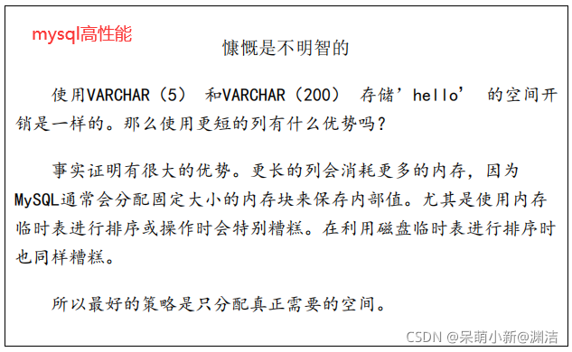

#### 4.1.4日期和时间类型

MySQL提供两种相似的日期类型：DATETIME 和TIMESTAMP 。

#### DATETIME

精度为秒。 它把日期和时间封装到格式为YYYYMMDDHHMMSS的整数中， 与时区无关。使用8个字节的存储空间。

#### TIMESTAMP

除了特殊行为之外，通常也应该尽量使用TIMESTAMP ，因为它比 DATETIME空间效率更高。
如果需要存储比秒更小粒度的日期和时间值:可以使用BIGINT 类型存储微秒级别的时间截，或者使用DOUBLE 存储秒之后的小数部分。

## 4.2加快ALTER TABLE操作的速度

一般而言，大部分ALTER TABLE 操作将导致MySQL服务中断。对常见的场景，能使用的技巧只有两种：一种是先在一台不提供服务的机器上执行ALTER TABLE 操作，然后和提供服务的主库进行切换； 另外一种技巧是“影子拷贝”。影子拷贝的技巧是用要求的表结构创建一 张和源表无关的新表，然后通过重命名和删表操作交换两张表。

不是所有的ALTER TABLE 操作都会引起表重建。例如，有两种方法 可以改变或者删除一个列的默认值（一种方法很快，另外一种则很 慢）。假如要修改电影的默认租赁期限，从三天改到五天。下面是很慢的方式:

```sql
mysql> ALTER TABLE sakila.film -> MODIFY COLUMN rental_duration TINYINT(3) NOT NULL DEFAUL
```

SHOW STATUS 显示这个语句做了1000次读和1000次插入操作。换句 话说，它拷贝了整张表到一张新表，甚至列的类型、大小和可否为NULL 属性都没改变。
理论上，MySQL可以跳过创建新表的步骤。列的默认值实际上存 在表的.frm 文件中，所以可以直接修改这个文件而不需要改动表本身。 然而MySQL还没有采用这种优化的方法，所有的MODIFY COLUMN 操作都 将导致表重建。 另外一种方法是通过ALTER COLUMN (16) 操作来改变列的默认值：

```sql
mysql> ALTER TABLE sakila.film -> ALTER COLUMN rental_duration SET DEFAULT 5;
```

这个语句会直接修改.frm 文件而不涉及表数据。所以，这个操作是非常快的。

### 4.2.1只修改.frm文件

从上面的例子我们看到修改表的.frm 文件是很快的，但MySQL有时 候会在没有必要的时候也重建表。如果愿意冒一些风险，可以让MySQL做一些其他类型的修改而不用重建表。
下面这些操作是有可能不需要重建表的：
移除（不是增加）一个列的AUTO_INCREMENT 属性。
增加、移除，或更改ENUM 和SET 常量。如果移除的是已经有行数据 用到其值的常量，查询将会返回一个空字串值。

基本的技术是为想要的表结构创建一个新的.frm 文件，然后用它替 换掉已经存在的那张表的.frm 文件，像下面这样：

1. 创建一张有相同结构的空表，并进行所需要的修改（例如增加ENUM 常量）。
2. 执行FLUSH TABLES WITH READ LOCK 。这将会关闭所有正在使用的 表，并且禁止任何表被打开。
3. 交换.frm 文件.
4. 执行UNLOCK TABLES 来释放第2步的读锁。

## 4.3 总结

- 尽量避免过度设计，例如会导致极其复杂查询的schema设计，或者有很多列的表设计（很多的意思是介于有点多和非常多之间）。
- 使用小而简单的合适数据类型，除非真实数据模型中有确切的需 要，否则应该尽可能地避免使用NULL 值。
- 尽量使用相同的数据类型存储相似或相关的值，尤其是要在关联条件中使用的列。
- 注意可变长字符串，其在临时表和排序时可能导致悲观的按最大长 度分配内存。
- 尽量使用整型定义标识列。
- 避免使用MySQL已经遗弃的特性，例如指定浮点数的精度，或者整数的显示宽度。
- 小心使用ENUM 和SET 。虽然它们用起来很方便，但是不要滥用，否 则有时候会变成陷阱。最好避免使用BIT 。
- 范式是好的，但是反范式（大多数情况下意味着重复数据）有时也 是必需的，并且能带来好处。

# 五.创建高性能索引

## 5.1 基本定义

`索引定义:索引(Index)是帮助MySQL高效获取数据的数据结构`

**索引会影响到where后面的查找和order by后面的排序**

数据本身之外，数据库还维护着一个满足特定查找算法的数据结构，这些数据结构以某种方式指向数据，这样就可以在这些数据结构的基础上实现高级查找算法，这种数据结构就是索引b+tree. **实质上B+Tree是一颗平衡树，如果对这颗树新增、修改、删除的话，会破坏它的原有结构；我们在做数据新增、修改、删除的时候，需要花额外的时间去维护索引；正因为这些额外的开销，导致索引会降低新增、修改、删除的速度。B-Tree通常意味着所有的值都是按顺序存储的，并且每一个叶子页 到根的距离相同。**

一般来说索引本身也很大，不可能全部存储在内存中，因此索引往往以索引文件的形式存储在磁盘.

```sql
select * from user where username='张三';
# 创建索引
create index idx_user_username on user(username); # 单值索引
alter table user add index `idx_user_username`(username) # 单值索引

select * from user where username='张三' and password= '123456';
create index  idx_user_usernamePassword on user(username, password); # 复合索引
alter table user add index  `idx_user_usernamePassword`(username, password); # 复合索引
# 1.PRIMARY  KEY（主键索引）
ALTER  TABLE  `table_name`  ADD  PRIMARY  KEY (  `column`  ) 
# 2.UNIQUE(唯一索引)
ALTER  TABLE  `table_name`  ADD  UNIQUE (`column` ) 
# 3.INDEX(普通索引)
ALTER  TABLE  `table_name`  ADD  INDEX index_name (  `column`  )
# 4.FULLTEXT(全文索引)
ALTER  TABLE  `table_name`  ADD  FULLTEXT ( `column` )
# 5.多列索引
ALTER  TABLE  `table_name`  ADD  INDEX index_name (  `column1`,  `column2`,  `column3`  )

# 删除索引
drop index idx_user_usernamePassword on user; # 删除user表的idx_user_usernamePassword 索引

# 查看索引
show index from user; # 查看user表的所有索引
```

## 5.2 b+tree的数据结构

叶子节点是`双向循环链表`
**我们平常所说的索引，如果没有特别指明，都是指B树（多路搜索树，并不一定是二叉的）结构组织的索引。** 其中聚集索引，次要索,复合索引，前缀索引，唯一索引默认都是使用B+树索引，统称索引。当然，像B+树这种类型的索引之外，还有哈希(hash index)索引


` mysq的b+树页分裂上面描述的仅是最简单的情况.更多相关内容,树的各种数据结构详情姜承尧的<<MySQL技术内幕 Innodb存储引擎>>`

```sql
SHOW GLOBAL STATUES LIKE 'Innodb_page_size';
# 页大小默认16384
```

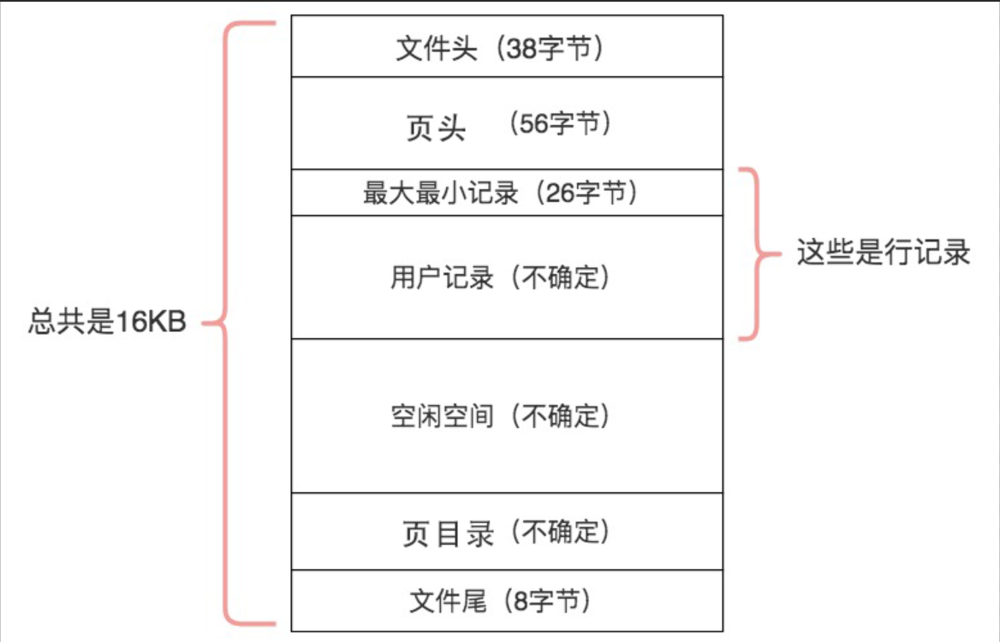


### 为啥b+树大概3到4层?

innodb引擎中,默认一个连续的节点(页)为16KB.
如上图除用户记录和空闲空间,页目录外共128B.
innodb默认指针大小为6KB.
设一条用户记录的主键为BIGINT类型,即8字节.
综上得: (16384-128)/(6+8) =1161 条索引数据.
`因而16k的页大小,大约可存1161条索引数据`
设叶子节点的数据为1KB(如果是非聚簇索引,只存BIGINT主键只需要8B.这里选聚簇索引数据结构的保守最大数据量).则一个页具备的数据条数为(16384-128)B/1000 B=16 条数据
`因而可以推算出一个根页具备3层树深.就可以存(满叶子节点数) 1161条 * 1161条 * 16条 = 2156 6736 条`

**B+Tree对索引列是顺序组织存储的，所以很适合查找范围数据。**
1.非叶子节点只存储键值信息。
2.所有叶子节点之间都有一个链指针。(顺序访问,提高范围访问速度)
3.数据记录都存放在叶子节点中。
4.通常在B+Tree上有两个头指针，一个指向根节点，另一个指向关键字最小的叶子节点，而且所有叶子节点（即数据节点）之间是一种链式环结构。因此可以对B+Tree进行两种查找运算：一种是对于主键的范围查找和分页查找，另一种是从根节点开始，进行随机查找。


`真实的情况是，3层的b+树可以表示上百万的数据，如果上百万的数据查找只需要三次IO,性能提高将是大的.如果没有索引，每个数据项都要发生一次IO,那么总共需要百万次的IO,显然成本非常非常高。`

[二叉树,红黑树,b-tree,b+tree树逻辑讲解](https://www.bilibili.com/video/BV1ta411C7xq?t=456.6)

### 5. 2.0 为什么要选择b+树?

#### 5.2.0.1 二叉搜索树


`如上图,当存入有序数时,由于二叉树的特性,他退化成了链表.没有起到减少比较次数的作用`

#### 5.2.0.2 AVL(二叉平衡树)

`在满足二叉树的基础上，任意两个节点的两个子树的高度差不能超过1`
添加操作: 需要回溯改变节点的深度.查询较慢
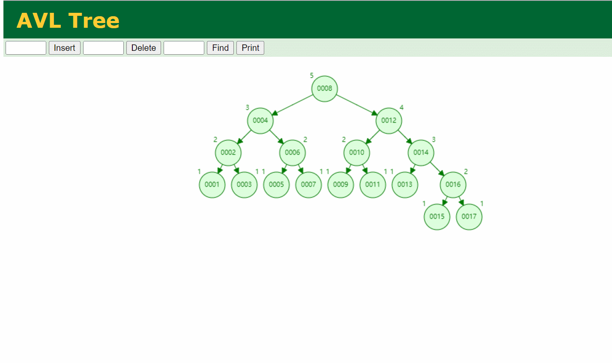

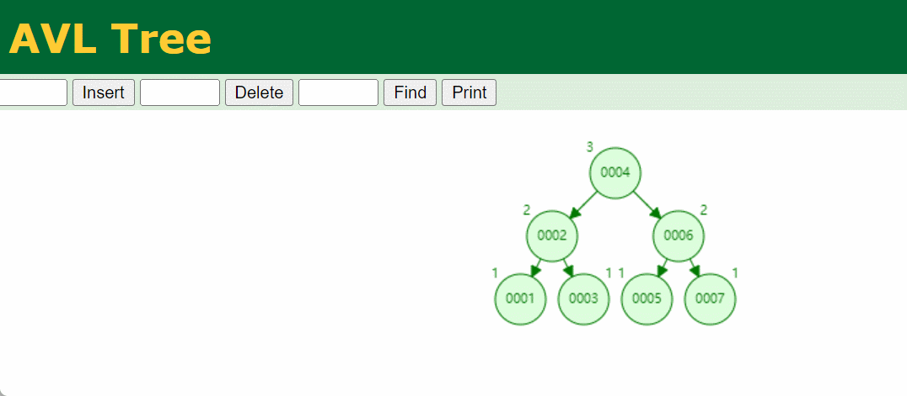

（1）维护平衡过程的成本代价很高，因为每次删除一个节点或者增加一个节点的话，需要一次或者多次的左旋，右旋等去维护“平衡”状态
（2）然后是查询的效率不稳定，有序性结构发生改变
（3）然后是如果节点很多的话，那么这个AVL树的高度还是会很高的，那么查询效率还是会很低

#### 5.2.0.3 红黑树(也称为平衡二叉树)

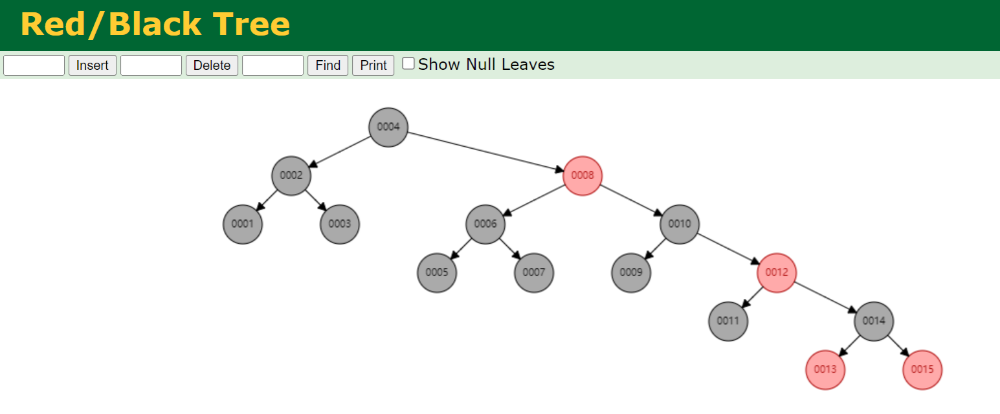
`大数据量,树深不可控进而导致效率低下的情况`

[数据结构可视化网站](https://www.cs.usfca.edu/~galles/visualization/Algorithms.html)

### 5.2.1 重要! b+tree索引生效的条件

B+Tree索引适用于全键值、键值范围或键前缀查找。其中键前缀查找只适用于根据最左前缀的查找。 前面所述的索引对如下类型的查询有效。

- **全值匹配**
  全值匹配指的是和索引中的所有列进行匹配,遵循最左前缀原则
- **匹配最左前缀**
  如果索引了多列，要遵守最左前缀法则。指的是查询从索引的最左前列开始并且不跳过索引中的列。即只使用索引的第一列。
- **匹配列前缀**
  也可以只匹配某一列的值的开头部分。
- **匹配范围值**
- 精确匹配某一列并范围匹配另外一列
- **只访问索引的查询**
  “覆盖索引”覆盖索引,就是select的数据列只用从索引中就能够取得，不必读取数据行，MySQL可以利用索引返回select列表中的字段，而不必根据索引再次读取数据文件，换句话说查询列要被所建的索引覆盖。
  注意：如果要使用覆盖索引，一定要注意select列表中只取出需要的列，不可select*,因为如果将所有字段一起做索引会导致索引文件过大，查询性能下降。

#### 5.2.1.1 为什么要遵循最左前缀原则?

`当构建一颗联合索引的b+树时候.第一字段递增排完,然后是第二个字段递增排序....如此...受到先前字段的约束,后面的字段可能是无序的.`(那么当你跳过前面的字段,他是无序的,相当于全表扫描了)


**全值匹配是`查询条件`要和索引字段`完全匹配`,覆盖索引是`查询字段`必须在设定的`索引字段范围内`**

> 因为索引树中的节点是有序的，所以除了按值查找之外，索引还可以用于查询中的ORDER BY操作（按顺序查找）。一般来说，如果B-+Tree可以按照某种方式查找到值，那么也可以按照这种方式用于排序。 所以，如果ORDER BY子句满足前面列出的几种查询类型，则这个索引也可以满足对应的排序需求。

###  5.2.2 下面是一些关于B+Tree索引的限制

- **如果不是按照索引的最左列开始查找，则无法使用索引。**
- **不能跳过索引中的列。**
- **如果查询中有某个列的范围查询，则其右边所有列都无法使用索引优化查找。**

到这里读者应该可以明白，前面提到的索引列的顺序是多么的重要：这些限制都和索引列的顺序有关。在优化性能的时候，可能需要使 用相同的列但顺序不同的索引来满足不同类型的查询需求。 也有些限制并不是B-Tree本身导致的，而是MySQL优化器和存储引擎使用索引的方式导致的，这部分限制在未来的版本中可能就不再是限制了.

`(and并列.mysql中存在查询优化器.会自动调整顺序比对索引.但还是建议按照顺序写查询条件)`
`where之后 order by之前`
`避免索引失效口诀:`
`全值匹配我最爱，最左前缀要遵守；`
`带头大哥不能死，中间兄弟不能断；`
`索引列上少计算，范围之后全失效;`
`LIKE%写最右，覆盖索引不写*;`
`要想LIKE左右%,覆盖索引要记牢`;
`不等空值还有or，索引失效要少用;`
`字符引号不能少,隐式转化泪千行.`

`注意大多情况遵循以上条件.实际深究这些都不可靠.走不走索引和数据倾斜度(数据量)有很大关系.将在最后提出比explain执行计划更精确详细的optimizer trace分析工具`

`在mysql8.0中有跳跃扫描的新特性.在一定条件下可以不遵循最左前缀原则`

[mysql8.0新特性跳跃扫描](https://dev.mysql.com/doc/refman/8.0/en/range-optimization.html#range-access-skip-scan)
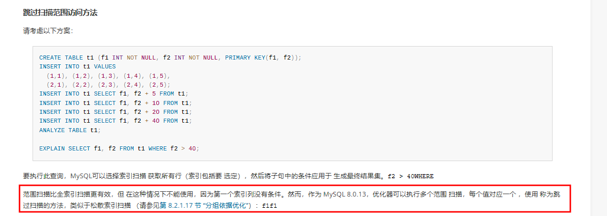
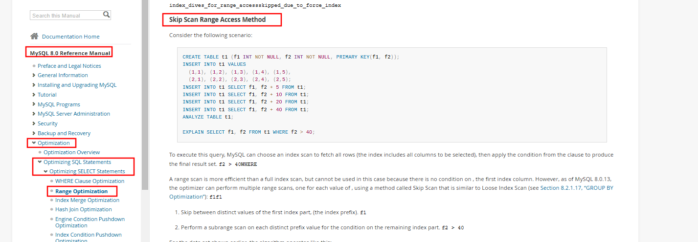

## 5.2.3 深度分析!=和<>

!=和<>到底走不走索引?
`在mysql8.0中!=会走索引,但是是针对主键说的. 二级索引看数据量而生效.`
在mysql8.0中 先说结论: `和数据量有关,当 !=和<>指明的索引条件占比大于数据量大概20%就能生效.但注意.主键索引不受这个约束.会进行范围索引搜索`测试结果如下

```sql
CREATE TABLE `user` (
  `id` bigint unsigned NOT NULL AUTO_INCREMENT,
  `name` varchar(32) NOT NULL,
  `age` tinyint unsigned DEFAULT NULL,
  PRIMARY KEY (`id`),
  KEY `idx_name` (`name`)
) ENGINE=InnoDB AUTO_INCREMENT=1001 DEFAULT CHARSET=utf8mb4 COLLATE=utf8mb4_0900_ai_ci;
```

**当数据量只有2条. 那么name条件占比远大于20%**
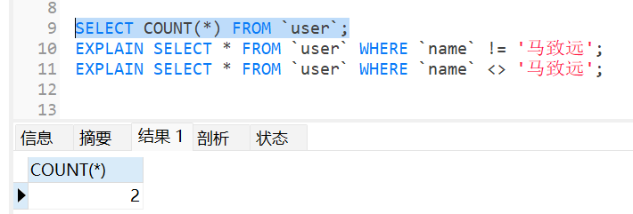


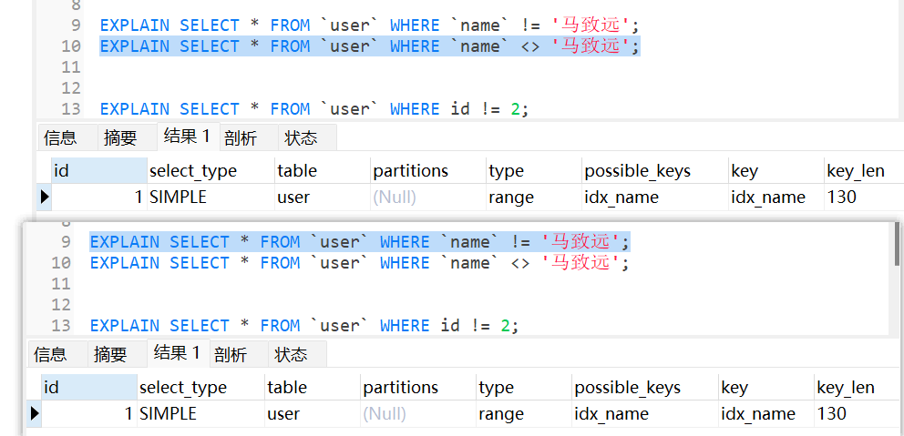
**当数据量大于100. 那么name条件占比远小于20%**
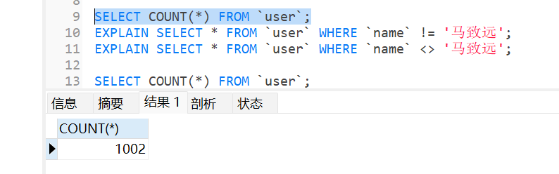
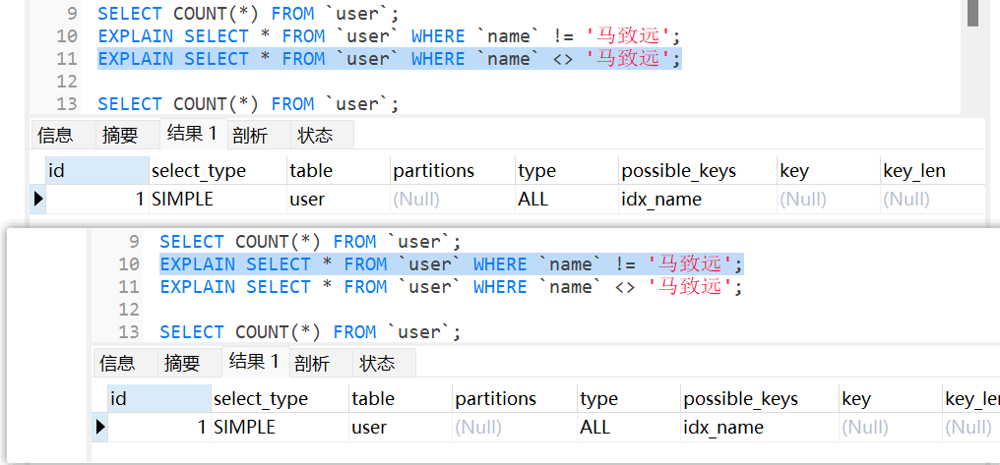

## 5.3 哈希索引

InnoDB引擎有一个特殊的功能叫做“自适应哈希索引（adaptive hash index）”。当InnoDB注意到某些索引值被使用得非常频繁时，它会在内 存中基于B-Tree索引之上再创建一个哈希索引，这样就让B-Tree索引也 具有哈希索引的一些优点，比如快速的哈希查找。这是一个完全自动 的、内部的行为，用户无法控制或者配置，不过如果有必要，完全可以关闭该功能。真正支持哈希索引的除了Memory引擎外，NDB集群引擎也支持唯一哈希索引.

**hash的特点**

- 键值唯一，哈希索引明显有绝对优势
- 无法完成范围查询检索
- 无法利用索引完成排序，以及Iike‘xxx%’
- 这样的部分模糊查询不支持多列联合索引的
- 因为哈希碰撞问题，索引效率是极低的

## 5.4 空间数据索引（R+Tree）

MyISAM表支持空间索引，可以用作地理数据存储。和B-Tree索引 不同，这类索引无须前缀查询。空间索引会从所有维度来索引数据。查 询时，可以有效地使用任意维度来组合查询。必须使用MySQL的GIS相关函数如MBRCONTAINS()等来维护数据。MySQL的GIS支持并不完 善，所以大部分人都不会使用这个特性。开源关系数据库系统中对GIS 的解决方案做得比较好的是PostgreSQL的PostGIS。

## 5.5 全文索引

全文索引是一种特殊类型的索引，它查找的是文本中的关键词，而 不是直接比较索引中的值。全文搜索和其他几类索引的匹配方式完全不 一样。它有许多需要注意的细节，如停用词、词干和复数、布尔搜索 等。全文索引更类似于搜索引擎做的事情，而不是简单的WHERE 条件匹 配。在相同的列上同时创建全文索引和基于值的B-Tree索引不会有冲 突，全文索引适用于MATCH AGAINST 操作，而不是普通的WHERE 条件操作。

## 5.6 聚簇(聚集)索引

聚簇索引并不是一种单独的索引类型，而是一种数据存储方式。术语“聚簇”表示数据行和相邻的键值紧凑地存储在一起.因为无法同时把数据行存放在两 个不同的地方，所以一个表只能有一个聚簇索引.

因为是存储引擎负责实现索引，因此不是所有的存储引擎都支持聚簇索引(MyISAM是非聚簇索引)。但InnoDB的聚簇索引实际上在同 一个结构中保存了B-Tree索引和数据行。一些数据库服务器允许选择哪个索引作为聚簇索引，但直到2022.8.30，还没有任何一个MySQL内建的存储引擎支持这一点。`InnoDB 将通过主键聚集数据`,也就是说`主键索引就是聚集索引`,它包含了`完整的数据记录`
`其余的都叫非聚集索引,一个索引构建一颗B+树,除了聚集索引(一级),其余全是非聚集(二级索引).非聚集索引只包含主键id是为了减少数据大量重复.因此回表找聚集索引对应的值是有必要的`
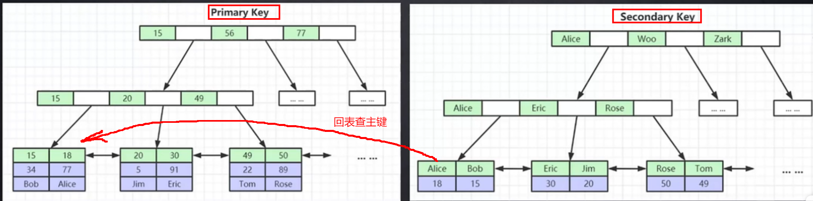


`如果没有定义主键，InnoDB会选择一个唯一的非空索引代替。如果没有这样的索引，InnoDB会隐式定义一个主键来作为聚簇索引。`

**聚集的数据有一些重要的优点：**

- 可以把相关数据保存在一起。例如实现电子邮箱时，可以根据用户 ID来聚集数据，这样只需要从磁盘读取少数的数据页就能获取某个 用户的全部邮件。如果没有使用聚簇索引，则每封邮件都可能导致 一次磁盘I/O。
- 数据访问更快。聚簇索引将索引和数据保存在同一个B-Tree中，因此从聚簇索引中获取数据通常比在非聚簇索引中查找要快。
- 使用覆盖索引扫描的查询可以直接使用页节点中的主键值。 如果在设计表和查询时能充分利用上面的优点，那就能极大地提升 性能。

**同时，聚簇索引也有一些缺点：**

- 聚簇数据最大限度地提高了I/O密集型应用的性能，但如果数据全部都放在内存中，则访问的顺序就没那么重要了，聚簇索引也就没什么优势了。
- 插入速度严重依赖于插入顺序。按照主键的顺序插入是加载数据到InnoDB表中速度最快的方式。但如果不是按照主键顺序加载数据，那么在加载完成后最好使用OPTIMIZE TABLE 命令重新组织一下表。
- 更新聚簇索引列的代价很高，因为会强制InnoDB将每个被更新的行移动到新的位置。
- 基于聚簇索引的表在插入新行，或者主键被更新导致需要移动行的时候，可能面临“页分裂（page split）”的问题。当行的主键值要求必须将这一行插入到某个已满的页中时，存储引擎会将该页分裂成两个页面来容纳该行，这就是一次页分裂操作。页分裂会导致表占 用更多的磁盘空间。
- 聚簇索引可能导致全表扫描变慢，尤其是行比较稀疏，或者由于页分裂导致数据存储不连续的时候。
- 二级索引（非聚簇索引）可能比想象的要更大，因为在二级索引的叶子节点包含了引用行的主键列。
- 二级索引访问需要两次索引查找，而不是一次。

### 5.6.1为什么InnoDB表必须建主键，并且推荐使用整型的自增主键？

上述基本概念提到`如果没有定义主键，InnoDB会选择一个唯一的非空索引代替。如果没有这样的索引，InnoDB会隐式定义一个主键来作为聚簇索引.` 你小子不建索引还让mysql帮你维护!
推荐使用整型的自增主键,整型比大小比字符类型快,自增为了充分利用自适应哈希和b+树叶子节点的双向链表.也避免了页频繁分裂(Hash仅能满足等值查找和嵌套查找)

## 5.7哪些情况需要建立索引

1.主键自动建立唯一索引
2.频繁作为查询条件的字段应该创建索引
3.查询中与其它表关联的字段，外键关系建立索引
4.频繁更新的字段不适合创建索引(因为每次更新不单单是更新了记录还会更新索引记录)
5.Where条件里用不到的字段不创建索引.
6.单键/组合索引的选择问题，who？(在高并发下倾向创建组合索引)
7.查询中排序的字段，排序字段若通过索引去访问将大大提高排序速度
8.查询中统计或者分组字段(group by的前提是排序)

## 5.8哪些情况不要建索引

1.表记录太少(这种情况下,简单的全表扫描更高效)
2.经常增删改的字段(提高了查询速度，同时却会降低更新表的速度，如对表进行INSERT、UPDATE和DELETE。
因为更新表时，MySQL不仅要保存数据，还要保存一下索引文件)
3.数据重复且分布平均的表字段，因此应该只为最经常查询和最经常排序的数据列建立索引。注意，如果某个数据列包含许多重复的内容，为它建立索引就没有太大的实际效果。


## 5.9 索引的优劣

- 优势
  提高数据检索速度,减少io时间
  降低排序和临时表,减少cpu消耗
  将随机io变为顺序io
- 劣势
  实际上索引也是一张表，该表保存了主键与索引字段，并指向实体表的记录，所以索引列也是要占用空间的.
  索引大大提高了查询速度，同时却会降低更新表的速度，如对表进行INSERT、UPDATE和DELETE。因为更新表时，MySQL不仅要保存数据，还要保存一下索引文件每次更新添加了索引列的字段，都会调整因为更新所带来的键值变化后的索引信息.
  索引只是提高效率的一个因素，如果你的MySQL有大数据量的表，就需要花时间研究建立最优秀的索引,或优化查询语句

## 5.10 采用逻辑删除的原因

我们现在大部分采用逻辑删除,原因如下: 1. 为了数据分析 2.为了索引有效
重建索引的原因主要包括：
1、删除的空间没有重用，导致索引出现碎片(频繁的delete和update操作)
2、删除大量的表数据后，空间没有重用，导致索引"虚高”(大量的delete操作)
3、索引的clustering facto和表不一致(即修改操作,内部还进行索引指针修改.clustering_factor是用来比较索引的顺序程度与表的杂乱排序程度的一个度量)


# 六. mysql高级实践技能

## 6.1 sql性能下降的原因

- ==查询语句写的烂==
- ==索引失效(单值,复合)==

```sql
select * from user where username='张三';
# 创建索引
create index idx_user_username on user(username); # 单值索引
alter table user add index `idx_user_username`(username) # 单值索引

select * from user where username='张三' and password= '123456';
create index  idx_user_usernamePassword on user(username, password); # 复合索引
alter table user add index  `idx_user_usernamePassword`(username, password); # 复合索引
```


- ==关联查询太多(join)==
  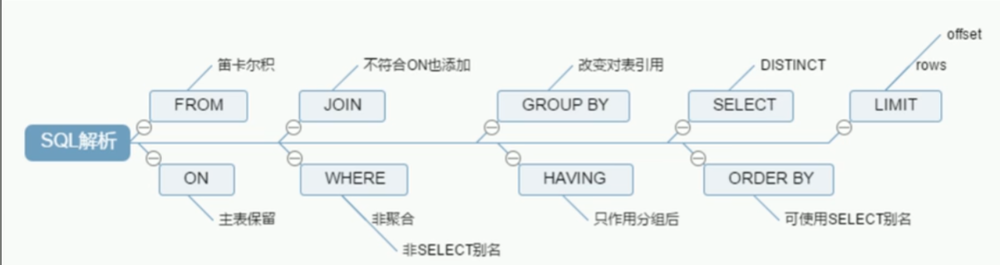
  

- ==服务器调优及各个参数设置(缓冲,线程池等)==

## 6.2 查询性能优化

###  6.2.1常见瓶颈

- CPU:CPU在饱和的时候一般发生在数据装入内存或从磁盘上读取数据时候
- IO:磁盘/O瓶颈发生在装入数据远大于内存容量的时候
- 服务器硬件的性能瓶颈：top,free,iostat和vmstat来查看系统的性能状态

### 6.2.2 explain

使用EXPLAIN关键字可以模拟优化器执行SQL查询语句，从而知道MySQL是如何处理你的SQL语句的。分析你的查询语句或是表结构的性能瓶颈.

**使用: explain + sql 语句**
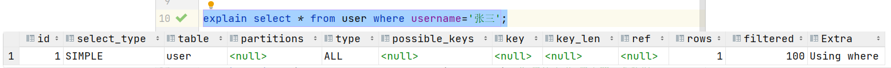
**能干啥**

- 表的读取顺序
- 数据读取操作的操作类型
- 哪些索引可以使用
- 哪些索引被实际使用
- 表之间的引用
- 每张表有多少行被优化器查询

**执行计划包含的信息**


- **1.id:** select查询的序列号，包含一组数字，表示查询中执行select子句或操作表的顺序.
  
  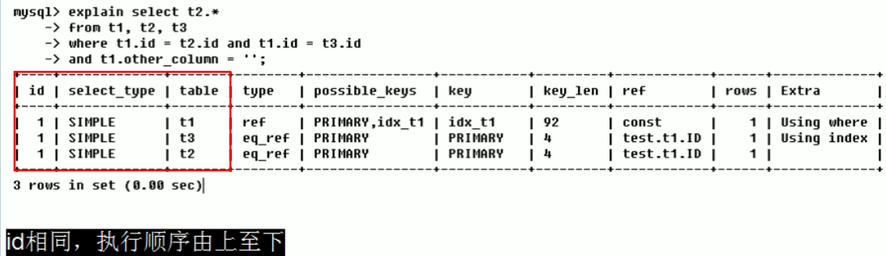

<hr style=" border:solid; width:100px; height:1px;" color=#000000 size=1">


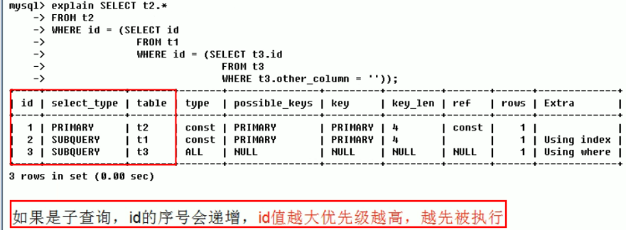

<hr style=" border:solid; width:100px; height:1px;" color=#000000 size=1">


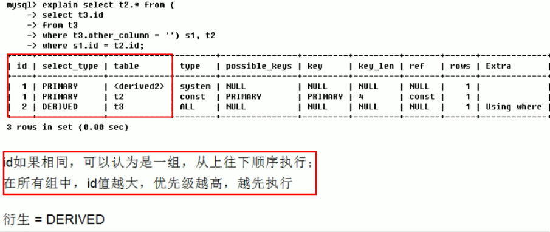

- **2.select_type:**
  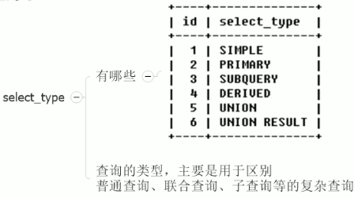
  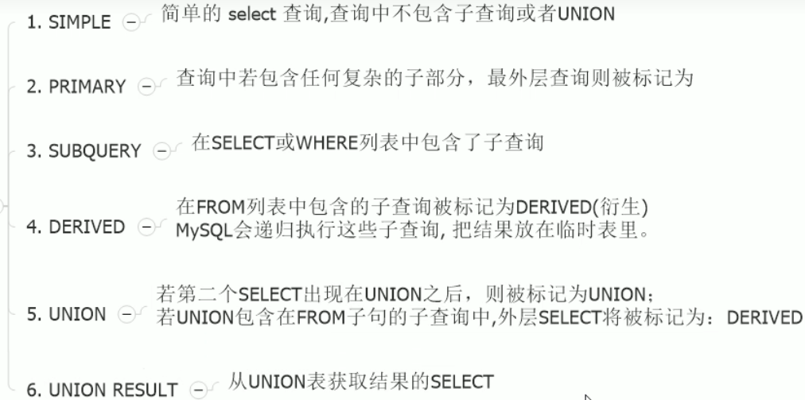
- **3.type**

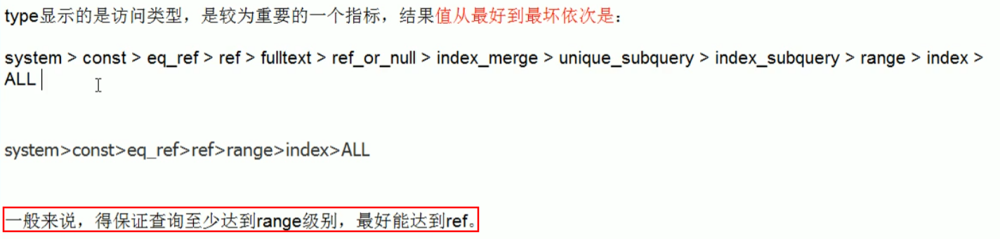
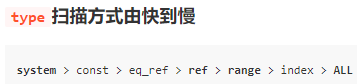

system：系统表，少量数据，往往不需要进行磁盘IO
const：常量连接
eq_ref：主键索引(primary key)或者非空唯一索引(unique not null)等值扫描
ref：非主键非唯一索引等值扫描
range：范围扫描
index：索引树扫描(全索引扫描)
ALL：全表扫描(full table scan)  (没加索引就是all)


`固态硬盘类似: 在固态硬盘里面，闪存颗粒则替代了机械磁盘成为了存储单元。
闪存(Flash Memory)本质上是一种长寿命的非易失性(在断电情况下仍能保持所存储的数据信息)的存储器，数据删除不是以单个的字节为单位而是以固定的区块为单位。`

- **4.possible_keys 和key字段**
  **possible_keys:** 显示可能应用在这张表中的索引，一个或多个查询涉及到的字段上若存在索引，则该索引将被列出，`但不一定被查询实际使用`
  **key:** 被优化器实际应用的索引,如果为null则没使用索引.查询中若使用了覆盖索引，则该索引仅出现在key列表中.(查询字段顺序和个数等于建立索引)

- **5.key_len**
  表示索引中使用的字节数，可通过该列计算查询中使用的索引的长度。在不损失精确性的情况下，长度越短越好.
  `key_Ien显示的值为索引字段的最大可能长度`，并非实际使用长度，即`key_len是根据表定义计算而得`，不是通过表内检索出的.


`UTF-8一个(字符)占用(3)个字节，英文占用(1)个字节。GDK： GDK一个(字符)占用(2)个字节，英文占用(1)个字节。`
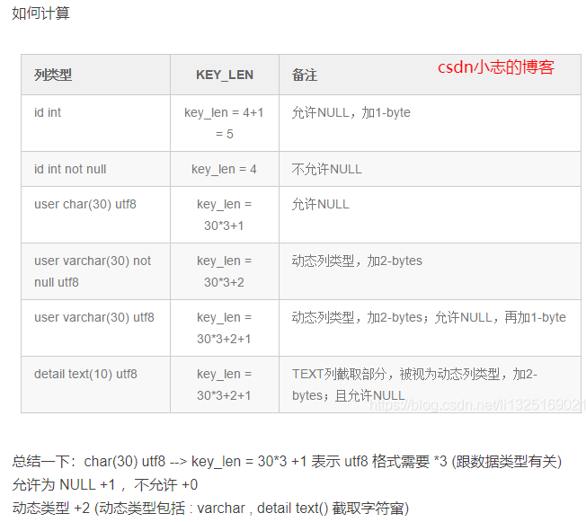


- **6. ref**
  显示了之前的表在key列记录的索引中查找值所用的列或常量

- **7. rows**
  rows 为了找到所需的行而需要读取的行数，估算值，不精确。通过把所有rows列值相乘，可粗略估算整个查询会检查的行数

- **8.extra**

| 字段                              | 解释                                                         |
| --------------------------------- | ------------------------------------------------------------ |
| **using filesort:**               | 排序没用到索引 (索引跟排序是有关系的.详见本文第五章,哪些字段需要创建索引) `弱鸡必须优化` |
| **using temporary:**              | 产生内部临时表  `更弱鸡必须优化`                             |
| **using index:**                  | 很好的查询方式.如果同时出现using where,表明索引被用来执行索引键值的查找；如果没有同时出现using where,表明索引用来读取数据而非执行查询动作。 |
| **Covering Index:**               | 覆盖索引,就是select的数据列只用从索引中就能够取得，不必读取数据行，MySQL可以利用索引返回select列表中的字段，而不必根据索引再次读取数据文件，换句话说查询列要被所建的索引覆盖。如果要使用覆盖索引，一定要注意select列表中只取出需要的列，不可select*,因为如果将所有字段一起做索引会导致索引文件过大，查询性能下降。 |
| **using where:**                  | 使用了where过滤                                              |
| **using join buffer:**            | 使用了连接缓存                                               |
| **impossible where:**             | where子句的值总是false,不能用来获取任何元组                  |
| **select tables optimized away:** | 在没有GROUPBY子句的情况下，基于索引优化MIN/MAX操作或者对于MyTSAM存储引擎优化COUNT(*)操作，不必等到执行阶段再进行计景，查询执行计划生成的阶段即完成优化。 |
| **distinct:**                     | 优化distinct操作，在找到第一匹配的元组后即停止找同样值的动作 |

**优化动作详见本文第五章,b+tree索引条件和限制条件**

**小总结** `explain 的表字段中 id,type,key,rows,extra是最重要的字段属性`

## 6.3 索引优化

### 6.3.1 小表驱动大表(join)

左连接: 右表加索引(左边一定会做全表扫描,而右边做匹配.合表左边做不做索引都不影响)
右连接: 左表加索引(这是因为RIGHT JOIN条件用于确定如何从左表搜索行，右边一定都有，所以左边是我们的关键点，一定需要建立素引。)

### 6.3.2 避免索引失效

索引生效条件,请查看本文第五章 索引生效的条件和限制

### 6.3.3 其他问题

#### 6.3.3.1.什么是回表

回表就是先通过数据库索引扫描出数据所在的行，再通过行主键id取出索引中未提供的数据，即基于非主键索引的查询需要多扫描一棵索引树.因此，可以通过索引先查询出id字段，再通过主键id字段，查询行中的字段数据，即通过再次查询提供MySQL查询速度.
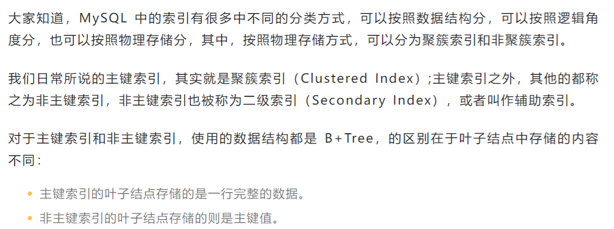
引自[什么是 MySQL 的“回表”？](https://z.itpub.net/article/detail/A89812AB1494E1D51731ADF0606CC0F3)

#### 6.3.3.2.解决like%字符串%时索引不被使用的方法？

可以使用覆盖索引解决.

#### 6.3.3.3.覆盖索引为什么可以不遵循最左前缀查询?

`在mysql8.0中引入跳跃扫描.在特定条件下可以不遵循最左前缀原则`
覆盖索引走的全索引扫描不是全表扫描.如下文: 查询优化器做了优化走全索引扫描.
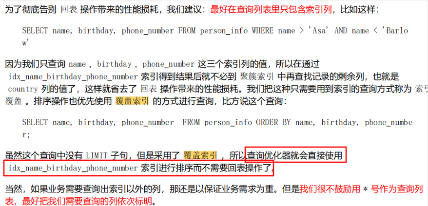

#### 6.3.3.4 注意: and表是并列关系.只要and中有最左前缀索引(带头大哥).那么无论顺序如何.都会被mysql查询优化器优化,变成正常的索引序列.但范围之后依然全失效

mysql查询优化器优化:将会尝试先调整条件顺序,使得条件和索引相匹配.
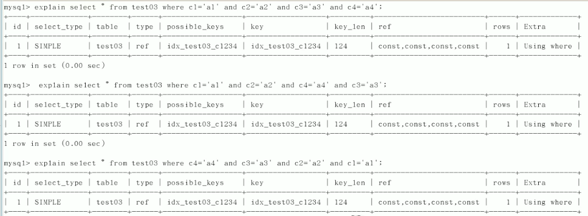
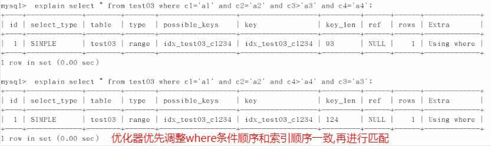

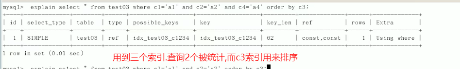

#### 6.3.3.5 mysq表关联底层机制

mysql表关联常见两种算法

- Nested-Loop Join 算法
- Block Nested-Loop Join 算法


## 6.4 count()函数

`以下摘自java开发手册华山版.`
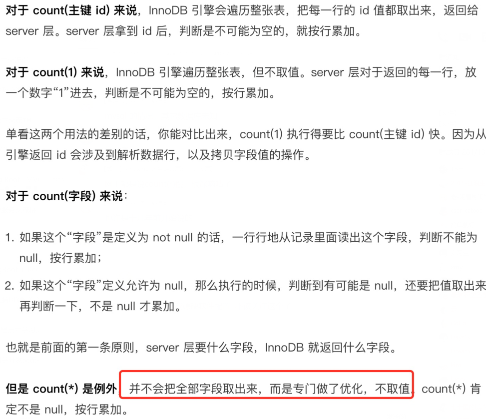


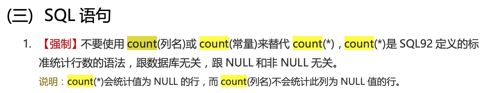

## 6.5 查询优化

优化分析过程:

----------------分析----------------
1 观察，至少跑1天，看看生产的慢SQL情况。
2 开启慢查询日志，设置阈值，比如超过5秒钟的就是慢SQL,并将它抓取出来。
3 explain-+慢SQL分析
4 show profile
5 运维经理or DBA,进行SQL数据库服务器的参数调优

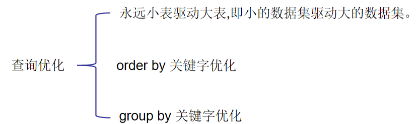

### 6.5.1 小表驱动大表

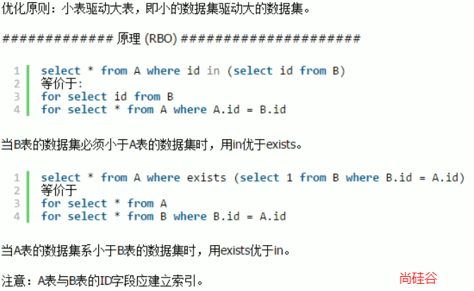

```sql
EXISTS
语法：
SELECT 字段 FROM table WHERE EXISTS (subquery); 

参数：
subquery是一个受限的SELECT语句（不允许有COMPUTE子句和INTO关键字）

示例：
SELECT * FROM A WHERE EXISTS (SELECT 1 FROM B WHERE B.id = A.id); 

EXISTS执行顺序：
1、首先执行一次外部查询，并缓存结果集，如 SELECT * FROM A
2、遍历外部查询结果集的每一行记录R，代入子查询中作为条件进行查询，如 SELECT 1 FROM B WHERE B.id = A.id
3、如果子查询有返回结果，则EXISTS子句返回TRUE，这一行R可作为外部查询的结果行，否则不能作为结果

--知乎 图南(https://zhuanlan.zhihu.com/p/351922940)
```

### 6.5.2 order by排序优化

`关注点:会不会产生FileSort`
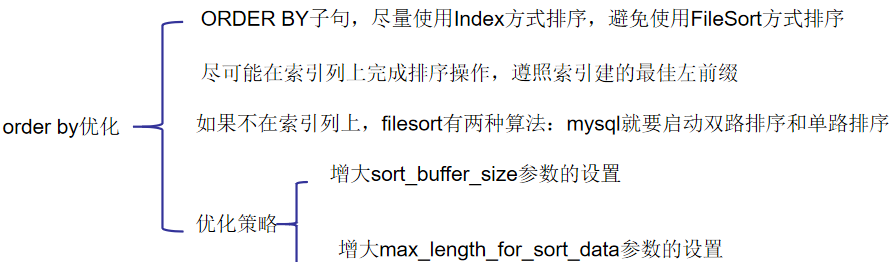
**双路排序:**
mysql4.1之前是使用双路排序，字面意思就是两次扫描磁盘，最终得到数据，指针和orderby列，对他们进行排序，然后扫描已经排序好的列表，按照列表中的值重新从列表中读取对应的数据.
**单路排序:**
从磁盘读取查询需要的所有列，按照order by列在buffer对它们进行排序，然后扫描排序后的列表进行输出，它的效率更快一些，避免了第二次读取数据。并且把随机IO变成了顺序IO,但是它会使用更多的空间，因为它把每一行都保存在内存中了。

由于单路是后出的，总体而言好过双路.但单路排序也存在问题:

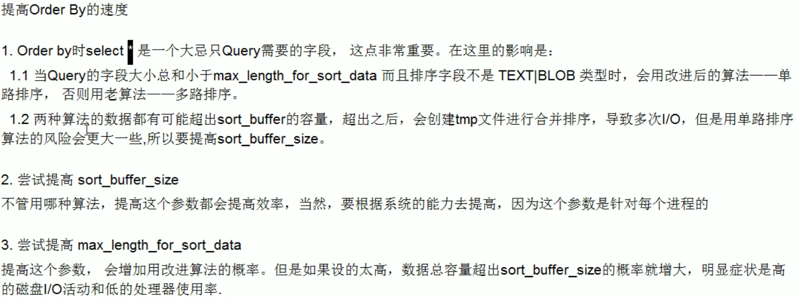

### 6.5.3 group by排序


## 6.6 慢查询日志

- MySQL的慢查询日志是MySQL提供的一种日志记录，它用来记录在MySQL中响应时间超过阀值的语句，具体指
  运行时间超过long_query_.time值的SQL,则会被记录到慢查询日志中。
- 具体指运行时间超过long_query_.time值的SQL,则会被记录到慢查询日志中。long_query._time的默认值为10，
  意思是运行10秒以上的语句。
- 由他来查看哪些SQL超出了我们的最大忍耐时间值，比如一条$q执行超过5秒钟，我们就算慢SQL,希望能收集
  超过5秒的sql,结合之前explain:进行全面分析。

`默认情况下，MySQL数据库没有开启慢查询日志，需要我们手动来设置这个参数。`
`当然，如果不是调优需要的话，一般不建议启动该参数，因为开启慢查询日志会或多或少带来一定的性能影响。`慢
查询日志支持将日志记录写入文件.

```sql
# 使用set global slow_query_.log=1开启了慢查询日志只对当前数据库生效，
# 如果MySQL重启后则会失效。
# 默认 SHOW VARIABLES LIKE '%slow_query_log%';
# 开启 set global show_query_log=1;
# 如果要永久生效，就必须修改配置文件my.cnf

# 记录运行时间大于long_query_time的sql
SHOW VARIABLES LIKE 'long_query_time%';
# 设置阈值时间
set global long_query_time=3; 

# 为什么设置后看不出变化？
# 需要重新连接或新开一个会话才能看到修改值。
SHOW VARIABLES LIKE 'long_query_time%'

# 查看慢查询日志 
# docker 在数据卷相应位置寻找
#  show variables like "slow_query_log_file"; 表示慢查询日志位置
# show global status like 'Slow_queries%'; 查看有当前有多少慢查询记录
```

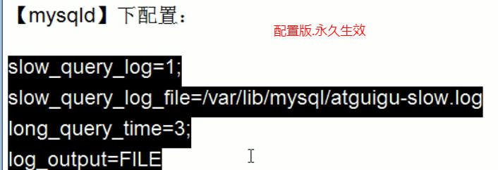

## 6.7 show profile

同样不要在生产环境开启
查看慢sql语句:

```sql
# 查看记录的慢sql.默认关闭,并只记录前15条
Show variables like 'profiling%';
set profling=on;
# 查看结果
show profiles;
# 具体查看其中一条信息
show profile cpu,block io for query query_id;
```


## 6.8 全局查询日志

同样不要在生产环境开启
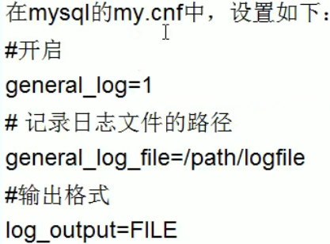

```sql
#在mysqlE的my.cnf中，设置如下
#开启
general_log=1
#记录日志文件的路径
general_log_file=/path/logfile
#输出格式
log_output=FILE


#命令启用方式
set global general_log=1;
set global log_output='TABLE';
```

## 6.7 optimizer trace分析工具

使用样例:

```bash
show variables like '%optimizer_trace%';
SET OPTIMIZER_TRACE="enabled=on",END_MARKERS_IN_JSON=on;
SET optimizer_trace_offset=-30, optimizer_trace_limit=20;
SELECT * FROM `user` WHERE uname='于震南' AND age>49 AND is_delete=0;
SELECT * FROM INFORMATION_SCHEMA.OPTIMIZER_TRACE;
SELECT * FROM `user` WHERE uname='于震南' AND age>=49 AND is_delete=0;
SELECT * FROM INFORMATION_SCHEMA.OPTIMIZER_TRACE;
SET optimizer_trace="enabled=off";
```

使用参数详解这里->[MySQL OPTIMIZER TRACE 详解](https://blog.csdn.net/eddielee9217/article/details/116748751)

over!