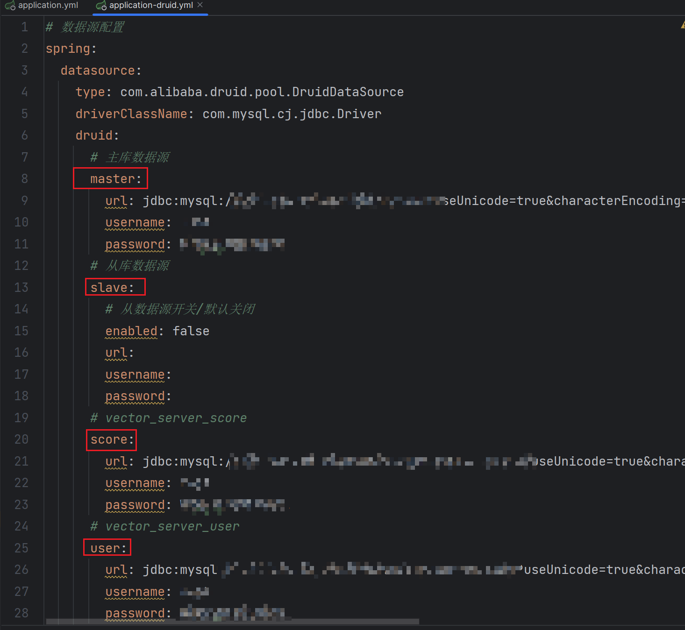

# SpringBoot数据库换源

[[toc]]

---
## 前言
笔者知道有三种方式:
1. baomidou提供的@DS
2. 自定义AOP自动换源
3. 实现AbstractRoutingDataSource手动换源
4. 
## 一. baomidou提供换源注解 @DS
`注意`
1.不能使用事务，否则数据源不会切换，使用的还是第一次加载的数据源；(建议在controller层切换数据源.因为一旦service开启事务,则@DS失效)
2. 第一次加载数据源之后，第二次、第三次…操作其它数据源，如果数据源不存在，使用的还是第一次加载的数据源；
3. 数据源名称不要包含下划线，否则不能切换。
4. 添加@DS注解到实现类或者实现类的方法上才可以
5. 注解添加到类上，意味着此类里的方法都使用此数据源；
6. 当注解添加到方法上时，意味着此方法上使用的数据源优先级高于其他一切配置


`引入依赖`
```xml
<!-- https://mvnrepository.com/artifact/com.baomidou/dynamic-datasource-spring-boot-starter -->
<dependency>
    <groupId>com.baomidou</groupId>
    <artifactId>dynamic-datasource-spring-boot-starter</artifactId>
    <version>3.5.2</version>
</dependency>

```
`配置数据源`
```yaml
spring:
  datasource:
    type: com.alibaba.druid.pool.DruidDataSource
    driverClassName: com.mysql.cj.jdbc.Driver
    druid:
      ## 初始连接数
      initialSize: 5
      ## 最小连接池数量
      minIdle: 10
      ## 最大连接池数量
      maxActive: 20
      ## 配置获取连接等待超时的时间
      maxWait: 60000
      ## 配置间隔多久才进行一次检测，检测需要关闭的空闲连接，单位是毫秒
      timeBetweenEvictionRunsMillis: 60000
      ## 配置一个连接在池中最小生存的时间，单位是毫秒
      minEvictableIdleTimeMillis: 300000
      ## 配置一个连接在池中最大生存的时间，单位是毫秒
      maxEvictableIdleTimeMillis: 900000
    dynamic:
      primary: master ## 默认数据源
      datasource:
        master: 
          url: jdbc:mysql://localhost:3306/a?serverTimezone=UTC&useUnicode=true&characterEncoding=utf8
          driver-class-name: com.mysql.cj.jdbc.Driver
          username: root
          password: 123456
        other:
          url: jdbc:mysql://localhost:3306/b?serverTimezone=UTC&useUnicode=true&characterEncoding=utf8
          driver-class-name: com.mysql.cj.jdbc.Driver
          username: root
          password: 123456
```
`使用`

```java

@Service
@DS("a")
public class UserServiceImpl implements UserService {
 
  	@Autowired
  	private JdbcTemplate jdbcTemplate;
 
 	// 用a源
    public List<String> getScore() {
        List<String> objects = scoreMapper.selectScoreById();
        return objects;
    }
  	@Override
  	@DS("b") // 用b源
    public List<String> getScore1() {
        DynamicDataSourceContextHolder.clearDataSourceType();
        DynamicDataSourceContextHolder.setDataSourceType(DataSourceType.SCORE.name());
        List<String> objects = scoreMapper.selectScoreById();
        return objects;
    }
```

---
## 二. 手动数据源切换

`配置`


`枚举数据源`

```java
public enum DataSourceType
{
    /**
     * 主库
     */
    MASTER,

    /**
     * 从库
     */
    SLAVE,
    /**
     * score
     */
    SCORE,
    /**
     * user
     */
    USER;
}

```

`实现AbstractRoutingDataSource`
```java
/**
 * 动态数据源
 * 
 * @author ruoyi
 */
public class DynamicDataSource extends AbstractRoutingDataSource // AbstractRoutingDataSource是Spring提供的动态数据源
{
    public DynamicDataSource(DataSource defaultTargetDataSource, Map<Object, Object> targetDataSources)
    {
        super.setDefaultTargetDataSource(defaultTargetDataSource); // 设置默认数据源
        super.setTargetDataSources(targetDataSources); // 设置数据源
        super.afterPropertiesSet(); // 初始化
    }

    @Override
    protected Object determineCurrentLookupKey() // 该方法返回的值是AbstractRoutingDataSource中的targetDataSources的key
    {
        return DynamicDataSourceContextHolder.getDataSourceType();
    }
}
```
`数据源上下文切换类 DynamicDataSourceContextHolder.class`

```java
/**
 * 数据源切换处理
 *
 * @author ruoyi
 */
public class DynamicDataSourceContextHolder
{
    public static final Logger log = LoggerFactory.getLogger(DynamicDataSourceContextHolder.class);

    /**
     * 使用ThreadLocal维护变量，ThreadLocal为每个使用该变量的线程提供独立的变量副本，
     *  所以每一个线程都可以独立地改变自己的副本，而不会影响其它线程所对应的副本。
     */
    private static final ThreadLocal<String> CONTEXT_HOLDER = new ThreadLocal<String>(){
        @Override
        protected String initialValue()
        {
            return DataSourceType.MASTER.name(); // 默认数据源
        }
    };


    /**
     * 设置数据源的变量
     */
    public static void setDataSourceType(String dsType)
    {
        log.info("切换到{}数据源", dsType);
        CONTEXT_HOLDER.set(dsType);
    }

    /**
     * 获得数据源的变量
     */
    public static String getDataSourceType()
    {
        return CONTEXT_HOLDER.get();
    }

    /**
     * 清空数据源变量
     */
    public static void clearDataSourceType()
    {
        CONTEXT_HOLDER.remove();
    }
}
```
`给配置的各个数据源注册实例 DruidConfig.class`

```java
/**
 * druid 配置多数据源
 *
 * @author ruoyi
 */
@Configuration
public class DruidConfig
{

    @Bean
    @ConfigurationProperties("spring.datasource.druid.master")
    public DataSource masterDataSource(DruidProperties druidProperties)
    {
        DruidDataSource dataSource = DruidDataSourceBuilder.create().build();
        return druidProperties.dataSource(dataSource);
    }

    @Bean
    @ConfigurationProperties("spring.datasource.druid.slave")
    @ConditionalOnProperty(prefix = "spring.datasource.druid.slave", name = "enabled", havingValue = "true")
    public DataSource slaveDataSource(DruidProperties druidProperties)
    {
        DruidDataSource dataSource = DruidDataSourceBuilder.create().build();
        return druidProperties.dataSource(dataSource);
    }

    /**
     * 配置score数据源
     * @param druidProperties
     * @return
     */
    @Bean
    @ConfigurationProperties("spring.datasource.druid.score") // 从配置文件中读取配置
    public DataSource scoreDataSource(DruidProperties druidProperties)
    {
        DruidDataSource dataSource = DruidDataSourceBuilder.create().build();
        return druidProperties.dataSource(dataSource);
    }

    /**
     * 配置user数据源
     * @param druidProperties
     * @return
     */
    @Bean
    @ConfigurationProperties("spring.datasource.druid.user") // 从配置文件中读取配置
    public DataSource userDataSource(DruidProperties druidProperties)
    {
        DruidDataSource dataSource = DruidDataSourceBuilder.create().build();
        return druidProperties.dataSource(dataSource);
    }

    @Bean(name = "dynamicDataSource")
    @Primary
    public DynamicDataSource dataSource(DataSource masterDataSource)
    {
        Map<Object, Object> targetDataSources = new HashMap<>();

        targetDataSources.put(DataSourceType.MASTER.name(), masterDataSource); // 设置默认数据源
        setDataSource(targetDataSources, DataSourceType.SLAVE.name(), "slaveDataSource"); // 设置从库数据源

        targetDataSources.put(DataSourceType.SCORE.name(), SpringUtils.getBean("scoreDataSource")); // 设置score数据源
        targetDataSources.put(DataSourceType.USER.name(), SpringUtils.getBean("userDataSource")); // 设置user数据源


        return new DynamicDataSource(masterDataSource, targetDataSources);
    }


    /**
     * 设置数据源
     *
     * @param targetDataSources 备选数据源集合
     * @param sourceName 数据源名称
     * @param beanName bean名称
     */
    public void setDataSource(Map<Object, Object> targetDataSources, String sourceName, String beanName)
    {
        try
        {
            // 这是一个spring封装的上下文的工具类，可以获取容器中的bean
            DataSource dataSource = SpringUtils.getBean(beanName); // 从容器中获取数据源
            targetDataSources.put(sourceName, dataSource); // 设置数据源
        }
        catch (Exception e)
        {
        }
    }

    /**
     * 去除监控页面底部的广告
     */
    @SuppressWarnings({ "rawtypes", "unchecked" })
    @Bean
    @ConditionalOnProperty(name = "spring.datasource.druid.statViewServlet.enabled", havingValue = "true")
    public FilterRegistrationBean removeDruidFilterRegistrationBean(DruidStatProperties properties)
    {
        // 获取web监控页面的参数
        DruidStatProperties.StatViewServlet config = properties.getStatViewServlet();
        // 提取common.js的配置路径
        String pattern = config.getUrlPattern() != null ? config.getUrlPattern() : "/druid/*";
        String commonJsPattern = pattern.replaceAll("\\*", "js/common.js");
        final String filePath = "support/http/resources/js/common.js";
        // 创建filter进行过滤
        Filter filter = new Filter()
        {
            @Override
            public void init(javax.servlet.FilterConfig filterConfig) throws ServletException
            {
            }
            @Override
            public void doFilter(ServletRequest request, ServletResponse response, FilterChain chain)
                    throws IOException, ServletException
            {
                chain.doFilter(request, response);
                // 重置缓冲区，响应头不会被重置
                response.resetBuffer();
                // 获取common.js
                String text = Utils.readFromResource(filePath);
                // 正则替换banner, 除去底部的广告信息
                text = text.replaceAll("<a.*?banner\"></a><br/>", "");
                text = text.replaceAll("powered.*?shrek.wang</a>", "");
                response.getWriter().write(text);
            }
            @Override
            public void destroy()
            {
            }
        };
        FilterRegistrationBean registrationBean = new FilterRegistrationBean();
        registrationBean.setFilter(filter);
        registrationBean.addUrlPatterns(commonJsPattern);
        return registrationBean;
    }
}
```

`使用`

```java
    /**
     * 通过手动切换数据源
     * @return
     */
    @RequestMapping("/1")
    public List<String> getScore1() {
        DynamicDataSourceContextHolder.clearDataSourceType(); // 清除数据源
        DynamicDataSourceContextHolder.setDataSourceType(DataSourceType.SCORE.name()); // 设置数据源
        List<String> objects = scoreMapper.selectScoreById();
        return objects;
    }
```

---
## 三. AOP自动换源

`注意在手动换源二的基础上进行`
`注意`
1.不能使用事务，否则数据源不会切换，使用的还是第一次加载的数据源；(建议在controller层切换数据源.因为一旦service开启事务,则@DS失效)
2. 第一次加载数据源之后，第二次、第三次…操作其它数据源，如果数据源不存在，使用的还是第一次加载的数据源；
3. 数据源名称不要包含下划线，否则不能切换。
4. 添加注解到实现类或者实现类的方法上才可以
5. 注解添加到类上，意味着此类里的方法都使用此数据源；
6. 当注解添加到方法上时，意味着此方法上使用的数据源优先级高于其他一切配置

`1.编写注解`

```java
/**
 * 自定义多数据源切换注解
 *
 * 优先级：先方法，后类，如果方法覆盖了类上的数据源类型，以方法的为准，否则以类上的为准
 *
 * @author ruoyi
 */
@Target({ ElementType.METHOD, ElementType.TYPE })
@Retention(RetentionPolicy.RUNTIME)
@Documented
@Inherited
public @interface DataSource
{
    /**
     * 切换数据源名称
     */
    public DataSourceType value() default DataSourceType.MASTER;
}

```

`编写注解aop处理`
```java
/**
 * 多数据源处理
 *
 * @author ruoyi
 */
@Aspect
@Order(1)
@Component
public class DataSourceAspect
{
    protected Logger logger = LoggerFactory.getLogger(getClass());

    @Pointcut("@annotation(com.ruoyi.common.annotation.DataSource)"
            + "|| @within(com.ruoyi.common.annotation.DataSource)")
    public void dsPointCut()
    {

    }

    @Around("dsPointCut()")
    public Object around(ProceedingJoinPoint point) throws Throwable
    {
        DataSource dataSource = getDataSource(point);
        if (StringUtils.isNotNull(dataSource))
        {
            DynamicDataSourceContextHolder.setDataSourceType(dataSource.value().name());
        }


        try
        {
            return point.proceed();
        }
        finally
        {
            // 销毁数据源 在执行方法之后
            DynamicDataSourceContextHolder.clearDataSourceType();
        }
    }

    /**
     * 获取需要切换的数据源
     */
    public DataSource getDataSource(ProceedingJoinPoint point)
    {
        MethodSignature signature = (MethodSignature) point.getSignature();
        DataSource dataSource = AnnotationUtils.findAnnotation(signature.getMethod(), DataSource.class);
        if (Objects.nonNull(dataSource))
        {
            return dataSource;
        }

        return AnnotationUtils.findAnnotation(signature.getDeclaringType(), DataSource.class);
    }
}

```

`使用`

```java
    /**
     * 通过注解切换数据源
     * @return
     */
    @RequestMapping("/")
    @DataSource(value = DataSourceType.SCORE)
    public List<String> getScore() {
        List<String> objects = scoreMapper.selectScores();
        return objects;
    }
```
