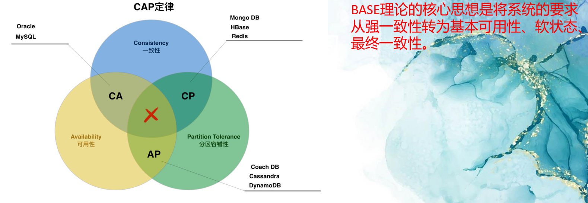
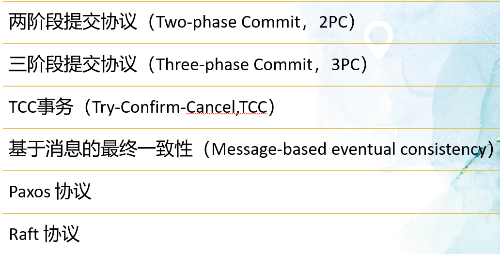
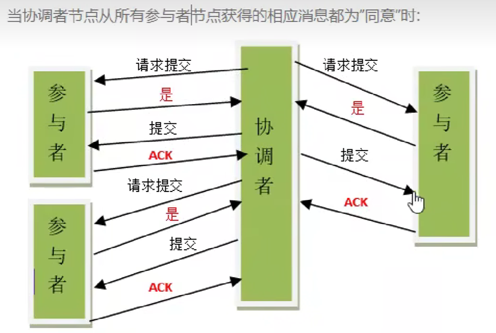
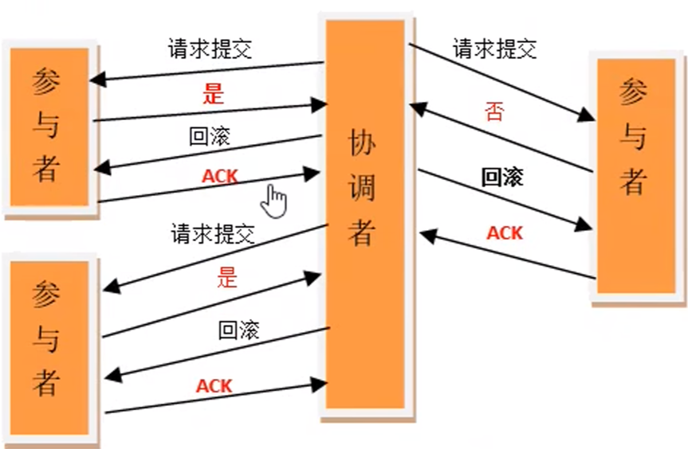
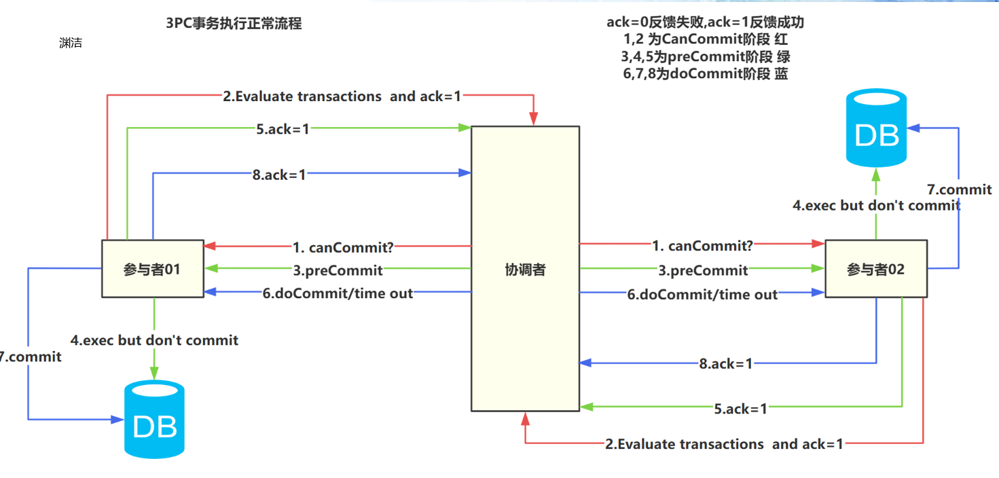
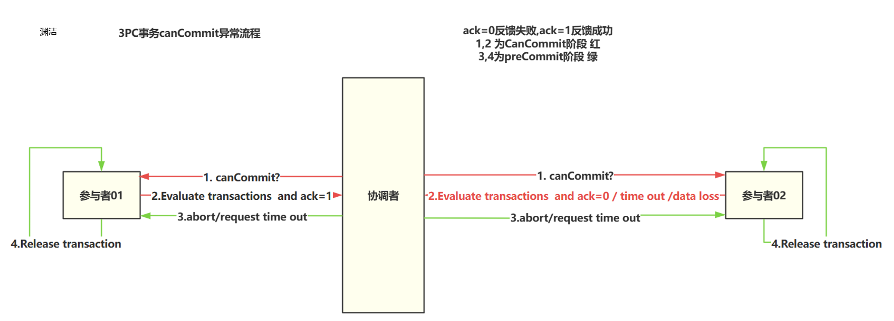
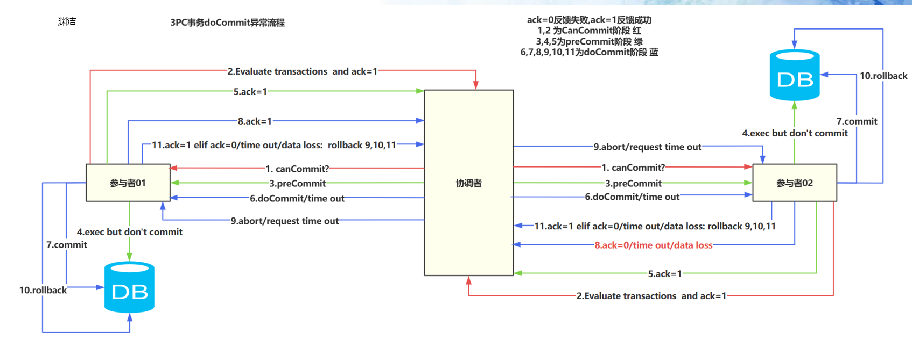
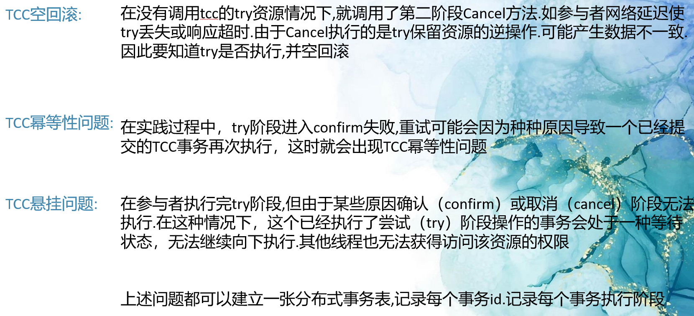
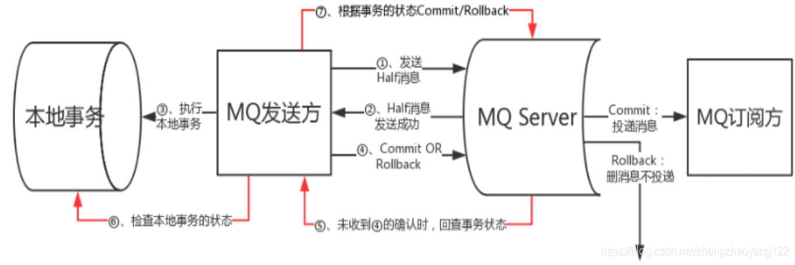

# 分布式事务

[[TOC]]

---

分布式事务: 与常规单机事务不同.
**事务:** 是一组操作，这些操作要么全部被执行，要么全部被回滚，以确保数据的一致性和完整性。
**分布式事务:** 是多个数据库或应用程序之间的网络通信事务，它们协调彼此的提交和回滚，以确保整个事务的完成性。这意味着，分布式事务是由多个本地事务结合的。事务只在单个节点中操作数据，并执行提交或回滚操作。而分布式事务涉及多个节点的事务协调，因此增加了复杂性和开销。

简单讲,事务指的一般是ACID特性.而分布式事务指的是CAP理论.再细化为BASE理论.`本期着重讨论分布式事务`

`常见的解决方案`
`本期讨论2PC,3PC,TCC,消息可靠性保证方案`

## 一.两阶段提交协议(2PC)

**第一阶段: 准备阶段(参与者vote)**
1）协调者节点向所有参与者节点询问是否可以执行提交操作(vote)，并开始等待各参与者节点的响应。
2)参与者节点执行询问发起为止的所有事务操作，并将Undo信息和Redo信息写入日志。(`执行但不提交事务`)
3)各参与者节点响应协调者节点发起的询问。如果参与者节点的事务操作实际执行成功，则它返回一个同意"消息;如果参与者节点的事务操作实际执行失败，则它返回一个"中止"消息。
**第二阶段: 提交/回滚阶段(执行阶段)**
如果协调者收到了参与者的失败消息或者超时直接给每个参与者发送回滚(Rollback)消息;
参与者根据协调者的指令执行提交或者回滚操作，释放所有事务处理过程中便用的锁资源。(注意:必须在最后阶段释放锁资源)

`2PC存在的问题:`
**1.同步阻塞问题:** 执行过程中，所有参与节点都是事务阻塞型的。当参与者占有公共资源时，其他第三方节点访问公共资源不得不处于阻塞状态。
**2.单点故障:** 由于协调者的重要性，一旦协调者发生故障。参与者会一直阻塞下去。尤其在第二阶段，协调者发生故障，那么所有的参与者还都处于锁定事务资源的状态中，而无法继续完成事务操作。(如果是协调者挂掉，可以重新选举一个协调者，但是无法解决因为协调者宕机导致的参与者处于阻塞状态的问题)
**3.数据不一致:** 在二阶段提交的阶段二中，当协调者向参与者发送commit请求之后，发生了局部网络异常或者在发送commit请求过程中协调者发生了故障，这会导致只有一部分参与者接受到了commit请求。而在这部分参与者接到commit请求之后就会执行commit操作。但是其他部分未接到commit请求的机器则无法执行事务提交。于是整个分布式系统便出现了数据不一致性的现象。
**4.二阶段无法解决的问题:** 协调者再发出commit消息之后宕机，而唯一接收到这条消息的参与者同时也宕机了。那么即使协调者通过选举协议产生了新的协调者，这条事务的状态也是不确定的，没人知道事务是否被已经提交。

---

## 二.三阶段提交协议(3PC)

3PC（Three-Phase Commit）是一种改进的分布式事务协议，与2PC相比，它引入了第三个阶段，以解决2PC可能发生长时间阻塞或挂起的问题。在3PC中，事务分为三个阶段：CanCommit、PreCommit和DoCommit。

- 1.  3PC比2PC多了一个can commit阶段，减少了不必要的资源浪费。因为2pc在第一阶段会占用资源，而3PC在这个阶段不占用资源，只是校验一下sql如果不能执行，就直接返回，减少了资源占用。

- 2.引入超时机制。同时在协调者和参与者中都引入超时机制。
    - 2PC:只有协调者有超时机制,超时后，发送回滚指令。
    - 3PC:协调者和参与者都有超时机制。
      协调者超时:发送中断指令。
      参与者超时:pre commit阶段进行中断,do commit阶段进行提交

具体如下图:
`3PC事务执行的正常流程`

`3PC事务canCommit阶段异常流程`

`3PC事务doCommit阶段异常流程`

---

## 三.TCC事务

TCC分布式事务是一种基于两阶段提交协议(Two-Phase Commit)的分布式事务解决方案。TCC是由Try-Confirm-Cancel三个阶段(`Confirm与Cancel阶段互斥`)组成，具体如下：

- Try: 试图执行，预留必要资源。如果资源不足，则回滚并中止事务。

- Confirm: 对所有参与者进行确认，提交所预留的资源。如果任何一个参与者确认失败，则回滚并中止事务。

- Cancel: 撤销所有参与者的执行，释放之前预留的资源。即使在Confirm阶段某个参与者出现了网络故障，也会执行Cancel阶段以保证数据一致性。

TCC分布式事务要求所有参与者都要实现Try、Confirm和Cancel三个操作，同时也需要引入补偿机制以处理到达不确定状态的异常。与传统的两阶段提交协议相比，TCC分布式事务具有更好的可扩展性和容错性，但是需要额外的逻辑和代码实现。

### 3.2 TCC注意事项

## 四.消息可靠性保证

基于消息的最终一致性（Message-based eventual consistency）

