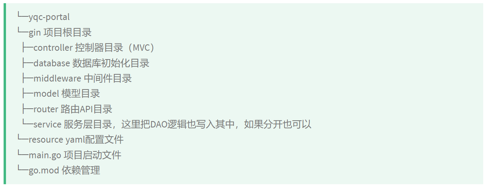
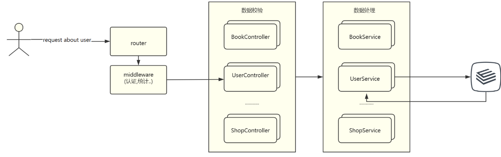

# 基于golang的gin框架和gorm框架的项目结构及演练
@[TOC](文章目录)

---


go学习资料:

[Go编程规范](https://github.com/xxjwxc/uber_go_guide_cn#import-分组)

[Go 语言基础语法 | 菜鸟教程 (runoob.com)](https://www.runoob.com/go/go-basic-syntax.html)

[GORM 指南 | GORM - The fantastic ORM library for Golang, aims to be developer friendly.](https://gorm.io/zh_CN/docs/)

[示例 | Gin Web Framework (gin-gonic.com)](https://gin-gonic.com/zh-cn/docs/examples/)

[lesson10_gin框架返回json_哔哩哔哩_bilibili](https://www.bilibili.com/video/BV1gJ411p7xC?p=10&vd_source=3c2251052802b14d4d8e7afdc95a2c3a)


`项目地址写在文章最后`   [https://github.com/YuanJie2001/gin-gorm-test](https://github.com/YuanJie2001/gin-gorm-test)
# 	一.项目结构

| 主要技术 | 版本   | 描述    |
| -------- | ------ | ------- |
| golang   | v1.20  | --      |
| gin      | v1.9.0 | mvc框架 |
| gorm     |        | ORM框架 |




1.router路由组可以嵌套

2.Gin框架允许开发者在处理请求的过程中，加入用户自己的钩子(Hook)函数。这个钩子函数就叫中间件，中间件适合处理一些公共的业务逻辑，比如登录认证、权限校验、数据分页、记录日志、耗时统计等。

3.gorm框架由后端驱动. 对象生成表结构, 对象的方法操作表结构

执行流程:



# 二.常用命令

```shell
# 设置国内代理下载
go env -w GO111MODULE=on
# 阿里云
go env -w GOPROXY=https://mirrors.aliyun.com/goproxy/,direct

# 1. 引用项目需要的依赖增加到go.mod文件。
# 2. 去掉go.mod文件中项目不需要的依赖。
go mod tidy

# 下载远程依赖库
go get -u url

# 启动项目
go run main.go
```

[项目地址](https://github.com/YuanJie2001/gin-gorm-test)