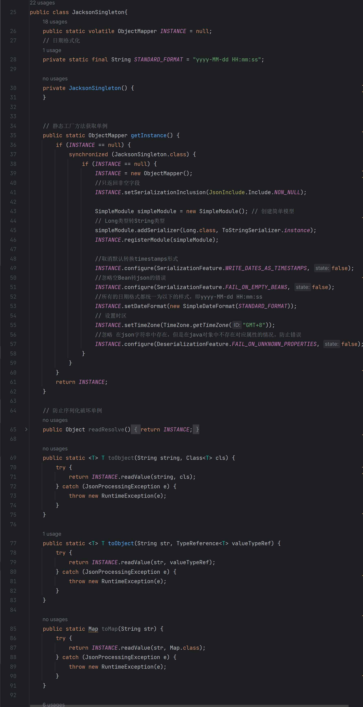
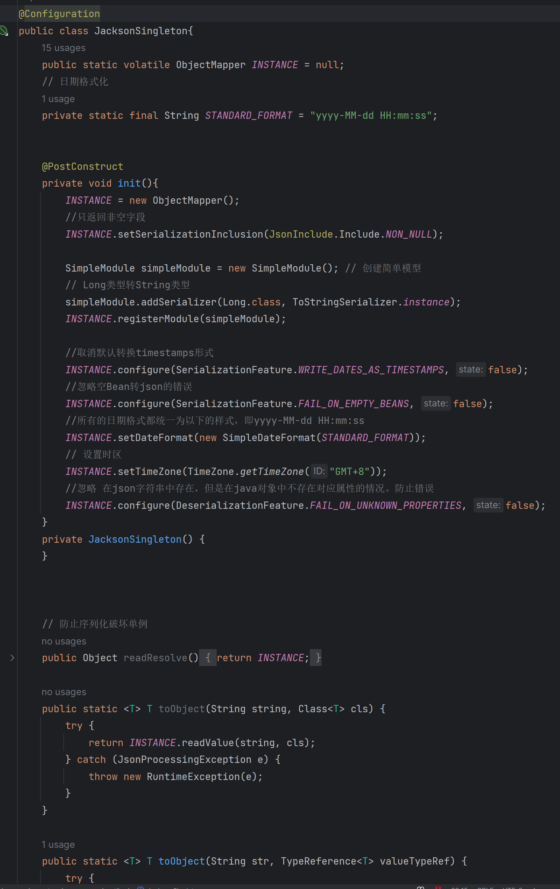

# 封装单例Jackson工具类
[[TOC]]

---

## 前言

为什么不注入spring容器代理.  像这样的无状态的工具类,共享资源配置池,无状态配置类等.都可以不注入.  但是这个工具类不注入spring是因为.如下


`自定义单例写法`


```java
/**
 * @author YuanJie
 * @projectName vector-server
 * @package com.vector.security.utils
 * @className com.vector.security.utils.JackSonSingle
 * @copyright Copyright 2020 vector, Inc All rights reserved.
 * @date 2023/4/17 10:54
 */
public class JacksonSingleton{
    public static volatile ObjectMapper INSTANCE = null;
    // 日期格式化
    private static final String STANDARD_FORMAT = "yyyy-MM-dd HH:mm:ss";

    private JacksonSingleton() {
    }


    // 静态工厂方法获取单例
    public static ObjectMapper getInstance() {
        if (INSTANCE == null) {
            synchronized (JacksonSingleton.class) {
                if (INSTANCE == null) {
                    INSTANCE = new ObjectMapper();
                    //只返回非空字段
                    INSTANCE.setSerializationInclusion(JsonInclude.Include.NON_NULL);

                    SimpleModule simpleModule = new SimpleModule(); // 创建简单模型
                    // Long类型转String类型
                    simpleModule.addSerializer(Long.class, ToStringSerializer.instance);
                    INSTANCE.registerModule(simpleModule);

                    //取消默认转换timestamps形式
                    INSTANCE.configure(SerializationFeature.WRITE_DATES_AS_TIMESTAMPS, false);
                    //忽略空Bean转json的错误
                    INSTANCE.configure(SerializationFeature.FAIL_ON_EMPTY_BEANS, false);
                    //所有的日期格式都统一为以下的样式，即yyyy-MM-dd HH:mm:ss
                    INSTANCE.setDateFormat(new SimpleDateFormat(STANDARD_FORMAT));
                    // 设置时区
                    INSTANCE.setTimeZone(TimeZone.getTimeZone("GMT+8"));
                    //忽略 在json字符串中存在，但是在java对象中不存在对应属性的情况。防止错误
                    INSTANCE.configure(DeserializationFeature.FAIL_ON_UNKNOWN_PROPERTIES, false);
                }
            }
        }
        return INSTANCE;
    }

    // 防止序列化破坏单例
    public Object readResolve() {
        return INSTANCE;
    }

    public static <T> T toObject(String string, Class<T> cls) {
        try {
            return INSTANCE.readValue(string, cls);
        } catch (JsonProcessingException e) {
            throw new RuntimeException(e);
        }
    }

    public static <T> T toObject(String str, TypeReference<T> valueTypeRef) {
        try {
            return INSTANCE.readValue(str, valueTypeRef);
        } catch (JsonProcessingException e) {
            throw new RuntimeException(e);
        }
    }

    public static Map toMap(String str) {
        try {
            return INSTANCE.readValue(str, Map.class);
        } catch (JsonProcessingException e) {
            throw new RuntimeException(e);
        }
    }

    public static String toJson(Object obj) {
        try {
            return INSTANCE.writeValueAsString(obj);
        } catch (JsonProcessingException e) {
            throw new RuntimeException(e);
        }
    }

    public static <T> List<T> toObjectList(String string, TypeReference<List<T>> typeReference) {
        try {
            return INSTANCE.readValue(string, typeReference);
        } catch (Exception e) {
            throw new RuntimeException(e);
        }
    }

    public static JsonNode toTree(String string) {
        try {
            return INSTANCE.readTree(string);
        } catch (JsonProcessingException e) {
            throw new RuntimeException(e);
        }
    }
}

```


`被spring代理写法`



如上对比.我们很容易发现. 第一种方式可以直接objectMapper.function().直接用

而 被spring代理的是当前对象,我需要通过JacksonSingleton.INSTANCE.function().不太优雅

