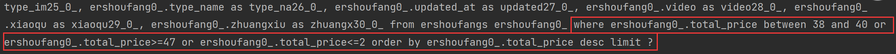
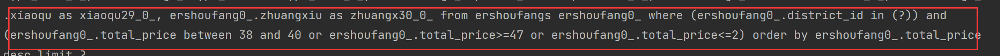

# Spring-Boot-JPA带括号复杂动态查询

[[toc]]

---

查询形如:

```bash
where area in (1,2,6,7) 
and (price<10 
	or price between 15 and 20
	or price >30) 
and (keyword like '%标题%' or keyword like '%简介%')
```

场景描述:
area是地区.可以多选,也可以不选.
price是价格. 可以多选,也可以不选.  
如查询北京,上海的 车价格在20w-30w 以及40w-50w的车量
如查询深圳,上海的 楼房在 15w-30w, 40w以上的房子.
选择动态查询+进一步模糊搜索.
`前端也只给了我们三个字段area,price,keyword`
`后端技术栈也只是JPA`

解决思路:
areaId传形如"1,2,3"的字符串后端切割.也可前端直传一维数组.`以下实例将以"1,2,3"的字符串参数`来解析.
price传二维数组字符串`"[[0,20],[15,20],[30]]"` .对于xxx以下数组用[0,xxx],对于xxx以上用[xxx]来解析.

## 一.Controller层

`设规定前端发送application/json的POST请求`

```java
    public Map getCars(@RequestBody Map<String,String> map) throws JsonProcessingException {
        String page = map.get("page");
        String perPage = map.get("per_page");
        String areaId = map.get("area_id");
        String keyword = map.get("keyword");
		// 类型转化失败将被全局异常处理
        int currentPage = page == null || Integer.parseInt(page) <= 0 ? StatusConstants.CURRENT_PAGE : Integer.valueOf(page);
        int pageSize = perPage == null || Integer.parseInt(perPage) <= 0 ? StatusConstants.PAGE_SIZE : Integer.valueOf(perPage);

        Integer[][] totalPrice = null;
        // jack解析二维数组字符串 解析失败将被全局异常处理
        if(StringUtils.isNotBlank(map.get("total_price"))){
            JsonMapper jsonMapper = new JsonMapper();
            totalPrice = jsonMapper.readValue(map.get("total_price"), Integer[][].class);
        }
        return carsService.getCars(currentPage - 1, pageSize, areaId, totalPrice);
    }
```

---

## 二.Service层

`需要在Mapper层继承JpaRepository<Car, Integer>, JpaSpecificationExecutor<Car>`

```java
	// 封装对地区"1,2,3"解析为集合
    private List<Integer> verifyAreaId(String areaId) {
        if (StringUtils.isBlank(areaId)) {
            return null;
        }
        List<Integer> areaIds = new ArrayList<>();
        String[] split = areaId.split(",");
        for (String s : split) {
            if (StringUtils.isNumeric(s)) {
                areaIds .add(Integer.valueOf(s));
            }
        }
        return areaIds ;
    }
	// 对获取条件选择的cars
	    @Override
    public Map getCars(Integer page, Integer perPage, String areaId, Integer[][] totalPrice,String keyword) {
        // 面向对象 ,反射动态获取排序参数
        Sort.TypedSort<Car> typedSort = Sort.sort(Car.class);
        Sort descending = typedSort.by(Car::getTotalPrice).descending();
        // 获取分页方法
        Pageable pageable = PageRequest.of(page, perPage, descending);
        Map result = new HashMap();

        // 校验有areaId参数
        List<Integer> areaIds = verifyAreaId(areaId);
        // 拼接查询条件
        Specification<Car> queryCondition = (root, query, criteriaBuilder) -> {
            List<Predicate> predicateList = new ArrayList<>();
            // 拼接areaId查询条件
            if (Optional.ofNullable(areaIds).isPresent()) {
                predicateList.add(criteriaBuilder.in(root.get("areaId")).value(areaIds));
            }

            // 拼接totalPrice查询条件
            if (Optional.ofNullable(totalPrice).isPresent()) {
                ArrayList<Object> objects = new ArrayList<>();
                for (Integer[] price : totalPrice) {
                    switch (price.length) {
                        case 2 -> {
                            if (price[0] == 0) {
                                objects.add(criteriaBuilder.lessThanOrEqualTo(root.get("totalPrice"), price[1]));
                            } else {
                                objects.add(criteriaBuilder.between(root.get("totalPrice"), price[0], price[1]));
                            }
                        }
                        case 1 -> objects.add(criteriaBuilder.greaterThanOrEqualTo(root.get("totalPrice"), price[0]));
                        default -> throw new TotalPriceException("价格区间参数错误");
                    }
                }
                // totalPrice查询条件是or的关系
                predicateList.add(criteriaBuilder.or(objects.toArray(new Predicate[0])));
            }
            if(StringUtils.isNotBlank(keyword)){
                predicateList.add(criteriaBuilder.or(criteriaBuilder.like(root.get("title"), "%" + keyword + "%"),
                        criteriaBuilder.like(root.get("detail"), "%" + keyword + "%")));
            }
            // areaId和totalPrice查询条件是and的关系
            return criteriaBuilder.and(predicateList.toArray(new Predicate[0]));
        };

        // 查询
        Page<Car> carPage = carsMapper.findAll(queryCondition, pageable);
        result.put("ok", true);
        result.put("msg", HttpCodeEnum.SUCCESS.getMsg());
        result.put("data", carPage.getContent());
        result.put("total", carPage.getTotalElements());
        return result;
    } 
```

拼接结果

```sql
where (car0_.area_id in (? , ?)) 
and car0_.total_price>=0 
order by car0_.total_price desc limit ?

where car0_.area_id in (?) order by car0_.total_price desc limit ?
```




---

