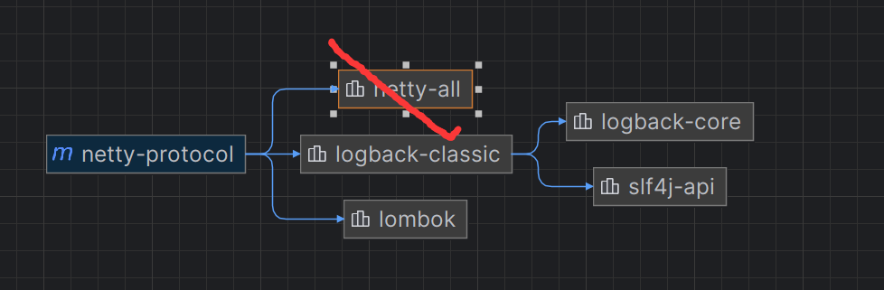
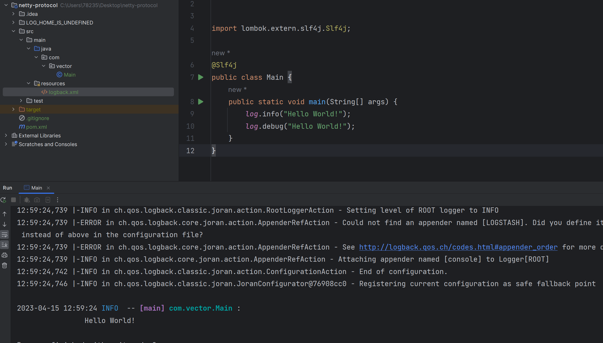

# Maven项目集成Lombok-Log4j日志

[[TOC]]

---

`springboot项目已经为日志系统做了很好的集成.那普通的maven项目还需一定配置`

## 一.引入依赖



```xml
        <dependency>
            <groupId>org.projectlombok</groupId>
            <artifactId>lombok</artifactId>
            <version>1.18.24</version>
            <scope>provided</scope>
        </dependency>

        <dependency>
            <groupId>ch.qos.logback</groupId>
            <artifactId>logback-classic</artifactId>
            <version>1.2.7</version>
        </dependency>
```


---

## 二.配置资源文件

`在maven的resource目录下建立logback.xml`
以下是springboot改良的普通项目log配置内容

```xml
<?xml version="1.0" encoding="UTF-8"?>
<configuration scan="true" scanPeriod="60 seconds" debug="false">
<!--    <include resource="org/springframework/boot/logging/logback/base.xml"/>-->
<!--    <include resource="org/springframework/boot/logging/logback/defaults.xml"/>-->

    <!--获取springboot的yml配置信息-->
<!--    <springProperty scope="context" name="applicationName" source="spring.application.name" defaultValue="default"/>-->
<!--    <springProperty scope="context" name="LOGSTASH_HOST" source="logstash.host" defaultValue="default"/>-->
<!--    <springProperty scope="context" name="LOGSTASH_PORT" source="logstash.port" defaultValue="default"/>-->
<!--    <springProperty scope="context" name="LOG_HOME" source="logstash.path" defaultValue="/mydata/logstash"/>-->

    <!--输出到控制台-->
    <appender name="console" class="ch.qos.logback.core.ConsoleAppender">
        <filter class="ch.qos.logback.classic.filter.ThresholdFilter">
            <level>INFO</level>
        </filter>
        <withJansi>false</withJansi>
        <encoder>
            <!--<pattern>%d %p (%file:%line)- %m%n</pattern>-->
            <!--格式化输出：%d:表示日期    %thread:表示线程名     %-5level:级别从左显示5个字符宽度  %msg:日志消x`x`息    %n:是换行符-->
            <pattern>%d{yyyy-MM-dd HH:mm:ss} %highlight(%-5level) -- %boldMagenta([%thread]) %boldCyan(%logger) :
                %msg%n
            </pattern>
            <charset>UTF-8</charset>
        </encoder>
    </appender>

    <springProfile name="dev,test">
        <!--  日志发送至logstash  -->
<!--        <appender name="LOGSTASH" class="net.logstash.logback.appender.LogstashTcpSocketAppender">-->
<!--            <destination>${LOGSTASH_HOST:- }:${LOGSTASH_PORT:- }</destination>-->
<!--            &lt;!&ndash; encoder is required &ndash;&gt;-->
<!--            <encoder charset="UTF-8" class="net.logstash.logback.encoder.LogstashEncoder">-->
<!--                &lt;!&ndash; 在elasticsearch的index中追加applicationName字段  &ndash;&gt;-->
<!--                <customFields>{"applicationName":"${applicationName}"}</customFields>-->
<!--            </encoder>-->
<!--        </appender>-->
    </springProfile>

    <!-- 按照每天生成日志文件 -->
<!--    <appender name="FILE" class="ch.qos.logback.core.rolling.RollingFileAppender">-->
<!--        <rollingPolicy class="ch.qos.logback.core.rolling.TimeBasedRollingPolicy">-->
<!--            &lt;!&ndash;日志文件输出的文件名&ndash;&gt;-->
<!--            <FileNamePattern>${LOG_HOME}/TestWeb.log.%d{yyyy-MM-dd}.log</FileNamePattern>-->
<!--            &lt;!&ndash;日志文件保留天数&ndash;&gt;-->
<!--            <MaxHistory>30</MaxHistory>-->
<!--        </rollingPolicy>-->
<!--        <encoder charset="UTF-8" class="ch.qos.logback.classic.encoder.PatternLayoutEncoder">-->
<!--            &lt;!&ndash;格式化输出：%d表示日期，%thread表示线程名，%-5level：级别从左显示5个字符宽度%msg：日志消息，%n是换行符&ndash;&gt;-->
<!--            <pattern>%d{yyyy-MM-dd HH:mm:ss.SSS} [%thread] %-5level %logger{50} - %msg%n</pattern>-->
<!--        </encoder>-->
<!--        &lt;!&ndash;日志文件最大的大小&ndash;&gt;-->
<!--        <triggeringPolicy class="ch.qos.logback.core.rolling.SizeBasedTriggeringPolicy">-->
<!--            <MaxFileSize>10MB</MaxFileSize>-->
<!--        </triggeringPolicy>-->
<!--    </appender>-->

    <!-- 日志输出级别 -->
    <!-- 线上环境，日志配置 -->
<!--    <springProfile name="prod">-->
<!--        <root level="INFO">-->
<!--            <appender-ref ref="LOGSTASH"/>-->
<!--        </root>-->
<!--    </springProfile>-->

    <!-- 本地、开发环境，日志配置 可以写logback支持的所有节点 -->
<!--    <springProfile name="dev,test">-->
<!--        <root level="INFO">-->
<!--            <appender-ref ref="LOGSTASH"/>-->
<!--            <appender-ref ref="console"/>-->
<!--        </root>-->
<!--    </springProfile>-->

    <root level="INFO">
        <appender-ref ref="LOGSTASH"/>
        <appender-ref ref="console"/>
    </root>
</configuration>
```

---

## 三.结果

`因为日志设置的info级别,所以只会打印第一句`
