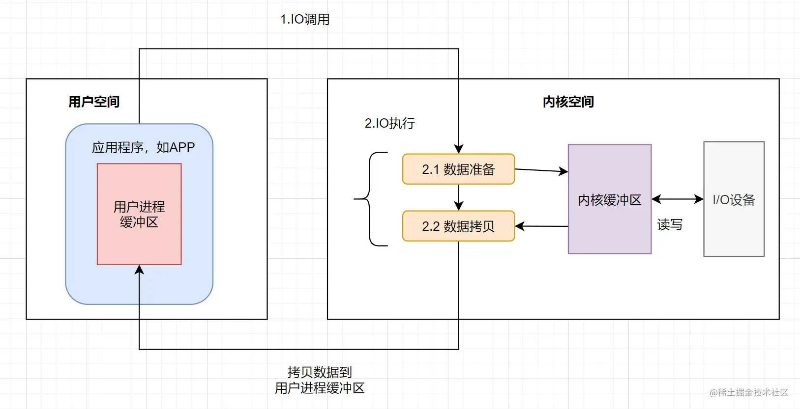

# BIO/NIO/Netty网络通信编程

[[TOC]]

---


## 1 BIO (BLOCK IO)

阻塞io,在C/S端接收请求会阻塞.如下代码.监听连接和接收数据都是阻塞方法.当一个连接建立成功,而不发送数据将导致接收数据处于阻塞状态.无法对后续请求连接做处理.

即便使用多线程,将建立连接后的数据接收用子线程处理.但线程也是有性能瓶颈的,核心线程数不超过cpu核心数,普通线程也要根据机器硬件选择开启数量.而且开启的线程处理都是长连接操作的话.,面对海量用户请求依然无法有空余处理.并发效率低这是BIO的痛点.

一个线程一个read/write


```java
public class SocketTest {
    public static void main(String[] args) throws IOException {
        ServerSocket serverSocket = new ServerSocket(9000);
        while (true) {
            System.out.println("等待连接");
            // 阻塞方法
            Socket socket = serverSocket.accept();
            System.out.println("连接成功");
            handler(socket);
        }
    }

    private static void handler(Socket socket) {
        byte[] bytes = new byte[1024];
        //通过socket获取输入流
        System.out.println("read data..");
        try {
            // 接收客户端的数据，阻塞方法，没有数据可读时就一直等待
            int read = socket.getInputStream().read(bytes);
            if (read != -1) {
                System.out.println("read data:" + new String(bytes, 0, read));
            }
        } catch (IOException e) {
            e.printStackTrace();
        }
    }
}

```

## 2. NIO (new IO)

NIO有三大核心部分: Channel(通道)，Buffer(缓冲区),Selector(选择器)
NIO是面向缓冲区,或者面向块编程的。数据读取到一个它稍后处理的缓冲区,需要时可在缓冲区中前后移动，这就增加了处理过程中的灵活性,使用它可以提供非阻塞式的高伸缩性网络.

解决BIO的阻塞问题.但依然存在的问题是.请求过多,而真正发送数据的连接很少.导致循环接收请求有效次占比不高.浪费资源. 死循环程序占用cpu资源高.

一个线程管理多个sockchannel


### 2.1 NIO-Buffer缓冲区

| 属性 | 描述                                                         |
| ---- | ------------------------------------------------------------ |
|      |  |

|
|Capacity|容量,即可以容纳的最大数据量;在缓冲区创建时被设定并且不能改变.缓冲创建时，limit 的值等于 capacity 的值|
|Limit|表示缓冲区的当前终点,不能对缓冲区超过极限的位置进行读写操作.且极限是可以修改的|
|Position|位置.下一个要被读或写的元素的索引,每次读写缓冲区数据时都会改变值,为下次读写作准备|
|Mark|一个备忘位置。标记在设定前是未定义的(undefined)。使用场景是，假设缓冲区中有 10 个元素，position 目前的位置为 2(也就是如果get的话是第三个元素)，现在只想发送 6 - 10 之间的缓冲数据，此时我们可以 buffer.mark(buffer.position())，即把当前的 position 记入 mark 中，然后 buffer.postion(6)，此时发送给 channel 的数据就是 6 - 10 的数据。发送完后，我们可以调用 buffer.reset() 使得 position = mark，因此这里的 mark 只是用于临时记录一下位置用的。|


### 2.2 NIO-Buffer分散读-集中写

`分散读`

```java
    public static void main(String[] args) {
        try (FileChannel channel = new RandomAccessFile("words.txt", "r").getChannel()) {
            // 分散读 words->onetwothree
            ByteBuffer buffer1 = ByteBuffer.allocate(3);
            ByteBuffer buffer2 = ByteBuffer.allocate(3);
            ByteBuffer buffer3 = ByteBuffer.allocate(5);
            channel.read(new ByteBuffer[]{buffer1, buffer2, buffer3});
            buffer1.flip();
            buffer2.flip();
            buffer3.flip();
            System.out.println(new String(buffer1.array(), 0, buffer1.limit()));
            System.out.println(new String(buffer2.array(), 0, buffer2.limit()));
            System.out.println(new String(buffer3.array(), 0, buffer3.limit()));
        } catch (IOException e) {
            System.out.println(e.getMessage());
        };
    }
```

`集中写`

```java
    public static void main(String[] args) {
        ByteBuffer buffer1 = StandardCharsets.UTF_8.encode("hello");
        ByteBuffer buffer2 = StandardCharsets.UTF_8.encode("world");
        ByteBuffer buffer3 = StandardCharsets.UTF_8.encode("java");
        try (FileChannel channel = new RandomAccessFile("helloword.txt", "rw").getChannel()) {
            channel.write(new ByteBuffer[]{buffer1, buffer2, buffer3});
        } catch (IOException e) {
            System.out.println(e.getMessage());
        };
    }
```

### 2.3 NIO-Buffer粘包半包

粘包:


半包:

`粘包半包处理(效率低版,要理解)`

```java
    public static void main(String[] args) {
        /**
         * 模拟粘包
         * Hello,world\n
         * I'm zhangsan\n
         * How are you?\n
         * 粘包后
         * Hello,world\nI'm zhangsan\nHo
         * w are you?\n
         */
        ByteBuffer source = ByteBuffer.allocate(32);
        source.put("Hello,world\nI'm zhangsan\nHo".getBytes());
        split(source);
        source.put("w are you?\n".getBytes());
        split(source);
    }

    private static void split(ByteBuffer source) {
        // 读当前这一条数据
        source.flip();
        for (int i = 0; i < source.limit(); i++) {
            // 找到一条完整的数据 不移动position 粘包处理
            if(source.get(i) == '\n'){
                // 把这条消息存入新的buffer
                int length = i + 1 - source.position();
                ByteBuffer target = ByteBuffer.allocate(length);
                // 从source中读取数据到target
                for (int j = 0; j < length; j++) {
                    // 读取数据后,position会自动+1
                    target.put(source.get());
                }
            };
        }
        // 切换写模式,写下一条数据. 不能用clear.需要接收上一条数据的剩余数据 半包处理
        source.compact();
    }
```

### 2.4 NIO-Channel

- 通道可以同时进行读写,而流只能读或者只能写通道
- 可以实现异步读写教据
- 通道可以从缓冲读数据，也可以写数据到缓冲

#### 2.4.1 files相关操作

`channel数据拷贝,底层使用操作系统0拷贝.一次最多传2G`

```java
    public static void main(String[] args) throws IOException {
        FileChannel from = new FileInputStream("data.txt").getChannel();
        FileChannel to = new FileOutputStream("to.txt").getChannel();
        // 从0开始，读取from.size()个字节，写入到to中
        // channel数据拷贝,底层使用操作系统0拷贝.一次最多传2G
        long size = from.size();
        // count > 0 说明还有数据没有拷贝
        for(long count = size; count > 0;){
            // 从from的size-count位置开始，读取count个字节，写入到to中
            count -= from.transferTo((size-count), count, to);
        }
        from.transferTo(0, from.size(), to);
    }
```

`遍历文件夹`

```java
    public static void main(String[] args) throws IOException {
        AtomicInteger dirCount = new AtomicInteger();
        AtomicInteger fileCount = new AtomicInteger();
        Files.walkFileTree(Paths.get(System.getProperty("user.dir")),new SimpleFileVisitor<Path>(){
            @Override
            public FileVisitResult preVisitDirectory(Path dir, BasicFileAttributes attrs) throws IOException {
                System.out.println("====>"+dir);
                dirCount.incrementAndGet();
                return super.preVisitDirectory(dir, attrs);
            }

            @Override
            public FileVisitResult visitFile(Path file, BasicFileAttributes attrs) throws IOException {
                if (file.toString().endsWith(".java")){
                    fileCount.incrementAndGet();
                    System.out.println(file);
                }
                return FileVisitResult.CONTINUE;
            }
        });
        System.out.println("dirCount:"+dirCount.get());
        System.out.println("fileCount:"+fileCount.get());
    }
```

`递归删除,危险代码`

```java
    public static void main(String[] args) throws IOException {
        Files.walkFileTree(Paths.get(System.getProperty("user.dir")),new SimpleFileVisitor<Path>() {
            @Override
            public FileVisitResult preVisitDirectory(Path dir, BasicFileAttributes attrs) throws IOException {
                return super.preVisitDirectory(dir, attrs);
            }

            @Override
            public FileVisitResult visitFile(Path file, BasicFileAttributes attrs) throws IOException {
                Files.delete(file);
                return super.visitFile(file, attrs);
            }

            @Override
            public FileVisitResult postVisitDirectory(Path dir, IOException exc) throws IOException {
                Files.delete(dir);
                return super.postVisitDirectory(dir, exc);
            }
        });
    }
```

`递归拷贝`

```java
    public static void main(String[] args) throws IOException {
        String source = "D:\\test\\";
        String target = "D:\\test1\\";
        Files.walk(Paths.get(source)).forEach(path -> {
            String targetName = path.toString().replace(source, target);
            try {
                if (Files.isDirectory(path)) { // 是文件夹
                    Files.createDirectory(Paths.get(targetName));
                } else if (Files.isRegularFile(path)) { // 是文件
                    Files.copy(path, Paths.get(targetName));
                }
            } catch (IOException e) {
                e.printStackTrace();
            }
        });
    }
```

#### 2.4.2 channel网络通信


`客户端-服务端网络通信demo`
分两组选择器

- 单线程配一个选择器，专门处理 accept 事件
- 创建 cpu 核心数的线程，每个线程配一个选择器，轮流处理 read 事件


`IO频繁,cpu使用不频繁参考阿姆达尔定律`

```java
@Slf4j
public class WriteClient {
    public static void main(String[] args) throws IOException {
        new BossEventLoop().register();
    }


    @Slf4j
    static class BossEventLoop implements Runnable {
        // boss线程 用于接收客户端连接 连接
        private Selector boss;
        // worker线程 用于处理客户端请求 读写
        private WorkerEventLoop[] workers;
        // 避免重复创建线程
        private volatile boolean start = false;
        AtomicInteger index = new AtomicInteger();

        public void register() throws IOException {
            if (!start) {
                // 创建一个ServerSocketChannel
                ServerSocketChannel ssc = ServerSocketChannel.open();
                // 绑定端口
                ssc.bind(new InetSocketAddress(8080));
                // 设置为非阻塞
                ssc.configureBlocking(false);
                // 创建一个boss线程用于接收客户端连接
                boss = Selector.open();
                SelectionKey ssckey = ssc.register(boss, 0, null);
                // 设置为接收连接事件
                ssckey.interestOps(SelectionKey.OP_ACCEPT);
                // 创建worker线程用于处理客户端请求
                workers = initEventLoops();
                // 启动线程
                new Thread(this, "boss").start();
                log.debug("boss start...");
                start = true;
            }
        }

        /**
         * 初始化worker线程
         * @return
         */
        public WorkerEventLoop[] initEventLoops() {
//        EventLoop[] eventLoops = new EventLoop[Runtime.getRuntime().availableProcessors()];
            WorkerEventLoop[] workerEventLoops = new WorkerEventLoop[2];
            for (int i = 0; i < workerEventLoops.length; i++) {
                // 创建worker线程
                workerEventLoops[i] = new WorkerEventLoop(i);
            }
            return workerEventLoops;
        }

        @Override
        public void run() {
            while (true) {
                try {
                    // 阻塞等待事件
                    boss.select();
                    // 获取事件
                    Iterator<SelectionKey> iter = boss.selectedKeys().iterator();
                    while (iter.hasNext()) {
                        SelectionKey key = iter.next();
                        iter.remove();
                        if (key.isAcceptable()) {
                            ServerSocketChannel c = (ServerSocketChannel) key.channel();
                            // 获取客户端连接
                            SocketChannel sc = c.accept();
                            sc.configureBlocking(false);
                            log.debug("{} connected", sc.getRemoteAddress());
                            // 将客户端连接注册到worker线程
                            workers[index.getAndIncrement() % workers.length].register(sc);
                        }
                    }
                } catch (IOException e) {
                    e.printStackTrace();
                }
            }
        }
    }

    @Slf4j
    static class WorkerEventLoop implements Runnable {
        private Selector worker;
        private volatile boolean start = false;
        private int index;

        private final ConcurrentLinkedQueue<Runnable> tasks = new ConcurrentLinkedQueue<>();

        public WorkerEventLoop(int index) {
            this.index = index;
        }

        public void register(SocketChannel sc) throws IOException {
            if (!start) {
                worker = Selector.open();
                new Thread(this, "worker-" + index).start();
                start = true;
            }
            // 线程间通信 通过队列
            tasks.add(() -> {
                try {
                    SelectionKey sckey = sc.register(worker, 0, null);
                    sckey.interestOps(SelectionKey.OP_READ);
                    worker.selectNow();
                } catch (IOException e) {
                    e.printStackTrace();
                }
            });
            // 唤醒worker线程 防止被select阻塞
            worker.wakeup();
        }

        @Override
        public void run() {
            while (true) {
                try {
                    // 阻塞等待事件
                    worker.select();
                    // 线程间通信 通过队列
                    Runnable task = tasks.poll();
                    if (task != null) {
                        task.run();
                    }
                    Set<SelectionKey> keys = worker.selectedKeys();
                    Iterator<SelectionKey> iter = keys.iterator();
                    while (iter.hasNext()) {
                        SelectionKey key = iter.next();
                        if (key.isReadable()) {
                            SocketChannel sc = (SocketChannel) key.channel();
                            ByteBuffer buffer = ByteBuffer.allocate(128);
                            try {
                                int read = sc.read(buffer);
                                if (read == -1) {
                                    key.cancel();
                                    sc.close();
                                } else {
                                    buffer.flip();
                                    log.debug("{} message:", sc.getRemoteAddress());
                                    System.out.println(buffer);
                                }
                            } catch (IOException e) {
                                e.printStackTrace();
                                key.cancel();
                                sc.close();
                            }
                        }
                        iter.remove();
                    }
                } catch (IOException e) {
                    e.printStackTrace();
                }
            }
        }
    }
}


```

### 2.4.3 处理消息边界


TLV即像计算机网络数据报文.分为消息头和消息体.
在2.3中我们曾用分隔符解析粘包边界问题

### 2.4.4 buffer大小分配


### 2.4.5 处理大量写事件

```java
    public static void main(String[] args) throws IOException {
        ServerSocketChannel socketChannel = ServerSocketChannel.open();
        socketChannel.configureBlocking(false);
        Selector selector = Selector.open();
        // 注册到selector，等待连接
        socketChannel.register(selector, SelectionKey.OP_ACCEPT);
        socketChannel.bind(new InetSocketAddress(8080));
        while (true) {
            selector.select();
            Set<SelectionKey> selectionKeys = selector.selectedKeys();
            for (SelectionKey selectionKey : selectionKeys) {
                if (selectionKey.isAcceptable()) {
                    SocketChannel client = socketChannel.accept();
                    client.configureBlocking(false);
                    SelectionKey registerClient = client.register(selector, SelectionKey.OP_READ);
                    // 向客户端发送大量消息
                    StringBuilder sb = new StringBuilder();
                    for (int i = 0; i < 30000000; i++) {
                        sb.append("a");
                    }
                    ByteBuffer buffer = ByteBuffer.wrap(sb.toString().getBytes());
                    // 返回值为写入的字节数
                    int write = client.write(buffer);
                    System.out.println(write);
                    // 判断是否写完
                    if (buffer.hasRemaining()) {
                        // 关注可写事件
                        registerClient.interestOps(SelectionKey.OP_WRITE + SelectionKey.OP_READ);
                        // 将未写完的数据放入到SelectionKey中
                        registerClient.attach(buffer);
                    }
                }else if (selectionKey.isWritable()) {
                    SocketChannel client = (SocketChannel) selectionKey.channel();
                    ByteBuffer buffer = (ByteBuffer) selectionKey.attachment();
                    int write = client.write(buffer);
                    System.out.println(write);
                    // 清理操作
                    if(!buffer.hasRemaining()) {
                        selectionKey.attach(null);
                        selectionKey.interestOps(selectionKey.interestOps() - SelectionKey.OP_WRITE);
                    }
                }

            }
            selectionKeys.clear();
        }

    }
```

---

### 2.5 selector-Epoll


selector多路复用选择器底层调用jdk DefaultSelectorProvider.在window,linux,unix,等中,jdk内部实现不同,但函数名相同.

windows

Linux


调用本地方法,c语言函数

是linux内核epoll_create()系统函数.epoll结构体调用存储对象信息.
`man epoll_create`


### 2.6 IO模型


-- 图片引自掘金 看一遍就理解：IO模型详解

- 1.阻塞IO: 在用户线程向内核线程读取数据时,需要阻塞等待内核线程返回数据资源.
- 2.非阻塞IO: 在用户线程向内核线程读取数据时,没获取到也立即返回结果.进行不断重试读取直到数据拷贝数据时被阻塞.
- 3.多路复用:  seletor监听系统内核线程事件,可以监听多个channel需要的事件.数据拷贝时阻塞.
- 4.信号驱动
- 5.异步IO

同步: 发送方单线程处理一个事件的请求与响应.
异步: 发送方一个线程负责请求,接收方一个线程负责响应.

BIO属于同步阻塞IO
NIO属于同步多路复用IO
AIO属于异步非阻塞IO

[详见看一遍就理解：IO模型详解](https://juejin.cn/post/7036518015462015006)

### 2.7 零拷贝

零拷贝: 不需要在java内存中缓存数据. 内核态线程直接从磁盘拷贝到网卡
传统的 IO 将一个文件通过 socket 写出

```java
File f = new File("helloword/data.txt");
RandomAccessFile file = new RandomAccessFile(file, "r");

byte[] buf = new byte[(int)f.length()];
file.read(buf);

Socket socket = ...;
socket.getOutputStream().write(buf);
```


* 用户态与内核态的切换发生了 3 次，这个操作比较重量级
* 数据拷贝了共 4 次

#### NIO 优化


---

## 三.Netty

Netty 是一个异步(非异步IO,指多线程)的、基于事件驱动的网络应用框架，用于快速开发可维护、高性能的网络服务器和客户端

* Netty vs NIO，工作量大，bug 多
    * 需要自己构建协议
    * 解决 TCP 传输问题，如粘包、半包
    * epoll 空轮询导致 CPU 100%
    * 对 API 进行增强，使之更易用，如 FastThreadLocal => ThreadLocal，ByteBuf => ByteBuffer


`server端`

```java
public class Server {
    public static void main(String[] args) {
        // 服务端启动引导类
        new ServerBootstrap()
                .group(new NioEventLoopGroup()) // 服务端接收连接线程组 BossEventLoop,WorkerEventLoop
                .channel(NioServerSocketChannel.class) // 指定服务端通道ServerSocketChannel实现类型
                .childHandler(new ChannelInitializer<NioSocketChannel>() { // 指定客户端通道类型,决定了workerEventLoop执行的任务
                    /**
                     * 客户端通道初始化 用于添加处理器
                     * @param nioSocketChannel
                     * @throws Exception
                     */
                    @Override
                    protected void initChannel(NioSocketChannel nioSocketChannel) throws Exception {
                        nioSocketChannel.pipeline().addLast(new StringDecoder()); // 字符串解码器 将ByteBuf转换为字符串
                        nioSocketChannel.pipeline().addLast(new ChannelInboundHandlerAdapter(){ // 自定义处理器
                            @Override // 读取客户端发送的数据
                            public void channelRead(ChannelHandlerContext ctx, Object msg) throws Exception {
                                // 打印上一步解码后的字符串
                                System.out.println(msg);
                            }
                        });
                    }
                }).bind(8080); // 绑定端口
    }
}
```


`client端`

```java
public class Client {
    public static void main(String[] args) throws InterruptedException {
        // 客户端启动引导类
        new Bootstrap()
                // 指定客户端线程组
                .group(new NioEventLoopGroup())
                // 指定客户端通道类型
                .channel(NioSocketChannel.class)
                // 指定客户端处理器
                .handler(new ChannelInitializer<NioSocketChannel>() {
                    @Override // 客户端通道初始化
                    protected void initChannel(NioSocketChannel nioSocketChannel) throws Exception {
                        // 添加处理器 用于处理客户端发送的数据
                        nioSocketChannel.pipeline().addLast(new StringEncoder()); // 字符串编码器 将字符串转换为ByteBuf
                    }
                })
                // 异步非阻塞 main发起了调用，真正执行connect 是 nio线程
                .connect(new InetSocketAddress("localhost", 8080))// 连接服务端
                .sync()// 主线程阻塞等待NIO线程连接成功
                .channel() // 获取客户端通道
                .writeAndFlush("hello,world"); // 向服务端发送数据

    }
}

```

### 3.1 EventLoop

事件循环对象

EventLoop 本质是一个单线程执行器（同时维护了一个 Selector），里面有 run 方法处理 Channel 上源源不断的 io 事件。

它的继承关系比较复杂

* 一条线是继承自 j.u.c.ScheduledExecutorService 因此包含了线程池中所有的方法
* 另一条线是继承自 netty 自己的 OrderedEventExecutor，
    * 提供了 boolean inEventLoop(Thread thread) 方法判断一个线程是否属于此 EventLoop
    * 提供了 parent 方法来看看自己属于哪个 EventLoopGroup


事件循环组

EventLoopGroup 是一组 EventLoop，Channel 一般会调用 EventLoopGroup 的 register 方法来绑定其中一个 EventLoop，后续这个 Channel 上的 io 事件都由此 EventLoop 来处理（保证了 io 事件处理时的线程安全） 也实现了轮询公平分发.

* 继承自 netty 自己的 EventExecutorGroup
    * 实现了 Iterable 接口提供遍历 EventLoop 的能力
    * 另有 next 方法获取集合中下一个 EventLoop

NioEventLoop 处理 io 事件:
两个NioEventLoop 线程轮流处理 channel，但一旦建立连接,NioEventLoop线程与 channel 之间进行了绑定


`server`

```java
new ServerBootstrap()
    .group(new NioEventLoopGroup(1), new NioEventLoopGroup(2))
    .channel(NioServerSocketChannel.class)
    .childHandler(new ChannelInitializer<NioSocketChannel>() {
        @Override
        protected void initChannel(NioSocketChannel ch) {
            ch.pipeline().addLast(new ChannelInboundHandlerAdapter() {
                @Override
                public void channelRead(ChannelHandlerContext ctx, Object msg) {
                    ByteBuf byteBuf = msg instanceof ByteBuf ? ((ByteBuf) msg) : null;
                    if (byteBuf != null) {
                        byte[] buf = new byte[16];
                        ByteBuf len = byteBuf.readBytes(buf, 0, byteBuf.readableBytes());
                        log.debug(new String(buf));
                    }
                }
            });
        }
    }).bind(8080).sync();
// 由NIO异步线程调用
// channelFuture.addListener((ChannelFutureListener) future -> {
//    System.out.println(future.channel()); // 2
//});
```


#### 3.1.1 EventLoop细分

`server`

```java
        // 处理耗时长的任务
        DefaultEventLoopGroup normalWorkers = new DefaultEventLoopGroup(2);
        // 服务端启动引导类
        new ServerBootstrap()
                // 指定服务端线程组 1个用于接收客户端连接 2个用于处理客户端连接
                .group(new NioEventLoopGroup(), new NioEventLoopGroup(2))
                // 指定服务端通道类型
                .channel(NioServerSocketChannel.class)
                // 指定服务端处理器
                .childHandler(new ChannelInitializer<NioSocketChannel>() {
                    @Override
                    protected void initChannel(NioSocketChannel ch) {
                        // 添加处理器 用于处理客户端发送的数据
                        ch.pipeline().addLast(new LoggingHandler(LogLevel.DEBUG));
                        // 用额外的线程池处理耗时长的任务,防止阻塞当前线程处理后续客户端事件
                        ch.pipeline().addLast(normalWorkers, "myhandler",
                                new ChannelInboundHandlerAdapter() {
                                    @Override
                                    public void channelRead(ChannelHandlerContext ctx, Object msg) {
                                        ByteBuf byteBuf = msg instanceof ByteBuf ? ((ByteBuf) msg) : null;
                                        if (byteBuf != null) {
                                            byte[] buf = new byte[16];
                                            ByteBuf len = byteBuf.readBytes(buf, 0, byteBuf.readableBytes());
                                            System.out.println(new String(buf));
                                        }
                                        // 通知后续处理器处理
                                        ctx.fireChannelRead(msg);
                                    }
                                });
                    }
                }).bind(8080).sync();
```


#### 3.1.2 处理器切换线程处理原理

判断下一个处理器线程是否和当前线程一致.


### 3.2 channel

channel 的主要作用

* close() 可以用来关闭 channel
* closeFuture() 用来处理 channel 的关闭
    * sync 方法作用是同步等待 channel 关闭
    * 而 addListener 方法是异步等待 channel 关闭
* pipeline() 方法添加处理器
* write() 方法将数据写入
* writeAndFlush() 方法将数据写入并刷出

#### 3.2.1 关闭连接后善后操作

关闭是异步操作,所以需要注意善后操作执行

```java
@Slf4j
public class CloseFutureClient {
    public static void main(String[] args) throws InterruptedException {
        NioEventLoopGroup group new NioEventLoopGroup();
        ChannelFuture channelFuture = new Bootstrap()
                .group(group)
                .channel(NioSocketChannel.class)
                .handler(new ChannelInitializer<NioSocketChannel>() {
                    @Override // 在连接建立后被调用
                    protected void initChannel(NioSocketChannel ch) throws Exception {
                        ch.pipeline().addLast(new LoggingHandler(LogLevel.DEBUG));
                        ch.pipeline().addLast(new StringEncoder());
                    }
                })
                .connect(new InetSocketAddress("localhost", 8080));
        Channel channel = channelFuture.sync().channel();
        log.debug("{}", channel);
        new Thread(()->{
            Scanner scanner = new Scanner(System.in);
            while (true) {
                String line = scanner.nextLine();
                if ("q".equals(line)) {
                    channel.close(); // close 异步操作 1s 之后
//                    log.debug("处理关闭之后的操作"); // 不能在这里善后
                    break;
                }
                channel.writeAndFlush(line);
            }
        }, "input").start();

        // 获取 CloseFuture 对象， 1) 同步处理关闭， 2) 异步处理关闭
        ChannelFuture closeFuture = channel.closeFuture();
        /*log.debug("waiting close...");
        closeFuture.sync();
        log.debug("处理关闭之后的操作");*/
        closeFuture.addListener(new ChannelFutureListener() {
            @Override
            public void operationComplete(ChannelFuture future) throws Exception {
                log.debug("处理关闭之后的操作");
                // NIO关闭后,还需关闭其他NioEventLoopGroup中的线程
                group.shutdownGracefully();
            }
        });
    }
}
```

### 3.3 netty为什么这么多异步

从上述代码我们可以看到,netty大多方法为异步方法.不能想当然的认为下一行代码就一定比当前行后执行. 都需要异步回调或者当前线程阻塞等待其他线程完成处理.那引入异步操作更麻烦了,为啥还要交给其他线程处理呢?

首先说明: 异步线程并没有实质上提高效率,但提高了吞吐量.

`解释: 负责连接任务的线程将关闭连接任务,事件监听任务和事件处理任务交给工作线程处理.这意味着连接线程只用处理连接任务.则他的吞吐量将变的非常高.会更难因为连接数量过多而熔断. 效率没提高是因为处理一个连接的流程是有序的,不会因为异步而少做什么.所以相同时间段效率是相同的.只是异步接收了更多的任务.但剩余那部分任务流程还没处理完.而且因为线程间任务交付还可能增加时间.`

### 3.4 Promise


```java
DefaultEventLoop eventExecutors = new DefaultEventLoop();
DefaultPromise<Integer> promise = new DefaultPromise<>(eventExecutors);

eventExecutors.execute(()->{
    try {
        Thread.sleep(1000);
    } catch (InterruptedException e) {
        e.printStackTrace();
    }
    log.debug("set success, {}",10);
    promise.setSuccess(10);
});

log.debug("start...");
log.debug("{}",promise.getNow()); // 还没有结果
log.debug("{}",promise.get());
```


```java
DefaultEventLoop eventExecutors = new DefaultEventLoop();
DefaultPromise<Integer> promise = new DefaultPromise<>(eventExecutors);

// 设置回调，异步接收结果
promise.addListener(future -> {
    // 这里的 future 就是上面的 promise
    log.debug("{}",future.getNow());
});

// 等待 1000 后设置成功结果
eventExecutors.execute(()->{
    try {
        Thread.sleep(1000);
    } catch (InterruptedException e) {
        e.printStackTrace();
    }
    log.debug("set success, {}",10);
    promise.setSuccess(10);
});

log.debug("start...");
```


### 3.5 Handler&PipeLine

ChannelHandler 用来处理 Channel 上的各种事件，分为入站、出站两种。所有 ChannelHandler 被连成一串，就是 Pipeline

* 入栈处理器通常是 ChannelInboundHandlerAdapter 的子类，主要用来读取客户端数据，写回结果
* 出栈处理器通常是 ChannelOutboundHandlerAdapter 的子类，主要对写回结果进行加工
  
  `super.channelRead(ctx, msg) ;`唤醒下一个入栈处理器.如下图所示
  
  不调super.channelRead(ctx, msg)或 ctx.fireChannelRead(msg) 会使处理器无法进行后续处理,同时`必须使用ctx的Channel对象写操作.拿入栈的ctx只会从当前位置向前找出栈处理器`.如下图所示
  

### 3.6 ByteBuf

* 池化 - 可以重用池中 ByteBuf 实例，更节约内存，减少内存溢出的可能
* 读写指针分离，不需要像 ByteBuffer 一样切换读写模式
* 可以自动扩容
* 支持链式调用，使用更流畅
* 很多地方体现零拷贝，例如 slice、duplicate、CompositeByteBuf

#### 3.6.1 直接内存 和 堆内存

上文我们讲过零拷贝.直接内存就是只在系统线程进行的操作. 堆内存则需要将系统数据读到用户线程,再由用户线程写入系统线程.
可以使用下面的代码来创建池化基于堆的 ByteBuf

```java
ByteBuf buffer = ByteBufAllocator.DEFAULT.heapBuffer(10);
```

也可以使用下面的代码来创建池化基于直接内存的 ByteBuf

```java
ByteBuf buffer = ByteBufAllocator.DEFAULT.directBuffer(10);
```

* 直接内存创建和销毁的代价昂贵，但读写性能高（少一次内存复制），适合配合池化功能一起用
* 直接内存对 GC 压力小，因为这部分内存不受 JVM 垃圾回收的管理，但也要注意及时主动释放

#### 3.6.2 池化和非池化

池化的最大意义在于可以重用 ByteBuf，优点有

* 没有池化，则每次都得创建新的 ByteBuf 实例，这个操作对直接内存代价昂贵，就算是堆内存，也会增加 GC 压力
* 有了池化，则可以重用池中 ByteBuf 实例，并且采用了与 jemalloc 类似的内存分配算法提升分配效率
* 高并发时，池化功能更节约内存，减少内存溢出的可能

池化功能是否开启，可以通过下面的系统环境变量来设置

```java
-Dio.netty.allocator.type={unpooled|pooled}
```

#### 3.6.3 ByteBuf组成


ByteBuff读写指针共用一个指针.需要切换读写模式.
ByteBuf则读写两个指针,还支持动态扩容.但不能超过最大容量限制

#####  写入


##### 扩容

扩容规则是

* 如何写入后数据大小未超过 512，则选择下一个 16 的整数倍，例如写入后大小为 12 ，则扩容后 capacity 是 16
* 如果写入后数据大小超过 512，则选择下一个 2^n，例如写入后大小为 513，则扩容后 capacity 是 2^10=1024（2^9=512 已经不够了）
* 扩容不能超过 max capacity 会报错

##### 读取

读过的内容，就属于废弃部分了，再读只能读那些尚未读取的部分.
如果需要重复读取 int 整数 5，怎么办？
可以在 read 前先做个标记 mark

```java
buffer.markReaderIndex();
System.out.println(buffer.readInt());
log(buffer);
```

这时要重复读取的话，重置到标记位置 reset

```java
buffer.resetReaderIndex();
log(buffer);
```

##### `内存释放`

由于 Netty 中有堆外内存的 ByteBuf 实现，堆外内存最好是手动来释放，而不是等 GC 垃圾回收。

* UnpooledHeapByteBuf 使用的是 JVM 内存，只需等 GC 回收内存即可
* UnpooledDirectByteBuf 使用的就是直接内存了，需要特殊的方法来回收内存
* PooledByteBuf 和它的子类使用了池化机制，需要更复杂的规则来回收内存

GC用的可达性分析. 而Netty 这里采用了引用计数法来控制回收内存，每个 ByteBuf 都实现了 ReferenceCounted 接口

* 每个 ByteBuf 对象的初始计数为 1
* 调用 release 方法计数减 1，如果计数为 0，ByteBuf 内存被回收
* 调用 retain 方法计数加 1，表示调用者没用完之前，其它 handler 即使调用了 release 也不会造成回收
* 当计数为 0 时，底层内存会被回收，这时即使 ByteBuf 对象还在，其各个方法均无法正常使用

`注意:`因为 pipeline 的存在，一般需要将 ByteBuf 传递给下一个 ChannelHandler，如果在 finally 中 release 了，就失去了传递性（当然，如果在这个 ChannelHandler 内这个 ByteBuf 已完成了它的使命，那么便无须再传递）

基本规则是，**`谁是最后使用ByteBuf`，谁负责 release,不能只交给tail处理器.因为向后传的可能是ByteBuf的转化内容.就不会对ByteBuf进行释放**，详细分析如下

* 起点，对于 NIO 实现来讲，在 io.netty.channel.nio.AbstractNioByteChannel.NioByteUnsafe#read 方法中首次创建 ByteBuf 放入 pipeline（line 163 pipeline.fireChannelRead(byteBuf)）
* 入站 ByteBuf 处理原则
    * 对原始 ByteBuf 不做处理，调用 ctx.fireChannelRead(msg) 向后传递，这时无须 release
    * 将原始 ByteBuf 转换为其它类型的 Java 对象，这时 ByteBuf 就没用了，必须 release
    * 如果不调用 ctx.fireChannelRead(msg) 向后传递，那么也必须 release
    * 注意各种异常，如果 ByteBuf 没有成功传递到下一个 ChannelHandler，必须 release
    * 假设消息一直向后传，那么 TailContext 会负责释放未处理消息（原始的 ByteBuf）
* 出站 ByteBuf 处理原则
    * 出站消息最终都会转为 ByteBuf 输出，一直向前传，由 HeadContext flush 后 release
* 异常处理原则
    * 有时候不清楚 ByteBuf 被引用了多少次，但又必须彻底释放，可以循环调用 release 直到返回 true


##### Slice切片-浅拷贝

Splice对原始 ByteBuf 进行切片成多个 ByteBuf，切片后的 ByteBuf 并没有发生内存复制，还是使用原始 ByteBuf 的内存，切片后的 ByteBuf 维护独立的 read，write 指针,并非真正拷贝成两段.而是具备逻辑指针.如下图


无参 slice 是从原始 ByteBuf 的 read index 到 write index 之间的内容进行切片，切片后的 max capacity 被固定为这个区间的大小，因此不能追加 write.否则由于浅拷贝,会造成数据错乱,影响其他切片内容.因此如下图使用


##### duplicate-浅拷贝

截取了原始 ByteBuf 所有内容，并且没有 max capacity 的限制，也是与原始 ByteBuf 使用同一块底层内存，只是读写指针是独立的


##### copy-深拷贝

会将底层内存数据进行深拷贝，因此无论读写，都与原始 ByteBuf 无关

##### CompositeByteBuf-浅拷贝合并


而CompositeByteBuf可以将多个 ByteBuf 合并为一个逻辑上的 ByteBuf，避免拷贝.如下代码
`浅拷贝注意内存释放.引用计数器`

```java
CompositeByteBuf buf3 = ByteBufAllocator.DEFAULT.compositeBuffer();
// true 表示增加新的 ByteBuf 自动递增 write index, 否则 write index 会始终为 0
buf3.addComponents(true, buf1, buf2);

```

## 四.netty粘包和半包

原因: NIO底层使用TCP通信协议.
TCP是面向连接的运输层协议,提供可靠交付服务,提供全双工通信,面向字节流.
TCP协议的可靠传输是通过: (1)以字节为单位的滑动窗口 (2)改良Karn超时重传机制 (3)流量控制 (4)拥塞控制 来提供可靠交付服务.
其中滑动窗口受流量控制和拥塞控制的影响.为接收方和发送方累计确认一组数据的大小做了约束.因此会出现粘包和半包问题.

TCP原理:
详见
<<计算机网络>>(第8版)谢希仁 P219
<<TCP/IP详解 卷1: 协议>> (美) Kevin R. Fall  W.Richard Stevens P412

粘包

* 现象，发送 abc def，接收 abcdef
* 原因
    * 应用层：接收方 ByteBuf 设置太大（Netty 默认 1024）
    * 滑动窗口：假设发送方 256 bytes 表示一个完整报文，但由于接收方处理不及时且窗口大小足够大，这 256 bytes 字节就会缓冲在接收方的滑动窗口中，当滑动窗口中缓冲了多个报文就会粘包
    * Nagle 算法和糊涂窗口综合征(silly window syndrome)：会造成粘包

半包

* 现象，发送 abcdef，接收 abc def
* 原因
    * 应用层：接收方 ByteBuf 小于实际发送数据量
    * 滑动窗口：假设接收方的窗口只剩了 128 bytes，发送方的报文大小是 256 bytes，这时放不下了，只能先发送前 128 bytes，等待 ack 后才能发送剩余部分，这就造成了半包
    * MSS分片限制：当发送的数据超过 MSS 限制后，会将数据切分发送，就会造成半包
      本质是因为 TCP 是流式协议，消息无边界

### 4.1 解决方案

1. 短链接，发一个包建立一次连接，这样连接建立到连接断开之间就是消息的边界，缺点效率太低

- 短链接方案可以解决半包问题的原因是，在每次建立TCP连接时，都会重新分配一块新的缓冲区来存储数据，因此不会出现上一次消息留下的半包问题。具体来说，当使用短链接方案进行通信时，每个请求都会借助新的Socket连接来发送和接收数据。每次只发送一条完整信息这样就能够避免多个请求之间数据相互干扰的情况，也就不存在拆包和粘包问题了。

2. 每一条消息采用固定长度，缺点浪费空间 (定长解码器) FixedLengthFrameDecoder()

- 固定长度方案能解决粘包半包是因为发送方和接收方对每条信息都有固定长度,不足则等待缓存满足指定长度再发送,也可以使用变长消息头.

4. 每一条消息采用分隔符，例如 \n，缺点需要转义 (行解码器) LineBasedFrameDecoder()
5. LTC预取值解码器 LengthFieldBasedFrameDecoder()

`1,2,3我们很容易理解解决半包和粘包. `
那4怎么解决半包的呢? 下面是对LTC预取值解码器的介绍
在Netty中，所有的数据都被封装成ByteBuf对象进行传输。当使用LengthFieldBasedFrameDecoder解码器时，它会监听ByteBuf输入事件，也就是有新的数据到达时会触发decode()方法进行解码处理。

具体来说，LengthFieldBasedFrameDecoder在decode()方法中会先读取指定长度的消息头，这个长度可以通过参数来设置。消息头通常包含了消息体的长度信息，因此我们需要先从消息头中提取出消息体的长度，然后再根据消息体的长度对TCP流进行拆包操作。

接下来，让我们来看一下LengthFieldBasedFrameDecoder的源代码：

```java
protected void decode(ChannelHandlerContext ctx, ByteBuf in, List<Object> out) throws Exception {
    // 首先判断是否已经读取到了消息头的长度
    if (this.discardingTooLongFrame) {
        this.discardedBytes += in.readableBytes();
        if (this.discardedBytes > this.maxFrameLength) {
            this.fail(ctx);
            return;
        }
        // 如果还没有读取够消息头的长度，则继续读取
        this.partiallyDiscardReadBytes(in);
    } else {
        // 读取消息头的长度
        if (this.bytesToDiscard == 0L) {
            if (in.readableBytes() < this.lengthFieldEndOffset) {
                return;
            }
            // 根据指定的长度字段类型从消息头中读取消息体的长度
            this.extractFrameLength(in, in.readerIndex() + this.lengthFieldOffset, this.lengthFieldLength, this.byteOrder);
        }
        // 根据消息体的长度对TCP流进行拆包操作
        if (in.readableBytes() >= this.bytesToDiscard) {
            int actualLengthFieldOffset = in.readerIndex() + this.lengthFieldOffset;
            byte[] frame = new byte[(int)this.bytesToDiscard];
            in.getBytes(actualLengthFieldOffset, frame);
            out.add(Unpooled.wrappedBuffer(frame));
            in.skipBytes((int)this.bytesToDiscard);
            this.bytesToDiscard = 0L;
        } else {
            // 如果还未读取到整个消息，则先缓存起来等待下一次数据传输
            this.bytesToDiscard -= (long)in.readableBytes();
            out.add(in.readRetainedSlice(in.readableBytes()));
        }
    }
}

```

在这段代码中，我们可以看到LengthFieldBasedFrameDecoder在decode()方法中根据指定的参数进行了如下操作：

1.如果已经读取到了消息头的长度，则直接根据消息体的长度对TCP流进行拆包操作。

2.如果还没有读取够消息头的长度，则继续读取字节数据，并从中获取消息体的长度。如果一直等不到,触发超时重传机制.tcp协议懂得都懂.

3.如果当前可读字节数小于消息体的长度，则将收到的字节暂时缓存下来，等待下一次数据传输。

4.如果收到的字节数超过了最大允许长度，则触发fail()方法进行异常处理。

综上所述，通过对消息头中的长度字段进行读取和解析，LengthFieldBasedFrameDecoder能够有效地处理TCP流中的拆包和粘包情况，从而解决半包问题。同时，它也提供了多种参数来控制缓存大小、消息头长度等，以便更好地适应不同的业务场景。


```java
// 最大长度，长度偏移，长度占用字节，长度调整，剥离字节数
ch.pipeline().addLast(new LengthFieldBasedFrameDecoder(1024, 0, 1, 0, 1));
```

`客户端代码`

```java
public class HelloWorldClient {
    static final Logger log = LoggerFactory.getLogger(HelloWorldClient.class);

    public static void main(String[] args) {
        NioEventLoopGroup worker = new NioEventLoopGroup();
        try {
            Bootstrap bootstrap = new Bootstrap();
            bootstrap.channel(NioSocketChannel.class);
            bootstrap.group(worker);
            bootstrap.handler(new ChannelInitializer<SocketChannel>() {
                @Override
                protected void initChannel(SocketChannel ch) throws Exception {
                    log.debug("connetted...");
                    ch.pipeline().addLast(new LoggingHandler(LogLevel.DEBUG));
                    ch.pipeline().addLast(new ChannelInboundHandlerAdapter() {
                        @Override
                        public void channelActive(ChannelHandlerContext ctx) throws Exception {
                            log.debug("sending...");
                            Random r = new Random();
                            char c = 'a';
                            ByteBuf buffer = ctx.alloc().buffer();
                            for (int i = 0; i < 10; i++) {
                                byte length = (byte) (r.nextInt(16) + 1);
                                // 先写入长度
                                buffer.writeByte(length);
                                // 再
                                for (int j = 1; j <= length; j++) {
                                    buffer.writeByte((byte) c);
                                }
                                c++;
                            }
                            ctx.writeAndFlush(buffer);
                        }
                    });
                }
            });
            ChannelFuture channelFuture = bootstrap.connect("192.168.0.103", 9090).sync();
            channelFuture.channel().closeFuture().sync();

        } catch (InterruptedException e) {
            log.error("client error", e);
        } finally {
            worker.shutdownGracefully();
        }
    }
}
```


## 五.协议设计与解析

`首先说明netty提供一些协议解析.可以使用如下代码解析`


```java
nioSocketChannel.pipeline().addLast(new StringEncoder()); // 字符串编码器 将字符串转换为ByteBuf
nioSocketChannel.pipeline().addLast(new RedisEncoder()); // redis编码器 将redis命令转换为ByteBuf
nioSocketChannel.pipeline().addLast(new RedisDecoder()); // redis解码器 将ByteBuf转换为redis命令
nioSocketChannel.pipeline().addLast(new HttpClientCodec()); // http编码器 将http请求转换为ByteBuf
nioSocketChannel.pipeline().addLast(new HttpServerCodec()); // http解码器 将ByteBuf转换为http请求
```

### 5.1 设计模拟redis协议

```java
NioEventLoopGroup worker = new NioEventLoopGroup();
byte[] LINE = {13, 10};
try {
    Bootstrap bootstrap = new Bootstrap();
    bootstrap.channel(NioSocketChannel.class);
    bootstrap.group(worker);
    bootstrap.handler(new ChannelInitializer<SocketChannel>() {
        @Override
        protected void initChannel(SocketChannel ch) {
            ch.pipeline().addLast(new LoggingHandler());
            ch.pipeline().addLast(new ChannelInboundHandlerAdapter() {
                // 会在连接 channel 建立成功后，会触发 active 事件
                @Override
                public void channelActive(ChannelHandlerContext ctx) {
                    set(ctx);
                    get(ctx);
                }
                private void get(ChannelHandlerContext ctx) {
                    ByteBuf buf = ctx.alloc().buffer();
                    buf.writeBytes("*2".getBytes());
                    buf.writeBytes(LINE);
                    buf.writeBytes("$3".getBytes());
                    buf.writeBytes(LINE);
                    buf.writeBytes("get".getBytes());
                    buf.writeBytes(LINE);
                    buf.writeBytes("$3".getBytes());
                    buf.writeBytes(LINE);
                    buf.writeBytes("aaa".getBytes());
                    buf.writeBytes(LINE);
                    ctx.writeAndFlush(buf);
                }
        /**
         * set name 张三
         * *3 元素个数为3
         * $3 set字节长度
         * set set字符串
         * $4 name字节长度
         * name name字符串
         * $6 张三字节长度 UTF-8编码
         * 张三 张三字符串
         */
                private void set(ChannelHandlerContext ctx) {
                    ByteBuf buf = ctx.alloc().buffer();
                    buf.writeBytes("*3".getBytes());
                    buf.writeBytes(LINE);
                    buf.writeBytes("$3".getBytes());
                    buf.writeBytes(LINE);
                    buf.writeBytes("set".getBytes());
                    buf.writeBytes(LINE);
                    buf.writeBytes("$3".getBytes());
                    buf.writeBytes(LINE);
                    buf.writeBytes("aaa".getBytes());
                    buf.writeBytes(LINE);
                    buf.writeBytes("$3".getBytes());
                    buf.writeBytes(LINE);
                    buf.writeBytes("bbb".getBytes());
                    buf.writeBytes(LINE);
                    ctx.writeAndFlush(buf);
                }

                @Override
                public void channelRead(ChannelHandlerContext ctx, Object msg) throws Exception {
                    ByteBuf buf = (ByteBuf) msg;
                    System.out.println(buf.toString(Charset.defaultCharset()));
                }
            });
        }
    });
    ChannelFuture channelFuture = bootstrap.connect("localhost", 6379).sync();
    channelFuture.channel().closeFuture().sync();
} catch (InterruptedException e) {
    log.error("client error", e);
} finally {
    worker.shutdownGracefully();
}
```

### 5.2 用netty提供的http编解码处理请求


```java
    public static void main(String[] args) throws InterruptedException {
        NioEventLoopGroup boss = new NioEventLoopGroup();
        NioEventLoopGroup worker = new NioEventLoopGroup();
        try {
            ServerBootstrap serverBootstrap = new ServerBootstrap();
            serverBootstrap.channel(NioServerSocketChannel.class);
            serverBootstrap.group(boss, worker);
            serverBootstrap.childHandler(new ChannelInitializer<SocketChannel>() {
                @Override
                protected void initChannel(SocketChannel ch) throws Exception {
                    ch.pipeline().addLast(new LoggingHandler(LogLevel.DEBUG));
                    ch.pipeline().addLast(new HttpServerCodec());
                    ch.pipeline().addLast(new SimpleChannelInboundHandler<HttpRequest>() {
                        @Override
                        protected void channelRead0(ChannelHandlerContext ctx, HttpRequest msg) throws Exception {
                            // 获取请求行
                            System.out.println(msg.uri());
                            // 返回响应 http协议版本，状态码
                            DefaultFullHttpResponse response =
                                    new DefaultFullHttpResponse(msg.protocolVersion(), HttpResponseStatus.OK);

                            byte[] bytes = "<h1>Hello, world!</h1>".getBytes();
                            // 设置响应头内容长度
                            response.headers().setInt(CONTENT_LENGTH, bytes.length);
                            response.content().writeBytes(bytes);

                            // 写回响应
                            ctx.writeAndFlush(response);
                        }
                    });
            /*ch.pipeline().addLast(new ChannelInboundHandlerAdapter() {
                @Override
                public void channelRead(ChannelHandlerContext ctx, Object msg) throws Exception {
                    log.debug("{}", msg.getClass());

                    if (msg instanceof HttpRequest) { // 请求行，请求头

                    } else if (msg instanceof HttpContent) { //请求体

                    }
                }
            });*/
                }
            });
            ChannelFuture channelFuture = serverBootstrap.bind(8080).sync();
            channelFuture.channel().closeFuture().sync();
        } catch (InterruptedException e) {
            System.out.println("server error"+e);
        } finally {
            boss.shutdownGracefully();
            worker.shutdownGracefully();
        }
    }
```

### 5.3 自定义协议


* 魔数，用来在第一时间判定是否是无效数据包
* 版本号，可以支持协议的升级
* 序列化算法，消息正文到底采用哪种序列化反序列化方式，可以由此扩展，例如：json、protobuf、hessian、jdk
* 指令类型，是登录、注册、单聊、群聊... 跟业务相关
* 请求序号，为了双工通信，提供异步能力
* 正文长度
* 消息正文

#### 编解码器

根据上面的要素，设计一个登录请求消息和登录响应消息，并使用 Netty 完成收发

```java
@Slf4j
public class MessageCodec extends ByteToMessageCodec<Message> {

    @Override
    protected void encode(ChannelHandlerContext ctx, Message msg, ByteBuf out) throws Exception {
        // 1. 4 字节的魔数
        out.writeBytes(new byte[]{1, 2, 3, 4});
        // 2. 1 字节的版本,
        out.writeByte(1);
        // 3. 1 字节的序列化方式 jdk 0 , json 1
        out.writeByte(0);
        // 4. 1 字节的指令类型
        out.writeByte(msg.getMessageType());
        // 5. 4 个字节
        out.writeInt(msg.getSequenceId());
        // 无意义，对齐填充
        out.writeByte(0xff);
        // 6. 获取内容的字节数组
        ByteArrayOutputStream bos = new ByteArrayOutputStream();
        ObjectOutputStream oos = new ObjectOutputStream(bos);
        oos.writeObject(msg);
        byte[] bytes = bos.toByteArray();
        // 7. 长度
        out.writeInt(bytes.length);
        // 8. 写入内容
        out.writeBytes(bytes);
    }

    @Override
    protected void decode(ChannelHandlerContext ctx, ByteBuf in, List<Object> out) throws Exception {
        int magicNum = in.readInt();
        byte version = in.readByte();
        byte serializerType = in.readByte();
        byte messageType = in.readByte();
        int sequenceId = in.readInt();
        in.readByte();
        int length = in.readInt();
        byte[] bytes = new byte[length];
        in.readBytes(bytes, 0, length);
        ObjectInputStream ois = new ObjectInputStream(new ByteArrayInputStream(bytes));
        Message message = (Message) ois.readObject();
        log.debug("{}, {}, {}, {}, {}, {}", magicNum, version, serializerType, messageType, sequenceId, length);
        log.debug("{}", message);
        out.add(message);
    }
}
```

`测试`

```java
EmbeddedChannel channel = new EmbeddedChannel(
    new LoggingHandler(),
    // 解决半包
    new LengthFieldBasedFrameDecoder(
        1024, 12, 4, 0, 0),
    new MessageCodec()
);
// encode
LoginRequestMessage message = new LoginRequestMessage("zhangsan", "123", "张三");
//        channel.writeOutbound(message);
// decode
ByteBuf buf = ByteBufAllocator.DEFAULT.buffer();
new MessageCodec().encode(null, message, buf);

ByteBuf s1 = buf.slice(0, 100);
ByteBuf s2 = buf.slice(100, buf.readableBytes() - 100);
s1.retain(); // 引用计数 2
channel.writeInbound(s1); // release 1
channel.writeInbound(s2);
```

#### @Sharable线程安全

* 当 handler 不保存状态时，就可以安全地在多线程下被共享
* 但要注意对于编解码器类，不能继承 ByteToMessageCodec 或 CombinedChannelDuplexHandler 父类，他们的构造方法对 @Sharable 有限制
* 如果能确保编解码器不会保存状态，可以继承 MessageToMessageCodec 父类
  

```java
@Slf4j
@ChannelHandler.Sharable
/**
 * 必须和 LengthFieldBasedFrameDecoder 一起使用，确保接到的 ByteBuf 消息是完整的
 */
public class MessageCodecSharable extends MessageToMessageCodec<ByteBuf, Message> {
    @Override
    protected void encode(ChannelHandlerContext ctx, Message msg, List<Object> outList) throws Exception {
        ByteBuf out = ctx.alloc().buffer();
        // 1. 4 字节的魔数
        out.writeBytes(new byte[]{1, 2, 3, 4});
        // 2. 1 字节的版本,
        out.writeByte(1);
        // 3. 1 字节的序列化方式 jdk 0 , json 1
        out.writeByte(0);
        // 4. 1 字节的指令类型
        out.writeByte(msg.getMessageType());
        // 5. 4 个字节
        out.writeInt(msg.getSequenceId());
        // 无意义，对齐填充
        out.writeByte(0xff);
        // 6. 获取内容的字节数组
        ByteArrayOutputStream bos = new ByteArrayOutputStream();
        ObjectOutputStream oos = new ObjectOutputStream(bos);
        oos.writeObject(msg);
        byte[] bytes = bos.toByteArray();
        // 7. 长度
        out.writeInt(bytes.length);
        // 8. 写入内容
        out.writeBytes(bytes);
        outList.add(out);
    }

    @Override
    protected void decode(ChannelHandlerContext ctx, ByteBuf in, List<Object> out) throws Exception {
        int magicNum = in.readInt();
        byte version = in.readByte();
        byte serializerType = in.readByte();
        byte messageType = in.readByte();
        int sequenceId = in.readInt();
        in.readByte();
        int length = in.readInt();
        byte[] bytes = new byte[length];
        in.readBytes(bytes, 0, length);
        ObjectInputStream ois = new ObjectInputStream(new ByteArrayInputStream(bytes));
        Message message = (Message) ois.readObject();
        log.debug("{}, {}, {}, {}, {}, {}", magicNum, version, serializerType, messageType, sequenceId, length);
        log.debug("{}", message);
        out.add(message);
    }
}
```

#### 连接假死

原因

* 网络设备出现故障，例如网卡，机房等，底层的 TCP 连接已经断开了，但应用程序没有感知到，仍然占用着资源。
* 公网网络不稳定，出现丢包。如果连续出现丢包，这时现象就是客户端数据发不出去，服务端也一直收不到数据，就这么一直耗着
* 应用程序线程阻塞，无法进行数据读写

问题

* 假死的连接占用的资源不能自动释放
* 向假死的连接发送数据，得到的反馈是发送超时

服务器端解决

* 怎么判断客户端连接是否假死呢？如果能收到客户端数据，说明没有假死。因此策略就可以定为，每隔一段时间就检查这段时间内是否接收到客户端数据，没有就可以判定为连接假死

```java
// 用来判断是不是 读空闲时间过长，或 写空闲时间过长
// 5s 内如果没有收到 channel 的数据，会触发一个 IdleState#READER_IDLE 事件
ch.pipeline().addLast(new IdleStateHandler(5, 0, 0));
// ChannelDuplexHandler 可以同时作为入站和出站处理器
ch.pipeline().addLast(new ChannelDuplexHandler() {
    // 用来触发特殊事件
    @Override
    public void userEventTriggered(ChannelHandlerContext ctx, Object evt) throws Exception{
        IdleStateEvent event = (IdleStateEvent) evt;
        // 触发了读空闲事件
        if (event.state() == IdleState.READER_IDLE) {
            log.debug("已经 5s 没有读到数据了");
            ctx.channel().close();
        }
    }
});
```

客户端定时心跳

* 客户端可以定时向服务器端发送数据，只要这个时间间隔小于服务器定义的空闲检测的时间间隔，那么就能防止前面提到的误判，客户端可以定义如下心跳处理器

```java
// 用来判断是不是 读空闲时间过长，或 写空闲时间过长
// 3s 内如果没有向服务器写数据，会触发一个 IdleState#WRITER_IDLE 事件
ch.pipeline().addLast(new IdleStateHandler(0, 3, 0));
// ChannelDuplexHandler 可以同时作为入站和出站处理器
ch.pipeline().addLast(new ChannelDuplexHandler() {
    // 用来触发特殊事件
    @Override
    public void userEventTriggered(ChannelHandlerContext ctx, Object evt) throws Exception{
        IdleStateEvent event = (IdleStateEvent) evt;
        // 触发了写空闲事件
        if (event.state() == IdleState.WRITER_IDLE) {
            //                                log.debug("3s 没有写数据了，发送一个心跳包");
            ctx.writeAndFlush(new PingMessage());
        }
    }
});
```


## 六.参数调优

### 6.1 CONNECT_TIMEOUT_MILLIS

* 属于 SocketChannal 参数
* 用在客户端建立连接时，如果在指定毫秒内无法连接，会抛出 timeout 异常

* SO_TIMEOUT 主要用在阻塞 IO，阻塞 IO 中 accept，read 等都是无限等待的，如果不希望永远阻塞，使用它调整超时时间

```java
@Slf4j
public class TestConnectionTimeout {
    public static void main(String[] args) {
   //  new ServerBootstrap().option() 是给ServerSocketChannel配置参数
// new ServerBootstrap().childOption() 给SocketChannel配置参数

        NioEventLoopGroup group = new NioEventLoopGroup();
        try {
            Bootstrap bootstrap = new Bootstrap()
                    .group(group)
                    .option(ChannelOption.CONNECT_TIMEOUT_MILLIS, 300)
                    .channel(NioSocketChannel.class)
                    .handler(new LoggingHandler());
            ChannelFuture future = bootstrap.connect("127.0.0.1", 8080);
            future.sync().channel().closeFuture().sync(); // 断点1
        } catch (Exception e) {
            e.printStackTrace();
            log.debug("timeout");
        } finally {
            group.shutdownGracefully();
        }
    }
}
```

#### 2) SO_BACKLOG

* 属于 ServerSocketChannal 参数`BIO`
  

1. 第一次握手，client 发送 SYN 到 server，状态修改为 SYN_SEND，server 收到，状态改变为 SYN_REVD，并将该请求放入 sync queue 队列
2. 第二次握手，server 回复 SYN + ACK 给 client，client 收到，状态改变为 ESTABLISHED，并发送 ACK 给 server
3. 第三次握手，server 收到 ACK，状态改变为 ESTABLISHED，将该请求从 sync queue 放入 accept queue

其中

* 在 linux 2.2 之前，backlog 大小包括了两个队列的大小，在 2.2 之后，分别用下面两个参数来控制

* sync queue - 半连接队列
    * 大小通过 /proc/sys/net/ipv4/tcp_max_syn_backlog 指定，在 `syncookies` 启用的情况下，逻辑上没有最大值限制，这个设置便被忽略
* accept queue - 全连接队列
    * 其大小通过 /proc/sys/net/core/somaxconn 指定，在使用 listen 函数时，内核会根据传入的 backlog 参数与系统参数，取二者的较小值
    * 如果 accpet queue 队列满了，server 将发送一个拒绝连接的错误信息到 client


netty 中可以通过  option(ChannelOption.SO_BACKLOG, 值) 来设置大小

#### 3）ulimit -n

* 属于操作系统参数


#### 4）TCP_NODELAY

* 属于 SocketChannal 参数

#### 5）ALLOCATOR

* 属于 SocketChannal 参数
* 用来分配 ByteBuf， ctx.alloc()


#### 6）RCVBUF_ALLOCATOR

* 属于 SocketChannal 参数
* 控制 netty 接收缓冲区大小
* 负责入站数据的分配，决定入站缓冲区的大小（并可动态调整），统一采用 direct 直接内存，具体池化还是非池化由 allocator 决定