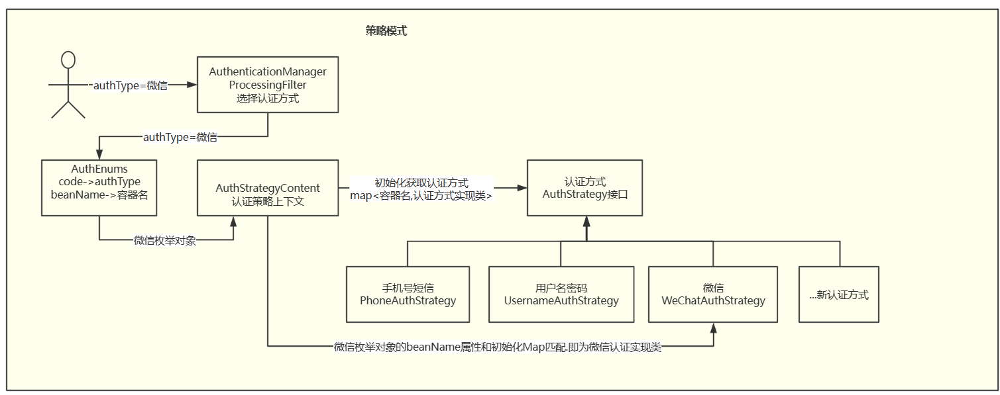
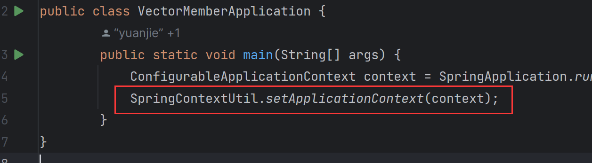
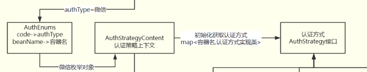

# 认证/支付/优惠劵策略模式-security多源认证

[[toc]]

---

## 一.为什么要采用策略模式

在使用策略模式以前,我们在单一接口凭借前端的类型判断.`以认证为例:authType指明认证类型 手机号短信认证,用户名密码认证,微信认证`可能需要写出如下代码

```java
        String msgCode = userLogin.getMsgCode(); // 判断是否走短信验证码登录
        String wechat = userLogin.getWechat(); // 判断是否走微信登录
        String password = userLogin.getPassword(); // 判断是否走密码登录
        Authentication authentication = null;
        if (StringUtils.isNotBlank(msgCode)) {
            // 短信验证码登录 不存在直接注册
            authentication = this.getAuthenticationManager().authenticate(new MobileVerificationCodeAuthenticationToken(userLogin));
        } else if (StringUtils.isNotBlank(wechat)) {
            // 微信登录 不存在直接注册
            authentication = this.getAuthenticationManager().authenticate(new WeChatAuthenticationToken(userLogin));
        } else if (StringUtils.isNotBlank(password)) {
            // 密码登录 不存在返回未注册
            authentication = this.getAuthenticationManager().authenticate(new MobileAccountAuthenticationToken(userLogin));
        }
```

那对于后续添加新的登录方式来说不太友好而且代码显得太过臃肿,需要重新梳理一遍业务流程.添加认证逻辑.那有没有一种只用新建一个认证类就ok了?
策略模式+枚举就是一种.


如图我们新增认证方式只需要直接实现AuthStrategy接口和新增枚举即可.

---

## 二.业务流程

### 2.1 AuthenticationManagerProcessingFilter认证过滤器

`需要注意的是这里没有给SpringBoot托管.一方面原因是AuthenticationManagerProcessingFilter实例化必须指明认证管理器是有参构造,我在securityConfig配置了该类的实例化;另一方面这意味着该类不能通过自动注入获取Bean.因为自动注入是都在容器中的Bean才能互相引用,因此需要维护一个application上下文引用.`
`redissonClient = (RedissonClient)SpringContextUtil.getBean(RedissonClient.class);`

### SpringContextUtil上下文引用工具类

```java
public class SpringContextUtil {

    private static ApplicationContext applicationContext;

    //获取上下文
    public static ApplicationContext getApplicationContext() {
        return applicationContext;
    }

    //设置上下文
    public static void setApplicationContext(ApplicationContext applicationContext) {
        SpringContextUtil.applicationContext = applicationContext;
    }

    //通过名字获取上下文中的bean
    public static Object getBean(String name) {
        return applicationContext.getBean(name);
    }

    //通过类型获取上下文中的bean
    public static Object getBean(Class<?> requiredType) {
        return applicationContext.getBean(requiredType);
    }

}
```




```java
@Slf4j
public class AuthenticationManagerProcessingFilter extends AbstractAuthenticationProcessingFilter {
    private boolean postOnly = false;


    public AuthenticationManagerProcessingFilter() {
        super(new AntPathRequestMatcher("/auth/user/v1/login", "POST"));
    }

    @Override
    public Authentication attemptAuthentication(HttpServletRequest request, HttpServletResponse response)
            throws AuthenticationException, IOException {
        if (postOnly && !request.getMethod().equals("POST")) {
            throw new AuthenticationServiceException(
                    "Authentication method not supported: " + request.getMethod());
        }
        // 获取用户信息
        UserLogin userLogin = getUserByRequest(request);
        if (userLogin == null) {
            throw new AuthenticationServiceException(HttpCodeEnum.BAD_REQUEST.getMsg() + "用户信息不能为空!");
        }
        // 认证策略模式
        String authType = userLogin.getAuthType();
        AuthEnums anEnum = AuthEnums.getEnum(authType);
        if (anEnum == null) {
            throw new AuthenticationServiceException(HttpCodeEnum.BAD_REQUEST.getMsg() + "authType认证方式错误!");
        }
        AuthStrategyContent authStrategyContent =
                (AuthStrategyContent) SpringContextUtil.getBean(AuthStrategyContent.class);
        Authentication authentication =
                authStrategyContent.authType(anEnum, userLogin, this.getAuthenticationManager());

        UserAuth userAuth = (UserAuth) authentication.getPrincipal();
        if (userAuth == null) {
            throw new AuthenticationServiceException(HttpCodeEnum.LOGIN_ERROR.getMsg());
        }

        // 登录成功后将密码置空
        userAuth.setPassword(null);
        //获取userId
        Long id = userAuth.getId();
        RedissonClient redissonClient=null;
        JwtUtil jwtUtil=null;
        try {

            redissonClient = (RedissonClient) SpringContextUtil.getBean(RedissonClient.class);
             jwtUtil = (JwtUtil) SpringContextUtil.getBean(JwtUtil.class);
            redissonClient.getBucket(CacheConstants.LOGIN_TOKEN_KEY + id)
                    .set(userAuth, jwtUtil.getExpire(), TimeUnit.MILLISECONDS);
        } catch (Exception e) {
            log.error("redisson初始化失败", e);
            throw new AuthenticationServiceException(HttpCodeEnum.SYSTEM_ERROR.getMsg());
        }
        //通过后用userid生成一个jwt存入ResponseResult
        String jwt = jwtUtil.createJWT(String.valueOf(id));
        userAuth.setTokenHead(JwtUtil.JWT_TOKEN_PREFIX);
        userAuth.setToken(jwt);
        return authentication;
    }

    /**
     * 获取request中的json用户信息
     *
     * @param request
     * @return
     * @throws IOException
     */
    private UserLogin getUserByRequest(HttpServletRequest request) throws IOException {
        StringBuffer sb = new StringBuffer();
        InputStream is = request.getInputStream();
        InputStreamReader isr = new InputStreamReader(is);
        BufferedReader br = new BufferedReader(isr);
        String s = "";
        while ((s = br.readLine()) != null) {
            sb.append(s);
        }
        String userInfo = sb.toString();
        JsonMapper jsonMapper = new JsonMapper();
        UserLogin userLogin = null;
        try {
            userLogin = jsonMapper.readValue(userInfo, UserLogin.class);
        } catch (JsonProcessingException e) {
            throw new AuthenticationServiceException(HttpCodeEnum.BAD_REQUEST.getMsg() + "json转换异常");
        }
        return userLogin;
    }
}
```

他们会调用具体匹配到的Provider完成认证

### 2.2 AuthEnums枚举

上述代码中我们通过枚举类`AuthEnums anEnum = AuthEnums.getEnum(authType);`枚举类维护了前端传来的验证类型和认证Bean对象名字的映射


```java
/**
 * 认证方式
 * code -> 认证方式别名
 * beanName -> 认证方式实现类
 */
public enum AuthEnums {
    /**
     * 认证方式
     * getSimpleName() -> 获取类名
     */
    Message("短信", MessageStrategy.class.getSimpleName()),
    USERNAME("用户名", UsernameStrategy.class.getSimpleName()),
    WECHAT("微信", WeChatStrategy.class.getSimpleName());

    private String code;
    private String beanName;

    AuthEnums(String code, String beanName) {
        this.code = code;
        this.beanName = StringUtils.isNotEmpty(beanName)?beanName.toLowerCase():null;
    }


    /**
     * 根据code获取对应的枚举对象
     */
    public static AuthEnums getEnum(String code) {
        AuthEnums[] values = AuthEnums.values(); // 获取枚举列表
        if (null != code && values.length > 0) {
            for (AuthEnums value : values) {
                if (value.code.equals(code)) {
                    return value;  // 返回枚举对象
                }
            }
        }
        return null;
    }

    /**
     * 该code在枚举列表code属性是否存在
     */
    public static boolean containsCode(String code) {
        AuthEnums anEnum = getEnum(code); // 获取枚举对象
        return anEnum != null;
    }

    /**
     * 判断code与枚举中的code是否相同
     */
    public static boolean equals(String code, AuthEnums calendarSourceEnum) {
        return calendarSourceEnum.code.equals(code);
    }


    public String getCode() {
        return code;
    }

    public String getBeanName() {
        return beanName;
    }
}

```

### 2.3策略模式上下文

接着` Authentication authentication =
authStrategyContent.authType(anEnum, userLogin, this.getAuthenticationManager());`策略模式,通过Bean名字匹配认证实现类.

该策略上下文通过自动注入接口的所有实现类.那上一步传来的bean名即可直接通过map映射到认证实现类.      `微信 -> 微信Bean名称 -> 微信Bean实现类`


```java
@Component
public class AuthStrategyContent {

    /** 策略实例集合 */
    private ConcurrentHashMap<String, AuthStrategy> strategyConcurrentHashMap =
            new ConcurrentHashMap<>(20);


    /**
     * 注入策略实例
     * 如果使用的是构造器注入，可能会有多个参数注入进来。
     *
     * 如果使用的是field反射注入
     *
     * 如果使用的是setter方法注入，那么你将不能将属性设置为final。
     *
     * @param strategyMap
     *         注意注入类型要是Map基础类型
     *         注入接口,spring会自动注入他的所有被spring托管的实现类
     */
    @Autowired
    public AuthStrategyContent(Map<String, AuthStrategy> strategyMap) {
        //清空集合数据
        this.strategyConcurrentHashMap.clear();
        if (!CollectionUtils.isEmpty(strategyMap)) {
            strategyMap.forEach((beanName, authStrategy) -> {
                if (StringUtils.isEmpty(beanName) || authStrategy == null) {
                    return;
                }
                this.strategyConcurrentHashMap.put(beanName.toLowerCase(), authStrategy);
            });
        }
    }
    /**
     * 选择登录方式
     * 手机短信,手机密码,微信,QQ...
     *
     * @param authEnums
     *
     * @return RemoteResult
     */
     public Authentication authType(AuthEnums authEnums, UserLogin userLogin, AuthenticationManager authenticationManager) {
        if (CollectionUtils.isEmpty(strategyConcurrentHashMap)) {
            throw new AuthenticationServiceException("策略实例集合初始化失败，请检查是否正确注入！");
        }
        return this.strategyConcurrentHashMap.get(authEnums.getBeanName()).authType(userLogin,authenticationManager);
    }

}
```


### 2.4 策略

既然上一步要自动注入`public AuthStrategyContent(Map<String, AuthStrategy> strategyMap)`
其中AuthStrategy是实现类接口.那我们只需定义AuthStrategy及其实现类即可.以下仅举出接口.

```java
public interface AuthStrategy {

    /**
     * 选择登录认证方式
     */
    Authentication authType(UserLogin userLogin, AuthenticationManager authenticationManager);
}
```

## 三.总结

通过如上方式.我们后期不需要再理解业务内容,增加多个if.而是只需要额外实现AuthStrategy 接口,并在AuthEnums枚举类中配置认证类和,实现类Bean称即可.

## 四.AuthenticationManagerProcessingFilter配置到security中

```java
    // 配置拦截规则 也可以在AuthenticationManagerAuthenticationProcessingFilter中配置
    private AuthenticationManagerProcessingFilter authenticationManagerProcessingFilter() throws Exception {
        AuthenticationManagerProcessingFilter authenticationManagerProcessingFilter =
                new AuthenticationManagerProcessingFilter();
        //指定认证管理器
        authenticationManagerProcessingFilter.setAuthenticationManager(authenticationManagerBean());
        authenticationManagerProcessingFilter.setFilterProcessesUrl("/auth/user/v1/login");
        //指定认证成功和失败处理
        authenticationManagerProcessingFilter.setAuthenticationSuccessHandler(authenticationSuccessFilter);
        authenticationManagerProcessingFilter.setAuthenticationFailureHandler(authenticationFailureFilter);
        return authenticationManagerProcessingFilter;
    }

```