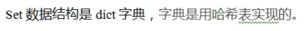
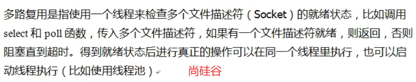
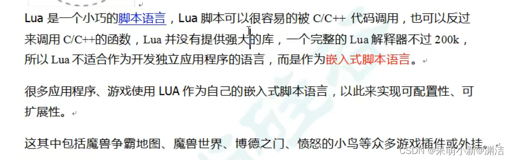
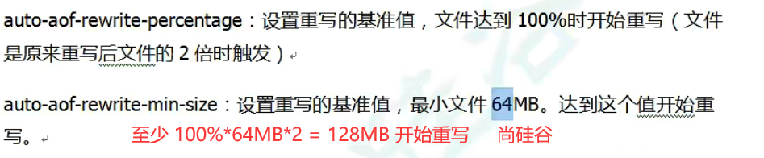
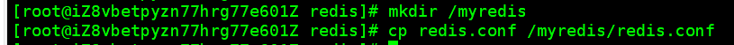

# redis6

[[TOC]]


---


# 前言

`感谢帮助过我的前辈们`
`好雨知时节，当春乃发生。随风潜入夜，润物细无声。有的博主在某个地方总结特别好,我就直接上连接了😄.`
`只为尽善尽美的出一篇redis入门的干货!奥里给!兄弟们,姐妹们`

---


# 一.redis解决的问题

### 1.1.1解决session共享问题

在web2.0中随着设备终端的不断增加,请求量大大增加,服务器利用nginx负载均衡减缓压力.但由于使用了负载均衡.用户第一次登录的请求被携带到服务器1,在服务器生成了session对象.这时用户再次发送请求,请求可能被nginx的负载均衡机制发送到其他的服务器中,而这里不存在用户的登录session信息.   


解决方式有:
1.cookie携带(客户端安全性难以保证)  
2.session复制,服务器同步复制(造成数据冗余)  
3.noSQL数据库(存入内存中)解决分布式中session的共享问题

### 1.1.2降低io读操作

>当数据的不断增加,造成表结构庞大,为了保证查询速度,我们通常会进行水平切分,垂直切分,读写分离等操作(这些都是通过破坏一定业务逻辑换取性能的方式)  这时我们可以通过nosql作为缓存数据库访问数据.它可以直接通过内存读取.降低cpu,io读压力


### 1.2.1nosql数据库的特点

- nosql不依赖于业务逻辑,仅通过key-value模式存储,因此大大增加了数据库扩展能力.
- 不遵循sql标准
- 不支持ACID
- 远超sql的性能

### 1.2.2 NoSQL的适用场景

- 对数据高并发的读写
- 海量数据的读写
- 对数据高可扩展性

### 1.2.3 NoSQL不适用的场景

- 需要事物支持
- 基于sql的结构化查询存储,处理复杂的关系,需要即席查询。

# 二.redis运行

## 2.1 常规安装

1. 我使用了堡塔安装.自动将redis安装在`/www/server/redis/`;随后`安装php`,在其中的应用扩展`安装redis服务器` ,重启系统
2. 在redis/src  下执行 make install
3. 配置redis目录下的`redis.conf`
   将其中的 daemonize 设置为 yes  (即允许后台运行)
   
   设置 `requirepass foobared`将注释符去掉并将foobared改成自己的密码,`注意密码一定要高度严格,大小写特殊符`
   3.在当前路径下启动redis `redis-cli -p 6379 `
4. `auth 密码` 打开数据库
   5.exit退出redis

## 2.2 docker-redis安装

`注意中文乱码和数据备份,降低坐牢风险`

```bash
docker search redis
docker pull redis:6.0 # 拉取redis
mkdir -p /mydata/redis/conf
touch /mydata/redis/conf/redis.conf

# 拷贝官方redis.conf文件 到/mydata/redis/conf/redis.conf (注意切勿创建成redis.conf目录)

# ---------vi redis.conf --------------
# 修改如下内容
requirepass 密码
masterauth 密码
# bind 127.0.0.1
protected-mode no
daemonize no #docker -d 具有守护线程功能,防止docker冲突
# -------------------------------------
docker run -p 6379:6379 --name redis --privileged=true \
-v /mydata/redis/conf/redis.conf:/etc/redis/redis.conf \
-v /mydata/redis/data:/data \
--restart=always \
-d redis:6.0 redis-server /etc/redis/redis.conf

docker ps # 查看是否启动容器成功
dcoker exec -it redis容器id /bin/bash
```

# 三.Redis相关知识

## 3.1.1 基本操作

|            | redis                                                        |
| ---------- | ------------------------------------------------------------ |
| 默认端口号 | 6379                                                         |
| 默认数据库 | 默认16个数据库 初始默认使用0号库   `select  num`  切换数据库 |
| 数据库密码 | 所有库统一密码                                               |

```powershell
redis-cli -p 6379 -a 设置的密码 #进入redis
dbsize   # 查看当前库key的数量

select 0 # 默认一号库  redis默认共16库
flushdb # 清空当前库
flushall # 清空所有库
exit #退出

# key操作
set key value #key键名 value值
keys * # 查看当前库的所有键(匹配:key *1 根据键名右边第一个1查询,key *任意多字符* 模糊查询匹配)
exists key # 判断某个key是否存在
type key # 查看key是什么类型

del key # 删除key
unlink key # 删除的时候根据value选择非阻塞删除, 仅将keys从keyspace元数据中删除，真正的删除会在后续异步操作

expire key time # time 给key设置过期时间,单位秒
setex age 20 value # 设置键age,值value  20秒 过期
ttl key # 查看还有多久过期, -1表示永不过期 -2表示已过期
```

## 3.1.2 string类型


`string类是二进制安全的,一个string类型的value最多可以是512M`

```powershell
get key # 获取key的值,对同一个key设置值,后面设置的会覆盖前面的值

append key value # 在key的值后追加值
strlen key # 获得key的值的长度
setnx key value # key不存在才能设置key的值,有点像mysql中的INSERT IGNORE INTO 

incr key # 将当前键的值+1 (只能对数值操作,如果当前值为空,则新值为1)
decr key # 将当前键的值-1 (只能对数值操作,如果当前值为空,则新值为1)
incrby/decrby key 步长 #将key的值增长/减少步长数 (只能对数值操作,如果当前值为空,则新值为1)
#incr 原子操作 即不会被线程调度机制打断的操作,并非事务原子性
#(1)在单线程中,能够在单条指令中完成的操作都可以认为是"原子操作”,因为中断只能发生于指令之间.
#(2)在多线程中，不能被其它进程(线程)打断的操作就叫原子操作
#Redis单命令的原子性主要得益于Redis的单线程。

mset key1 value1 key2 value2 ... #mset可以一次性设置多个key-value
msetnx #可以一次性设置多个key-value,当key不存在时
mget key1 key2 ... # 同时获取一个或多个key的value

getrange key 0 3 #获取key值的0~3个字符
setrange key 3 abc #在key的3位置插入abc,原先的3位置及其后的字符后移
```

## 3.1.3 List类型

单键多值
Redis列表是简单的字符串列表，按照插入顺序排序。你可以添加一个元素到列表的头部(左边）或者尾部(右边)。
它的底层实际是个双向链表，对两端的操作性能很高，通过索引下标的操作中间的节点性能会较差。

```powershell
lpush/rpush key value1/value2/... # 从左边或右边插入多值
lpop/rpop key # 从左边/右边弹出一个值.值在键在,值亡键亡
lrange key 0 3 #从左到右获取值
rpoplpush key1 key2 # 从key1的列表右边的值,插入到key2列表左边
lindex key index # 获取键下标index的值
llen key # 获取列表长度
linsert key before value newvalue #在key的value前面插入newvalue
linsert key aftervalue newvalue #在key的value后面插入newvalue
lrem key n value #从左边删除key的n个value值
lset key index newvalue # 将key的index下标的值替换为newvalue
```


## 3.1.4 set类型

Redis set对外提供的功能与list类似是一个列表的功能，特殊之处在于`set是可以自动排重`的，当你需要存储一个列表数据，又不希望出现重复数据时，set是一个很好的选择.

Redis的set是string类型的无序集合。它底层其实是一个value为null的hash表，所以添加，删除，查找的复杂度都是O(1).

```powershell
sadd key value1 value2 # 将一个或多个number加入到集合key中,已存在的member元素将被忽略
smembers key # 去除该元素的所有值
sismember key value #判断key中是否有符合valu的值,有返回1,无返回0
scard key # 返回该集合的元素个数
srem key value1 value2 # 删除集合中的某个元素
spop key # 随机从该集合中弹出一个值
srandmember key n # 随机从该集合中取出n个值,不会从集合中删除
smove key1 key2 value # 将key1的value,添加到key2中(但key2中不会加入重复的值)
sinter key1 key2 # 取出两个set集合的交集
sunion key1 key2 # 取出两个set集合的并集
sdiff key1 key2 # 取出key1中不包含key2的元素
```



## 3.1.5 Hash类型


| key        | field-value |
| ---------- | ----------- |
| 键名(对象) | 属性-值     |

```powershell
hset key field value # 在key集合中给field键赋值value
hget key field # 在key集合中获取field键的值
hmset key1 field1 value1 field2 value2 field3 value3 # 批量设置hash的值
hexists key1 field # 查看哈希表中的key,给定的field域是否存在
hkeys key #列出该hash集合的所有field
hvals key #列出该hash集合的所有value
hincrby key field increment # 为哈希表key中的域field 的值加上增量1 -1
hsetnx key field value # 将哈希表key中的域field 的值设置为 value，当且仅当域field不存在.

```


## 3.1.6 Zset有序类型

zset也是一个`没有重复元素`的字符串的集合
有序集合的每个成员都关联了一个`评分( score)` ,这个评分( score )被用来按照从最低分到最高分的方式排序集合中的成员。`集合的成员是唯一的，但是评分可以是重复了。`

```powershell
zadd key score1 value1 score2 value2 # 将一个或多个member元素及其score值加入到有序集key当中。
zrange key start stop [withscores]# 返回有序集合key中,下标在start,stop之间的元素.带WITHSCORES，可以让分数一起和值返回到结果集。
zrangebyscore key min max [withscores] [limit offset count] # 返回有序集key中,所有score值介于min和max之间(包含minx和max)按score递增排序
zrecrangebyscore  key max min [withscores] [limit offset count] # 同上,逆序排列
zincrby key increment value # 给score添加上增量
zrem key value # 删除该集合下,指定值的元素
zcount key min max # 统计该集合，分数区间内的元素个数
zrank key value # 返回该值在集合中排名,从0开始
```

**zset底层使用了两个数据结构**
**( 1 ) hash ,hash的作用就是关联元素value和权重score，保障元素value的唯一性，可以通过元素value 找到相应的score值。
(2）跳跃表，跳跃表的目的在于给元素value排序，根据score的范围获取元素列表。**

[跳跃表详解](https://www.jianshu.com/p/dc252b5efca6)
即可以利用类似索引的思想，提取出链表中的部分关键节点。,这样我们可以提取多级索引.
提取的极限，则是同一层只有两个节点的时候，因为一个节点没有比较的意义。这样的多层链表结构，就是所谓的跳跃表。

## 3.1.7 redis6新数据类型

### 3.1.7.1 Bitmaps

进行位操作
( 1 )Bitmaps本身不是一种数据类型，实际上它就是字符串 ( key-value ) ,但是它可以对字符串的位进行操作。
( 2) Bitmaps单独提供了一套命令，所以在 Redis 中使用Bitmaps和使用字符串的方法不太相同。可以把Bitmaps想象成一个以位为单位的数组教组的每个单元只能存储0和1，数组的下标在Bitmaps中叫做偏移量.

实例举例:可以对n个用户其中访问过这个网站的人做标记

```powershell
setbit key offset value #设置bitmaps某个偏移量的值
getbit key offset # 取出bitmaps某个偏移量的值
bitcount key # 统计bitmaps中数值为1的数量
bitop and newkey key1 key2 # 获得key1和key2的值做与运算赋值给newkey(可支持计算与或非,异或)
```

### 3.1.7.2 HyperLogLog

降低一定的精度来平衡存储空间   Redis推出了HyperLogLog.用来统计基数,解决不重复个数基数问题的解决方案.

```powershell
pfadd key "element1" "element2"# 将指定元素加入到hyperLogLog中去(加入后重新评估key中的基数,发生变化返回1,否则返回0)
pfcount key # 查看当前key中的元素个数
pfmerage newkey key1 key2 #将key1,key2合并加入到newkey中
```

### 3.1.7.3 Geospatial

增加了对GEO(地理信息类型)的支持,即2维坐标.
有效经度范围为-180度,180度
有效维度范围为-85.05112878°到85.05112878°

```powershell
geoadd key 城市 经度 纬度 城市 经度 纬度 #添加城市地理信息给key
geopos key 城市 # 取出key中具体城市经纬度
geodist key 城市1 城市2 单位#取出key中两地直线距离,单位可以是m,km,mi,ft  默认使用m
georadius key 经度 维度 1000 km #取出经纬位置处1000km内的所有元素
```

# 四 redis配置文件

只支持bytes,不支持bit.大小写不敏感
[详见此处](https://www.cnblogs.com/ysocean/p/9074787.html)

以下是粗略的

```powershell
include 路径 # 可以被公共调用的文件 

# bind 127.0.0.1 # 只允许本机访问,ssh需要注释该段
protected-mode no # 开启本机保护模式,ssh需要将yes改成no

port 6379 # 默认端口
# 在高并发环境下你需要一个高backlog值来避免慢客户端连接问题。
# 注意Linux内核会将这个值减小到/proc/sys/net/core/somaxconn的值(128 )，所以需要确认增大/proc/sys/net/core/somaxconn和/proc/sys/net/ipv4/tcp_max_syn_backlog (128)两个值来达到想要的效果;
tcp-backlog 511 # 连接队列总和(backlog总和=未完成三次握手队列+已完成三次握手队列)
timeout 0 # 在redis中无操作,自动超时退出.当值为0.默认永久不自动退出
tcp-keepalive 300 # 检测当前是否有用户操作,周期300 seconds

daemonize yes # 允许后台启动,设置为守护进程

pidfile /var/run/redis_6379.pid # redis实例进程号保留地址
loglevel notice # 日志级别debug:详细信息 verbose:有用信息 notice:生产环境使用 warning:有用的
logfile "" # 日志输出路径

databases 16 # 默认16个数据库

requirepass 密码 # 设定redis密码

maxclients 10000 # 设置最大连接数
maxmemory <bytes># 必须设置,否则内存满,服务器宕机

```

**maxmemory-policy**


## 4.1 redis的技术选型

`Redis是单线程+IO多路复用技术`

`通俗的说就是找代理(管家)帮忙处理额外事务,在此期间自己做其他的事. 办成了通知本人对接即就绪放行,但可能出现代理商办事不利,即阻塞超时`  其中代理属于cpu的一部分操作,不会让cpu等待用户,而让它一直工作.

# 五 redis发布与订阅

## 5.1 啥是订阅和发布

Redis 发布订阅(pub/sub)是一种消息通信模式︰发送者(pub)发送消息，订阅者(sub)接收消息。
Redis客户端可以订阅任意数量的频道。

## 5.2相关命令

```powershell
SUBSCRIBE a # 订阅频道a
publish a hello #向频道a中发送hello(不具备持久化,只能看到订阅后的信息)
```

# 六 jedis操作redis6

## 6.1.1简单连接redis和基本使用

通过java操作redis
堡塔玩家请注意下面的截图.

==注意服务器提供商和服务器防火墙端口的开启.==

==注意redis.conf配置文件中的bind 127.0.0.1 和 protected-mode no==

```xml
    <dependencies>
        <dependency>
            <groupId>redis.clients</groupId>
            <artifactId>jedis</artifactId>
            <version>3.2.0</version>
        </dependency>
    </dependencies>
```

```java
public class jedisdemo1 {
    private static String HOST = "127.0.0.1";
    private static Integer PORT = 6379;
    private static String PASSWORD="#1$2%3.aAbBCcDOs";

    public static void main(String[] args) {
 		 // 1)连接redis
        Jedis jedis = new Jedis(HOST, PORT);
        // 2)访问redis密码
        jedis.auth(PASSWORD);
        // 测试
        String str = jedis.ping();
        System.out.println(str);

        Set<String> keys = jedis.keys("*");
        for (String key : keys) {
            System.out.println(key);
        }
        jedis.close();
    }
}
```

## 6.2 jedis模拟验证码操作


```java
import redis.clients.jedis.Jedis;

import java.util.Random;

/**
 * @author WangJiaHui
 * @description: test
 * @ClassName PhoneCode
 * @date 2022/3/2 10:00
 */
public class PhoneCode {
    private static String HOST = "127.0.0.1";
    private static Integer PORT = 6379;
    private static String PASSWORD="@a1^sJS)25s";
    public static void main(String[] args) {
        // 模拟验证码发送
        verifyCode("110");
        getRedisCode("110","215533");

    }

    // 1.生成6位随机密码
    public static String getCode() {
        Random random = new Random();
        String code = "";
        for(int i=0;i<6;i++) {
            int rand = random.nextInt(10);
            code += rand;
        }
        return code;
    }

    // 2. 每个手机每天只能发送三次,验证码放入redis,设置过期时间
    public static void verifyCode(String phoneNum){
        Jedis jedis=null;
        try {
            // 1)连接redis
            jedis = new Jedis(HOST, PORT);
            // 2)访问redis密码
            jedis.auth(PASSWORD);
            // 3)拼接key
            // 手机发送key次数,这里键名随便拼接,但要保证键名唯一
            String countKey = "VerifyCode" + phoneNum + ":count";
            // 4)验证码key
            String codeKey = "VerifyCode" + phoneNum + ":code";

            // 5)每个手机每天发送三次
            String count = jedis.get(countKey);
            if(count == null) {
                // 没有记录,第一次发送
                jedis.setex(countKey,24*60*60,"1");
            } else if (Integer.parseInt(countKey) <= 2) {
                // 发送次数+1
                jedis.incr(countKey);
            } else if(Integer.parseInt(countKey) > 2){
                // 发送三次,不能再发送了
                System.out.println("今天的发送次数已经超过三次");
                jedis.close();
                return;
            }
            // 发送的验证码放到redis
            String vcode = getCode();
            jedis.setex(codeKey,120,vcode);

        } catch (NumberFormatException e) {
            e.printStackTrace();
        } finally {
            jedis.close();
        }
    }

    // 3.验证码校验
    public static void getRedisCode(String phoneNum,String code) {
        Jedis jedis = null;
        try {
            // 1)连接redis
            jedis = new Jedis(HOST, PORT);
            // 2)访问redis密码
            jedis.auth(PASSWORD);
            // 从redis获取验证码
            String codeKey = "VerifyCode" + phoneNum + ":code";
            String redisCode = jedis.get(codeKey);
            // 判断
            if(code.equals(redisCode)) {
                System.out.println("success");
            } else {
                System.out.println("error");
            }
        } catch (Exception e) {
            e.printStackTrace();
        } finally {
            jedis.close();
        }

    }
}

```

# 七.springboot-redisTemplate整合redis6

## 7.1 pom导入

```xml
        <dependency>
            <groupId>org.springframework.boot</groupId>
            <artifactId>spring-boot-starter-data-redis</artifactId>
        </dependency>
<!--        spring2.x集成redis所需common-pool2-->
        <dependency>
            <groupId>org.apache.commons</groupId>
            <artifactId>commons-pool2</artifactId>
        </dependency>
```

## 7.2 相关配置文件

`properties`

```bash
# Redis数据库索引(默认为0)
spring.redis.database=0
# Redis服务器地址
spring.redis.host=localhost
# Redis服务器连接端口
spring.redis.port=6379
# Redis服务器连接密码(默认为空)
spring.redis.password=root
# 连接池最大连接数(使用负值表示没有限制)
spring.redis.jedis.pool.max-active=1000
# 连接池最大阻塞等待时间(使用负值表示没有限制)
spring.redis.jedis.pool.max-wait=-1
# 连接池最大空闲连接
spring.redis.jedis.pool.max-idle=10
# 连接池最小空闲连接
spring.redis.jedis.pool.min-idle=2
# 连接超时时间(毫秒)
spring.redis.timeout=0
```

`config RedisTemplate客户端封装`

```java
package com.vector.redis_springboot.com.vector.config;

import org.springframework.boot.autoconfigure.condition.ConditionalOnMissingBean;
import org.springframework.context.annotation.Bean;
import org.springframework.data.redis.connection.RedisConnectionFactory;
import org.springframework.data.redis.core.RedisTemplate;
import org.springframework.data.redis.core.StringRedisTemplate;
import org.springframework.data.redis.serializer.Jackson2JsonRedisSerializer;
import org.springframework.data.redis.serializer.StringRedisSerializer;

/**
 * @author YuanJie
 * @description: test
 * @ClassName RedisConfig
 * @date 2022/3/2 11:36
 */
 @EnableCaching
@Configuration
public class RedisConfig {
    @Bean
    @ConditionalOnMissingBean(name = "redisTemplate")
    public RedisTemplate<Object, Object> redisTemplate(
            RedisConnectionFactory redisConnectionFactory) {
        RedisTemplate<Object, Object> template = new RedisTemplate<>();
        //使用Jackson2JsonRedisSerializer序列化
        Jackson2JsonRedisSerializer jackson2JsonRedisSerializer = new Jackson2JsonRedisSerializer(Object.class);
        // value值的序列化采用Jackson2JsonRedisSerializer
        template.setValueSerializer(jackson2JsonRedisSerializer);
        template.setHashValueSerializer(jackson2JsonRedisSerializer);
        // key的序列化采用StringRedisSerializer
        template.setKeySerializer(new StringRedisSerializer());
        template.setHashKeySerializer(new StringRedisSerializer());
        template.setConnectionFactory(redisConnectionFactory);
        return template;
    }

    @Bean
    @ConditionalOnMissingBean(StringRedisTemplate.class)
    public StringRedisTemplate stringRedisTemplate(
            RedisConnectionFactory redisConnectionFactory) {
        StringRedisTemplate template = new StringRedisTemplate();
        template.setConnectionFactory(redisConnectionFactory);
        return template;
    }
}

```

`controller`

```java
package com.vector.redis_springboot.com.vector.controller;

import org.springframework.beans.factory.annotation.Autowired;
import org.springframework.data.redis.core.RedisTemplate;
import org.springframework.stereotype.Controller;
import org.springframework.web.bind.annotation.GetMapping;
import org.springframework.web.bind.annotation.RequestMapping;
import org.springframework.web.bind.annotation.RestController;

/**
 * @author YuanJie
 * @description: test
 * @ClassName RedisTestController
 * @date 2022/3/2 11:49
 */
@RestController
@RequestMapping("/redisTest")
public class RedisTestController {
    @Autowired
    private RedisTemplate redisTemplate;
    @GetMapping
    public String testRedis() {
        // 设置值到redis
        redisTemplate.opsForValue().set("name","lucy");
        // 从redis获取值
        String name = (String) redisTemplate.opsForValue().get("name");
        return name;
    }
}

```


# 八.Redis6事务_锁机制_秒杀

## 8.1 Redis6的事务定义

Redis事务是一个单独的隔离操作∶事务中的所有命令都会序列化、按顺序地执行。事务在执行的过程中，不会被其他客户端发送来的命令请求所打断。
Redis事务的主要作用就是`串联多个命令`防止别的命令插队.

## 8.2 Multi,Exec,discard

从输入Multi命令开始，输入的命令都会依次进入命令队列中，但不会执行，直到输入Exec后，Redis 会将之前的命令队列中的命令依次执行.
组队的过程中可以通过discard来放弃组队。

```powershell
wacth key #对某些键进行监听
multi # 开启组队 就绪
exec # 顺序执行组队命令(事务在执行的过程中，不会被其他客户端发送来的命令请求所打断。) 执行
discard # 回滚,放弃组队  销毁
unwatch key # 对某些键取消监听
```

## 8.3 事务的错误处理

`1.组队中某个命令出现了报告错误，执行时整个的所有队列都会被取消。`
`2.执行时某个命令出现了报告错误,则仅该命令失效.`

## 8.4事务冲突悲观锁和乐观锁

[乐观锁和多版本并发控制的详细区别](https://www.zhihu.com/question/27876575)
**悲观锁**:每次读数据都会加锁独占数据,即在操作前加锁.操作后释放锁. 传统的关系型数据库
**乐观锁(OCC)**:不加锁,而是进行版本控制.每行数据都有一个版本号,仅在每次修改数据时,修改版本号.当出现版本号不一致,则操作失败,否则操作成功.  `操作写-写,专门解决并发修改数据`,用于多读的应用类型,提高吞吐量.
**多版本并发控制(MVCC)**: `操作读-写,解决事务隔离性问题.`


## 8.5 Watch key [key...]

在执行multi之前，先执行watch key1 [key2],可以监视一个(或多个) key ，如果在事务执行之前这个(或这些) key 被其他命令所改动，那么事务将被打断。

```powershell
wacth key #对某些键进行监听
unwatch key # 对某些键取消监听
```

## 8.6 redis事务三特性

- 单独的隔离操作
  事务中的所有命令都会序列化、按顺序地执行。事务在执行的过程中，不会被其他客户端发送来的命令请求所打断.
- 没有隔离级别的概念
  队列中的命令没有提交之前都不会实际被执行，因为事务提交前任何指令都不会被实际执行
- 不保证原子性
  事务中如果有一条命令执行失败，其后的命令仍然会被执行，没有回滚.

## 8.7 `秒杀案例`

### 8.7.1 RedisTemplate封装redis秒杀案例

[解决超卖超买方案](https://blog.csdn.net/cheng__yu/article/details/122620213)
[解决超买超卖的分布式优秀源码理解](https://www.jianshu.com/p/7e47a4503b87)

```xml
        <!-- https://mvnrepository.com/artifact/org.redisson/redisson -->
        <dependency>
            <groupId>org.redisson</groupId>
            <artifactId>redisson</artifactId>
            <version>3.16.8</version>
        </dependency>
                <dependency>
            <groupId>org.springframework.boot</groupId>
            <artifactId>spring-boot-starter-data-redis</artifactId>
        </dependency>
<!--        spring2.x集成redis所需common-pool2-->
        <dependency>
            <groupId>org.apache.commons</groupId>
            <artifactId>commons-pool2</artifactId>
        </dependency>
```

### 8.7.2 synchronized单机锁解决样例(🔸)

` 分布式环境下依然出现问题的原因:假设nginx反向代理2台服务器,当多个请求被负载均衡的均匀分配到2台服务器上,这时synchronized锁不住,因为他只在jvm内部有效,他无法跨服务器锁另一台服务器`

```java
package com.vector.redis_springboot.com.vector.controller;

import jodd.util.StringUtil;
import org.springframework.beans.factory.annotation.Autowired;
import org.springframework.data.redis.core.RedisConnectionUtils;
import org.springframework.data.redis.core.RedisTemplate;
import org.springframework.data.redis.core.StringRedisTemplate;
import org.springframework.stereotype.Controller;

import java.util.Objects;

/**
 * @author YuanJie
 * @description: 单机锁
 * @ClassName doSecKill01
 * @date 2022/3/3 11:50
 */
@Controller
public class doSecKill01 {

    public static void main(String[] args) {
        new doSecKill02().getSecKill("123","123231");
    }
    @Autowired
    private StringRedisTemplate redisTemplate;
    public boolean getSecKill(String uid,String prodid) {
        try {
            // 1.uid和prodid非空判断  存在用户id或商品id?
            if(StringUtil.isBlank(uid) || StringUtil.isBlank(prodid)){
                return false;
            }
            // 3.拼接key
            // 3.1库存key
            String repositorykey = "repository:"+prodid;
            // 3.2秒杀成功用户key
            String userkey = "user:"+uid;
            // 4.获取库存,如果库存为null,秒杀未开始
            synchronized (this) {
                String countRepository = redisTemplate.opsForValue().get(repositorykey);
                if (countRepository == null) {
                    System.out.println("秒杀未开始,请等待");
                    RedisConnectionUtils.unbindConnection(Objects.requireNonNull(redisTemplate.getConnectionFactory()));
                    return false;
                }
                // 5. 判断用户是否重复秒杀
                if (Boolean.TRUE.equals(redisTemplate.hasKey(userkey))) {
                    System.out.println("已经秒杀成功了,不能重复秒杀");
                    RedisConnectionUtils.unbindConnection(Objects.requireNonNull(redisTemplate.getConnectionFactory()));
                    return false;
                }
                // 6.判断商品数量,库存数量是否小于1,秒杀结束
                if (Integer.parseInt(countRepository) < 1) {
                    System.out.println("秒杀已经结束");
                    RedisConnectionUtils.unbindConnection(Objects.requireNonNull(redisTemplate.getConnectionFactory()));
                    return false;
                } else {
                    // 7.秒杀过程
                    // 7.1 库存-1
                    redisTemplate.opsForValue().decrement(repositorykey);
                    // 7.2 把秒杀成功用户添加到清单
                    redisTemplate.opsForValue().set(userkey, uid);
                    System.out.println("秒杀成功了");
                }
            }
        } catch (NumberFormatException e) {
            e.printStackTrace();
        } finally {
            RedisConnectionUtils.unbindConnection(Objects.requireNonNull(redisTemplate.getConnectionFactory()));
        }
        return true;
    }
}

```

### 8.7.3 `setnx-setIfAbsent分布式锁入门级解决样例(🔸🔸)`

==注意redis是单线程==
`一般解决方案原理:通过setnx对应redisTemplate.opsForValue().setIfAbsent(),当一个请求对数据库加入该锁,则其他请求在进行加入锁时,由于存在则返回false,不能加锁`
`存在的问题:1.当出现加锁后的业务代码出现异常或物理自然灾害导致代码宕机中断,那么这个锁就解除不掉,发生死锁!
2.即便是设置超时时间,如在执行设置过期时间时运维或自然灾害导致宕机,设置的时间依然无法成功.造成死锁.`
`	Boolean result = redisTemplate.opsForValue().setIfAbsent(lockKey ,"lock",5, TimeUnit.SECONDS);`可解决上述两个问题,`但是设置的时间是多少我们无法人为评判,高并发情况下依然可能出现超买超卖问题.,比如超高并发情况下,负载极其严重,当我们设置的锁时间过了,我们这个线程的业务逻辑还没有执行完,当前线程执行又删了其他业务的锁,造成连环事故出现超卖超买.即便通过uuid判断是否为自己的锁,也会被其他业务加锁,也就是说至少会出现2个线程抢占资源`==即只要高并发存在,锁就一直失效==

```java
package com.vector.redis_springboot.com.vector.controller;

import jodd.util.StringUtil;
import org.springframework.beans.factory.annotation.Autowired;
import org.springframework.data.redis.core.RedisConnectionUtils;
import org.springframework.data.redis.core.RedisTemplate;
import org.springframework.data.redis.core.StringRedisTemplate;
import org.springframework.stereotype.Controller;

import java.util.Objects;
import java.util.UUID;
import java.util.concurrent.TimeUnit;

/**
 * @author YuanJie
 * @description: 分布式入门锁
 * @ClassName doSecKill
 * @date 2022/3/2 18:30
 */
@Controller
public class doSecKill02 {

    public static void main(String[] args) {

        new doSecKill02().getSecKill("123","123231");
    }
    @Autowired
    private StringRedisTemplate redisTemplate;
    public boolean getSecKill(String uid,String prodid) {
        String lockKey = "lockKey";
        String clientId = UUID.randomUUID().toString();
        try {
            // 1.uid和prodid非空判断  存在用户id或商品id?
            if(StringUtil.isBlank(uid) || StringUtil.isBlank(prodid)){
                return false;
            }
            // 3.拼接key
            // 3.1库存key
                String repositorykey = "repository:"+prodid;
                // 3.2秒杀成功用户key
                String userkey = "user:"+uid;
                // 4.获取库存,如果库存为null,秒杀未开始
                Boolean result = redisTemplate.opsForValue().setIfAbsent(lockKey,clientId,10,TimeUnit.SECONDS);
                if (Boolean.FALSE.equals(result)){
                    System.out.println("请求繁忙");
                    return false;
                }
                String countRepository = redisTemplate.opsForValue().get(repositorykey);
                if(countRepository == null) {
                    System.out.println("秒杀未开始,请等待");
                    if (clientId.equals(redisTemplate.opsForValue().get(lockKey)))
                        redisTemplate.delete(lockKey);
                    RedisConnectionUtils.unbindConnection(Objects.requireNonNull(redisTemplate.getConnectionFactory()));
                    return false;
                }
                // 5. 判断用户是否重复秒杀
                if(Boolean.TRUE.equals(redisTemplate.hasKey(userkey))) {
                    System.out.println("已经秒杀成功了,不能重复秒杀");
                    if (clientId.equals(redisTemplate.opsForValue().get(lockKey)))
                        redisTemplate.delete(lockKey);
                    RedisConnectionUtils.unbindConnection(Objects.requireNonNull(redisTemplate.getConnectionFactory()));
                    return false;
                }
                // 6.判断商品数量,库存数量是否小于1,秒杀结束
                if(Integer.parseInt(countRepository)<1){
                    System.out.println("秒杀已经结束");
                    if (clientId.equals(redisTemplate.opsForValue().get(lockKey)))
                        redisTemplate.delete(lockKey);
                    RedisConnectionUtils.unbindConnection(Objects.requireNonNull(redisTemplate.getConnectionFactory()));
                    return false;
                } else {
                    // 7.秒杀过程
                    // 7.1 库存-1
                    redisTemplate.opsForValue().decrement(repositorykey);
                    // 7.2 把秒杀成功用户添加到清单
                    redisTemplate.opsForValue().set(userkey,uid);
                    System.out.println("秒杀成功了");
                }
        } catch (NumberFormatException e) {
            e.printStackTrace();
        } finally {
            if (clientId.equals(redisTemplate.opsForValue().get(lockKey)))
                redisTemplate.delete(lockKey);
            RedisConnectionUtils.unbindConnection(Objects.requireNonNull(redisTemplate.getConnectionFactory()));
        }
        return true;
    }
}

```

### 8.7.4 `redisson3.16.8-redlock分布式解决样例(🔸🔸🔸🔸🔸)`

主从同步[redlock解决方案](https://www.jianshu.com/p/7e47a4503b87):超过半数redis节点加锁成功才算加锁成功,存在性能的问题和不确定加锁情况因素.
1.顺序向五个节点请求加锁
2.根据一定的超时时间来推断是不是跳过该节点
3.三个节点加锁成功并且花费时间小于锁的有效期
4.认定加锁成功
**redission3.16.8存在的问题:**`只能解决单机redis;在主从,哨兵架构依然存在问题;刚同步从节点,主节点挂了;这时重新选举新主节点,新线程重新请求就会出现问题;在一定程度上可以较为繁琐的通过一些判断解决这些问题;当然还有另一个方案使用zookeeper`


**原理:**


`1.核心加锁源码 redisson3.16.8`
`KEYS[1]分布式锁的key`
`ARGV[1]即锁的租约时间，默认30s；`
`ARGV[2]是获取锁的唯一值，即UUID+threadId`



```java
    public boolean tryLock() {
        return (Boolean) this.get(this.tryLockAsync());
    }

    <T> RFuture<T> tryLockInnerAsync(long waitTime, long leaseTime, TimeUnit unit, long threadId, RedisStrictCommand<T> command) {
    // 通过java执行lua脚本命令
        return this.evalWriteAsync(this.getRawName(), LongCodec.INSTANCE, command,
        		// 若key不存在,则执行以下代码
                "if (redis.call('exists', KEYS[1]) == 0) then " + 
                		// redis中hash递增1
                        "redis.call('hincrby', KEYS[1], ARGV[2], 1); " +
                        // 锁租期30s过期
                        "redis.call('pexpire', KEYS[1], ARGV[1]); " +
                        "return nil; end; " +
                        // 如果存在key的hash数据类型,则执行以下代码
                        "if (redis.call('hexists', KEYS[1], ARGV[2]) == 1) then " +
                        // redis中hash递增1
                        "redis.call('hincrby', KEYS[1], ARGV[2], 1); " +
                        // 锁租期30s过期
                        "redis.call('pexpire', KEYS[1], ARGV[1]); " +
                        "return nil; " +
                        "end; " +
                        "return redis.call('pttl', KEYS[1]);",
                Collections.singletonList(this.getRawName()), 
                new Object[]{unit.toMillis(leaseTime), 
                        this.getLockName(threadId)});
    }
```


按道理这里存在原子性问题:但是lua底层具备原子性,redis会把这里当作一条命令执行


`2.看门狗,后台线程守护,redisson在不同版本有重大变更,早前版本是通过lua脚本定时任务执行`
新版源码在


看门狗默认延时10s执行一次.

**redisson使用样例**

[redisson官方api](https://www.javadoc.io/doc/org.redisson/redisson/latest/index.html)
[配置较为详细的案例](https://blog.csdn.net/lms1719/article/details/83652578)

**config客户端配置**

```java
package com.vector.redis_springboot.com.vector.config;

import org.redisson.Redisson;
import org.redisson.api.RedissonClient;
import org.redisson.config.Config;
import org.springframework.context.annotation.Bean;
import org.springframework.context.annotation.Configuration;

import java.io.IOException;

/**
 * @author WangJiaHui
 * @description: test
 * @ClassName RedissonConfig
 * @date 2022/3/5 10:11
 */

@Configuration
public class RedissonConfig {
    @Bean(destroyMethod = "shutdown")
    RedissonClient redisson() throws IOException {
        Config config = new Config();
        //config.useClusterServers().addNodeAddress("127.0.0.1:6379");集群配置
        config.useSingleServer().setAddress("redis://127.0.0.1:6379").setPassword("123456");
        return Redisson.create(config);
    }

}
```

只用了redisson的分布式锁,但redisson的运用远不止这些;我的红锁不是很规范,因为节约代码,就上了一个红锁;红锁的本质要有半数以上加锁才算成功.

```java
package com.vector.redis_springboot.com.vector.controller;

import jodd.util.StringUtil;

import org.redisson.api.*;
import org.springframework.beans.factory.annotation.Autowired;
import org.springframework.stereotype.Controller;

import java.util.Objects;


/**
 * @author YuanJie
 * @description: redisson分布式java锁解决
 * @ClassName doSecKill
 * @date 2022/3/3 12:30
 */
@Controller
public class doSecKill03 {
    // redisson-redlock的分布式锁
    @Autowired
    private RedissonClient redisson;
    public boolean getSecKill(String uid, String prodid) {
        String lockKey = "lockKey";
        RLock redissonLock = redisson.getLock(lockKey);
        try {
            // 1.uid和prodid非空判断  存在用户id或商品id?
            if (StringUtil.isBlank(uid) || StringUtil.isBlank(prodid)) {
                return false;
            }
            // 3.拼接key
            // 3.1库存key
            String repositorykey = "repository:" + prodid;
            // 3.2秒杀成功用户key
            String userkey = "user:" + uid;
            // 4.获取库存,如果库存为null,秒杀未开始
            // 加锁
            redissonLock.lock(); //redisTemplate.opsForValue().setIfAbsent(lockKey,clientId,10, TimeUnit.SECONDS);
//            String countRepository =  redisTemplate.opsForValue().get(repositorykey);
            String countRepository = (String) redisson.getBucket(repositorykey).get();;

            if (StringUtil.isBlank(countRepository)) {
                System.out.println("秒杀未开始,请等待");
                redissonLock.unlock();
//                RedisConnectionUtils.unbindConnection(Objects.requireNonNull(redisTemplate.getConnectionFactory()));
                redisson.shutdown();
                return false;
            }
            // 5. 判断用户是否重复秒杀

            if (redisson.getBucket(userkey).isExists()) {
                System.out.println("已经秒杀成功了,不能重复秒杀");
                redissonLock.unlock();
                redisson.shutdown();
                return false;
            }
            // 6.判断商品数量,库存数量是否小于1,秒杀结束
            if (Integer.parseInt(countRepository) < 1) {
                System.out.println("秒杀已经结束");
                redissonLock.unlock();
                redisson.shutdown();
                return false;
            } else {
                // 7.秒杀过程
                RTransaction transaction = null;
                try {
                    // 开启事务
                    transaction = redisson.createTransaction(TransactionOptions.defaults());
                    RSet<Integer> set = transaction.getSet(repositorykey);
                    // 7.1 库存-1
                    set.add(Integer.parseInt(repositorykey) - 1);
                    // 7.2 把秒杀成功用户添加到清单
                    RMap<String,String> map =transaction.getMap(userkey);
                    map.put(userkey,uid);
                    transaction.commit();
                    System.out.println("秒杀成功了");
                } catch (Exception e) {
                    e.printStackTrace();
                    assert transaction != null;
                    transaction.rollback();
                }
            }
        } catch (NumberFormatException e) {
            e.printStackTrace();
        } finally {
            redissonLock.unlock();
            redisson.shutdown();
        }
        return true;
    }
}
```


## 8.8 redis ab模拟秒杀并发测试

centos7

```powershell
yum install httpd-tools
ab --help
ab [options] [http[s]://]hostname[ :port]/path
```

windows下可使用jmeter进行并发测试,jmeter很强大的一款压力测试软件.

# 九.持久化操作-RDB(全量备份)

RDB: 是把当前 Redis 进程在一定时间间隔生成的数据集快照保存到磁盘。(数据集快照)

## 9.1 如何执行备份->fork

防止脏数据

`linux在redis.conf配置 `

```shell
#   save ""
 
save 900 1
save 300 10
save 60 10000
 
appendonly no
# appendfsync always
appendfsync everysec
# appendfsync no
stop-writes-on-bgsave-error yes # 当redis无法写入磁盘时,关闭redis写操作
rdbchecksum yes # 检测完整性
```

`在redis里执行 BGSAVE`  Bgsave 命令用于自动在后台异步保存当前数据库的数据到磁盘。
手动触发：

- save命令，使Redis处于阻塞状态，直到RDB持久化完成，才会响应其他客户端发来的命令，所以在生产环
  境一定要慎用
- bgsave命令，fork出一个子进程执行持久化，主进程只在fork过程中有短暂的阻塞，子进程创建之后，主进程
  就可以响应客户端请求了

自动触发：

- save m n:在m秒内，如果有n个键发生改变，则自动触发持久化，通过bgsave执行，如果设置多个、只
  要满足其一就会触发，配置文件有默认配置（可以注释掉）
- flushall:用于清空redis所有的数据库，flushdb清空当前redis所在库数据（默认是0号数据库），会清空RDB文
  件，同时也会生成dump.rdb、内容为空
- 主从同步：**全量同步**时会自动触发bgsave命令，生成rdb发送给从节点

## 9.2 RDB优势

- 相对于数据集大时，比AOF的启动效率更高
- 性能最大化，fok子进程来完成写操作，让主进程继续处理命令所以是1O最大化。使用单独子进程来进行
  持久化，主进程不会进行任何IO操作，保证了redis的高性能
- 节省磁盘空间,恢复速度快.整个Redis数据库将只包含一个文件dump.rdb,方便持久化。

## 9.3 RDB劣势

- Fork 的时候，内存中的数据被克隆了一份，大致2倍的膨胀性需要考虑
- 由于RDB是通过fok子进程来协助完成数据持久化工作的，因此，如果当数据集较大时，可能会导致整个服务
  器停止服务几百毫秒，甚至是1秒钟。会占用cpu
- 数据安全性低。RDB是间隔一段时间进行持久化，如果持久化之间rdis发生故障，会发生数据丢失。所以这
  种方式更适合数据要求不严谨的时候)

## 9.4 rdb恢复

dump.rdb文件在指定redis.conf的保存目录下,当服务再次启动,自动回退到dump.db保存的数据节点.

# 十.持久化操作-AOF

`以日志的形式来记录每个写操作（增量保存）`，将Redis执行过的所有写指令记录下来(`读操作不记录`)，`只许追加文件但不可以改写文件`，redis启动之初会读取该文件重新构建数据，换言之，redis重启的话就根据日志文件的内容将写指令从前到后执行一次,以便完成数据恢复操作.

AOF:Append Only File以日志的形式记录服务器所处理的每一个写、删除操作，查询操作不会记录，以文本的
方式记录，可以打开文件看到详细的操作记录，调操作系统命令进程刷盘

1、所有的写命令会追加到AOF缓冲中。
2、AOF缓冲区根据对应的策略向硬盘进行同步操作。
3、随着AOF文件越来越大，需要定期对AOF文件进行重写，达到压缩的目的。
4、当Redis重启时，可以加载AOF文件进行数据恢复。


`AOF默认不开启,在redis.conf中的配置名称,默认为appendonly.aof`,路径默认同rdb
`若AOF与RDB同时开启,系统默认取AOF的数据`

## 10.1 如何恢复

重新启动redis,自动读取.当出现启动拒绝服务,可能是备份文件出了问题.
**异常恢复:** ` redis-check-aof --fix appendonly.aof`  最后重启redis

## 10.2 AOF同步频率设置

同步策略：

- 每秒同步：异步完成，效率非常高，一旦系统出现宕机现象，那么这一秒钟之内修改的数据将会丢失
- 每修改同步：同步持久化，每次发生的数据变化都会被立即记录到磁盘中，最多丢一条
- 不同步：由操作系统控制，可能丢失较多数据

```powershell
appendfsync always # 始终同步,每次Redis的写入都会立刻记入日志
appendfsync everysec # 每秒同步，每秒记入日志一次，如果宕机，本秒的数据可能丢失。
appendfsync no # redis不进行同步操作,把同步交给操作系统
```

## 10.3 Rewrite压缩

redis4.0之后新增.

>`出现的目的:`AOF采用文件追加方式，文件会越来越大为避免出现此种情况，新增了重写机制,当AOF文件的大小超过所设定的阈值时，>Redis就会启动AOF文件的内容压缩，只保留可以恢复数据的最小指令集.即按顺序,记录压缩相同指令的操作.可以`在redis下使用命令>bgrewriteaof` 开启.  
>如: set a a
>		 set b b  将会被记录成set a a b b

如同RDB,新增fork线程,重写文件.把RDB的快照以二进制形式附在新的AOF头部,作为已有历史数据,替换原先操作.

### 10.3.1 触发rewrite机制

`Redis 会记录上次重写时的AOF大小，默认配置是当AOF文件大小是上次rewrite后大小的一倍且文件大于64M时触发.`

**重写流程**
类似于RDB写时复制技术,详见上文RDB描述

>  1. bgrewriteaof触发重写，判断是否当前有bgsave或bgrewriteaof 在运行，如果有，则等待该命令结束后再继续执行.
>   2. 主进程fork 出子进程执行重写操作，保证主进程不会阻塞.
>  3. 子进程遍历redis 内存中数据到临时文件，客户端的写请求同时写入aof_buf缓冲区和aof_rewrite_buf重写缓冲区,保证原AOF文件完整以及新AOF文件生成期间的新的数据修改动作不会丢失.
>  4. 1).子进程写完新的AOF文件后，向主进程发信号，父进程更新统计信息。2).主进程把 aof_rewrite_buf 中的数据写入到新的AOF文件。
>  5. 使用新的AOF文件覆盖旧的AOF文件，完成AOF重写.

## 10.4 持久化流程

>( 1）客户端的请求写命令会被append追加到AOF缓冲区内
>( 2 )AOF缓冲区根据AOF持久化策略[always,everysec,no]将操作sync同步到磁盘的AOF文件中
>( 3 )AOF文件大小超过重写策略或手动重写时，会对AOF文件rewrite重写，压缩AOF文件容量
>( 4) Redis服务重启时，会重新load 加载 AOF文件中的写操作达到数据恢复的目的

## 10.5 AOF优势

- 备份机制更稳固,数据恢复更安全.
- 可处理备份文件损坏及误操作.

## 10.6 AOF劣势

- 恢复备份速度慢
- 占用更多的io磁盘空间
- 每次都要读写同步,有一定性能压力
- 存在潜在bug,造成不能恢复

# 数据备份小结

- 官方推荐两个都启用.
- 如果对数据不敏感使用RDB
- 不建议单独用AOF,因为可能会出现bug
- 纯内存缓存可以都不用.

# 十一.主从复制


**runld**:每个redis节点启动都会生成唯一的uuid,每次redis重启后，runld都会发生变化
**offset**:主从节点各自维护自己的复制偏移量offset,当主节点有写入命令时，offset=offset+命令的字节长度。从节点在收到主节点发送的命令后，也会增加自己的offset,并把自己的offset发送给主节点。主节点同时保存自己的offset和从节点的offset,通过对比offset采判断主从节点数据是否一致。
**repl_backlog_size**:保存在主节点上的一个固定长度的先进先出队列，默认大小是1MB。

**全量复制**：
(1)主节点通过ogsavet命令fork子进程进行RDB持久化，该过程是非常消耗CPU、内存（页表复制）、硬盘IO的
(2)主节点通过网络将DB文件发送给从节点，对主从节点的带宽都会带来很大的消耗
(3)从节点清空老数据、载入新DB文件的过程是阻塞的，无法响应客户端的命令；如果从节点执行
bgrewriteaof,,也会带来额外的消耗
**部分复制**：
1.复制偏移量：执行复制的双方，主从节点，分别会维护一个复制偏移量offset

2.复制积压缓冲区：主节点内部维护了一个固定长度的、先进先出(FO)队列作为复制积压缓冲区，当主从节点
offset的差距过大超过缓冲区长度时，将无法执行部分复制，只能执行全量复制.

3.服务器运行lD(runid):每个Redis节点，都有其运行lD,运行lD由节点在启动时自动生成，主节点会将自己的
运行ID发送给从节点，从节点会将主节点的运行ID存起来。从节点Redis断开重连的时候，就是根据运行ID来
判断同步的进度.

- 如果从节点保存的runid与主节点现在的runid相同，说明主从节点之前同步过，主节点会继续尝试使用部
  分复制(到底能不能部分复制还要看offset和复制积压缓冲区的情况);
- 如果从节点保存的runid.与主节点现在的runid.不同，说明从节点在断线前同步的Redis节点并不是当前的
  主节点，只能进行全量复制。


>主机数据更新后根据配置和策略，自动同步到备机的master/slaver机制，Master以写为主，Slave以读为主;主服务器只能有一台,但是可以通过集群的方式创建多台互相联系.


## 11.1 搭建一主一从

<font size=5 color=red>强烈建议!使用两台服务器或多台虚拟机,docker进行配置!尽量不要用1台!
注意放行各服务器间的防火墙及服务器提供商防火墙端口</font>

### 1.定时任务删除日志

<font size=5 color=red>注意,如果在服务器上搭建,一定要处理好日志!一定要用定时任务处理冗余!</font>
<font size=5 color=red>当然也可以在redis.conf中将logfile 置为 ""</font>
`先建立del_log.sh脚本`

```bash
#!/bin/sh
#日志位置
location="/www/server/redis/"
# 找到location变量路径,匹配在0分钟前修改的 .log后缀的文件,执行删除操作;-mtime表示小时
find $location -name "*.log" -mmin +0 -exec rm -rf {} \;
```

`chmod +x del_log.sh` 让crontab 可以执行脚本；
`接着crontab 定时任务执行`
`crontab -e 开启任务编辑`

```bash
# 分 时 日 月 周 命令
# 每过15分钟执行一次del_log.sh脚本
15 * * * * ./www/server/redis/del_log.sh
```

### 2.主从搭建

1. 创建 /myredis
2. 复制配置文件
   
3. 在/myredis/redis.conf 中设置

## 11.1.1 配置文件

**1.`从服务器`的redis.conf**

```powershell
appendonly no 
daemonize yes # 作为守护进程
# bind 127.0.0.1 # 只允许本机访问,ssh需要注释该段
protected-mode no # 开启本机保护模式,ssh需要将yes改成no
maxmemory <Bytes>

replicaof ip port # redis5及以上,配置连接主服务器目标ip和端口
slaveof ip port # redis低版本,配置连接主服务器目标ip和端口
masterauth 密码 #远程连接密码认证
requirepass 密码 # 本机数据库密码            
```

==重启服务器==
**`主服务器`的redis.conf**

```bash
appendonly no 
daemonize yes # 作为守护进程
# bind 127.0.0.1 # 只允许本机访问,ssh需要注释该段
protected-mode no # 开启本机保护模式,ssh需要将yes改成no
maxmemory <Bytes>

requirepass 密码 # 本机数据库密码    
```

==重启服务器==

**2.`接着启动运行并查看`**
在主服务器执行

```bash
redis-cli -p 6379 -a 密码
#auth 密码必须在上方指定
info replication # 查看主从关系
```

在从服务器中执行

```bash
redis-cli -p 6379
auth 密码
replicaof ip port # 目标主服务器ip和端口
info replication # 查看主从关系
```


## 11.2 一主一从

特点:
1.**当从服务器挂掉**,重启从服务器自动变成master,需要手动加入,从头复制主服务器
2.**主服务器挂掉**,从服务器知晓,但不会升格为master.重新启动主服务器,一切如常.


## 11.3 薪火相传

```bash
replicaof ip port # 在本节点设置上一级从节点的ip和端口,以后同步此获得数据;即本节点的主机变为上一级从节点
```


**特点:**
1.**当从服务器挂掉**,重启从服务器自动变成master,需要手动加入,从头复制主服务器
2.**主服务器挂掉**,从服务器知晓,但不会升格为master.重新启动主服务器,一切如常.

## 11.4 反客为主

> 当一个master宕机后，后面的slave可以立刻升为master，其后面的slave不用做任何修改。

```bash
replicaof no one #将从节点升级为主服务器
```

## 11.5 哨兵模式(Sentinel)

**反客为主的自动版**

> 后台自动监控redis集群中Master主服务器工作状态并通知从机

1. 创建`sentinel.conf` 写入 (堡塔玩家,只需修改sentinel.conf文件中的下面属性)

```bash
appendonly no 
daemonize yes # 作为守护进程
# bind 127.0.0.1 # 只允许本机访问,ssh需要注释该段

requirepass 密码 # 本机数据库密码    
# sentinel 哨兵 monitor 监控  mymaster 给监控的主机起的名称  被监控主机的ip port
sentinel monitor mymaster 127.0.0.1 6379 1 # 至少有1个哨兵同意,就进行迁移切换主
```

**哨兵默认端口26379**

`注意在服务器和服务器提供商开放端口`

- 在`命令行执行`

```bash
redis-sentinel sentinel.conf # 哨兵模式启动
```

**哨兵选择master的特点:**

- 选择slave-priority 100   #值越小优先级越高
- 选择偏移量最大的  # 原主机复制量最全的
- 选择runid最小的从服务器  # 每个redis实例启动都会随机生成一个40位的runid

[了解更多详情此处](https://blog.csdn.net/jj89929665/article/details/113527865)

## 11.6 主从复制延时

**写操作都是在master中进行,然后同步到slave机;这其中存在延时,特别是系统繁忙,slave机过多.**

# 十二.集群

`解决的问题: 1.通过集群解决redis容量不足的问题  2.通过集群分摊单master机的并发写入压力`
redis3.0 之后提出`去中心化集群`
**集群:** **Redis集群实现了对Redis的水平扩容，即启动N个redis 节点，将整个数据库分布存储在这N个节点中，每个节点存储总数据的1/N。**

## 12.1 集群搭建

`放行各个服务器之间的防火墙,服务器提供商防火墙端口`
**1.在`redis.conf中`**

```bash
appendonly no #aof备份关闭
daemonize yes # 作为守护进程
# bind 127.0.0.1 # 只允许本机访问,ssh需要注释该段
protected-mode no # 开启本机保护模式,ssh需要将yes改成no
maxmemory <Bytes>
masterauth 密码 #远程连接密码认证
requirepass 密码 # 本机数据库密码   

cluster-enabled yes # 打开集群模式
cluster-config-file nodes-6379.conf # 设定节点配置文件名
cluster-node-timeout 15000 # 设定节点失联时间，超过该时间(毫秒），集群自动进行主从切换。
```

`redis-server redis.conf`**重新启动配置文件 确保所有redis 实例启动后，nodes-xoxx.conf文件都生成正常**


**2.合体**
`认真阅读上图`

进入`redis目录下的src`执行

```bash
#假定3主3从
redis-cli --cluster create --cluster-replicas 1 ip:port ip:port
ip:port ip:port ip:port ip:port
# --cluster create --cluster-replicas 1 创建集群 集群规则 1主有1从
# 分配原则尽量保证每个主数据库运行在不同的IP地址，每个从库和主库不在一个iP地址上。
```

`自动分配,此时有提示[OK]All 16384 slots covered.`

> [OK]All 16384 slots covered.
> 一个Redis集群包含16384个插槽 ( hash slot )，数据库中的每个键都属于这16384个插槽的其中一个.
> 集群使用公式`CRC16(key)% 16384`来计算键key属于哪个槽，其中 CRC16(key)语句用于计算键key的 CRC16校验和.
> 根据插槽值决定将写入哪个数据库

**3.启动方式**
`以后启动,应当使用集群启动方式`

```bash
redis-cli -c -p 6379 -a 密码
# auth 密码这里指定无效!必须进入集群客户端时指定
cluster nodes # 查看集群信息
```

## 12.2 集群使用

**`集群提示:`
1.按插槽值(slot)计算将要放入的库号
2.当一次性批量插入键值时举例:**
反例:

```bash
mset name yuanjie age 21 address china # 错误
# (error) CROSSSLOT Keys in request don 't hash to the same slot
```

正例:

```bash
# 以user对象计算插槽,插入某个数据库
mset name{user} yuanjie age{user} 21 address{user} china
```

```bash
cluster keyslot key #查看当前键对应的插槽值
cluster countkeysinslot 插槽值 #计算插槽值中的键的个数,但是不可跨库查询
cluster getkeysinslot 插槽值 个数 # 返回插槽值中指定数量的键名
```

## 12.3 故障恢复

**当某一主机挂掉,对应从机自动升格为大哥(主机)(有一定延迟);当挂掉的主机重连变为小弟(从机)**
**当某一个主从都挂了:**在redis.conf中`若 cluster-require-full-coverage yes`则整个集群挂掉
若 `cluster-require-full-coverage no`则其他集群不受影响

## 12.4 springboot整合Redisson集群操作

[技术指导详见此处](https://www.cnblogs.com/youcong/p/13939485.html)

## 12.5 redis主从扩缩容-弹性云

[移步此处](https://blog.csdn.net/m0_50913327/article/details/123583266?spm=1001.2014.3001.5501)

# 十三.redis可能遇到的其他问题

## 13.1 缓存穿透

`访问的key不存在,数据库也不存在.频繁访问不存在的key导致mysql压力陡增`

`解决方案`

>` (1)对空值缓存(应急级别):`如果一个查询返回的数据为空(不管是数据是否不存在），我们仍然把这个空结果( null )进行缓存，设置空结果的过期时间会很短，最长不超过五分钟.缺点是占用内存,多个key的value都是null
>`(2)设置可访问的名单(白名单) :`使用bitmaps类型定义一个可以访问的名单，名单id作为 bitmaps的偏移量每次访问和bitmap里面的id进行比较，如果访问id不在bitmaps里面，进行拦截，不允许访问。
>`(3)采用布隆过滤器∶` 它实际上是一个很长的二进制向量(位图)和一系列随机映射函数（哈希函数)。
>存储数据: id为1的数据，通过多个hash函数获取hash值，根据hash计算数组对应位置改为1
>查询数据: 使用相同hash函数获取hash值，判断对应位置是否都为1.
>只用将redis存储的所有key的hash散射位置用1表示.内存消耗低.
>缺点:由于存在哈希碰撞,可能误判,也会造成内存资源浪费.因为要`缓存数据库所有数据,并实现增量更新`.才能保证缓存不被穿透.
>`(4)进行实时监控:`当发现Redis 的命中率开始急速降低，需要排查访问对象和访问的数据，和运维人员配合，可以设置黑名单限制服务

## 13.2 缓存击穿

`热门访问,key过期`


key可能会在某些时间点被超高并发地访问，是一种非常“热点”的数据。这个时候，需要考虑一个问题:缓存被“击穿”的问题。
`解决方案-引自尚硅谷`

> `(1)预先设置热门数据∶`在redis高峰访问之前，把一些热门数据提前存入到redis里面，加大这些热门数据key的时长.
> ` (2)实时调整∶`现场监控哪些数据热门，实时调整key的过期时长
> `(3)使用互斥锁:`
> 线程A查询缓存未命中,加互斥锁对数据库请求资源. 其余线程查询时由于A线程的互斥锁被阻塞.因此可以避免缓存击穿 缺点,`强一致,性能较差`
> `(4)逻辑过期: 不设置过期时间:` 给值新增过期时间字段,来描述这条数据过期时间. 当该key过期时,直接返回该过期值.同时新开线程重建缓存.  `高可用,一致性弱`
> 


## 13.3 缓存雪崩


**缓存失效时的雪崩效应对底层系统的冲击非常可怕!**
`解决方案-引自尚硅谷`

> `(1)构建多级缓存架构:`nginx缓存+redis缓存+其他缓存( ehcache等)
> ` (2)使用锁或队列:`用加锁或者队列的方式保证来保证不会有大量的线程对数据库一次性进行读写，从而避免失效时大量的并发请求落到底层存储系统上。不适用高并发情况.
> `(3)设置过期标志更新缓存∶`记录缓存数据是否过期（设置提前量），如果过期会触发通知另外的线程在后台去更新实际key的缓存.
> `(4)将缓存失效时间分散开∶`比如我们可以在原有的失效时间基础上增加一个随机值，比如1-5分钟随机，这样每一个缓存的过期时间的重复率就会降低，就很难引发集体失效的事件。
> `(5)添加降级限流策略∶`  redis限流器,nginx,gateway,sentinel

# 十四.分布式锁

关于分布式锁,可以看上文秒杀章节,`特别是`采用redisson的使用,研究它的源码.


# 十五.redis6.0 新功能

## 15.1 acl权限


[参考官网: https://redis.io/topics/acl](https://redis.io/topics/acl)

```bash
acl list # 展现用户权限列表
acl cat # 具体查看可操作命令
# 设置用户user1   on启用 password密码 ~~cached:* 表示可以操作的命令 +@all所有命令
acl setuser user1 on >password ~cached:* +@all
acl whoami #查看当前用户
auth 用户名 密码 # 切换用户
```

## 15.2 io多线程

>I0多线程其实指客户端交互部分的网络I0交互处理模块多线程，而非执行命令多线程。`Redis6执行命令依然是单线程。`

> 原理架构 Redis 6 加入多线程,但跟Memcached 这种从I0处理到数据访问多线程的实现模式有些差异。Redis的多线程部分只是用来处理网络数据的读写和协议解析，执行命令仍然是单线程。之所以这么设计是不想因为多线程而变得复杂，需要去控制key、lua、事务，LPUSH/LPOP等等的并发问题。整体的设计大体如下:

**多线程IO默认也是不开启的，需要再配置文件中配置。**

```bash
io-threads-do-reads yes # 开启
io-threads 4 #线程数
```


## 15.3 工具支持cluster

不需要额外装配ruby环境,使用集群步骤即如集群章节描述.
官方redis-benchmark工具支持cluster模式


# 十六. 其他问题

## 16.1 redis单线程为什么还这么快

- redis的瓶颈不在cpu,而在网络和内存.单线程避免多线程频繁上下文切换的开销.
- 基于内存
- 非阻塞的IO多路复用机制,基于Reactor模式开发了网络事件处理器、文件事件处理器file event handler.它是单线程的，所以Redis才叫做单线程的模型，它采用IO多路复用机制来同时监听多个Socket,根据Socket上的事件类型来选择对应的事件处理器来处理这个事件。可以实现高性能的网络通信模型，又可以跟内部其他单线程的模块进行对接，保证了Redis内部的线程模型的简单性。

## 16.2 redis过期键的策略

Redis,是key-value数据库，我们可以设置Redis中缓存的key的过期时间。Redis的过期策略就是指当Redis中缓存的key过期了，Redis如何处理。

- 惰性过期：只有当访问一个key时，才会判断该key是否已过期，过期则清除。该策略可以最大化地节省CPU
  资源，却对内存非常不友好。极端情况可能出现大量的过期key没有再次被访问，从而不会被清除，占用大量
  内存。
- 定期过期：每隔一定的时间，会扫描一定数量的数据库的expires字典中一定数量的key,并清除其中已过期的
  ky。该策略是前两者的一个折中方案。通过调整定时扫描的时间间隔和每次扫描的限定耗时，可以在不同情
  况下使得CPU和内存资源达到最优的平衡效果。
  (expires字典会保存所有设置了过期时间的key的过期时间数据，其中，key是指向键空间中的某个键的指针，value是该键的毫秒精度的UNIX时间戳表示的过期时间。键空间是指该Redis集群中保存的所有键。)

Redis中同时使用了惰性过期和定期过期两种过期策略。

## 16.3 双写一致性

根据业务背景不同有: 1.一致性要求高 2.允许延迟一致

延时双删是因为,无论是先删除缓存再修改数据库,还是先修改数据库再删除缓存.都可能出现脏数据.因此需要延时删除降低脏数据概率.
