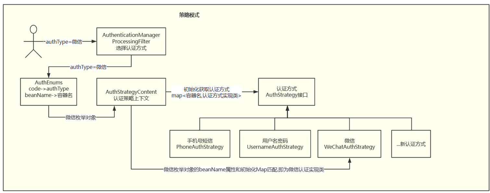
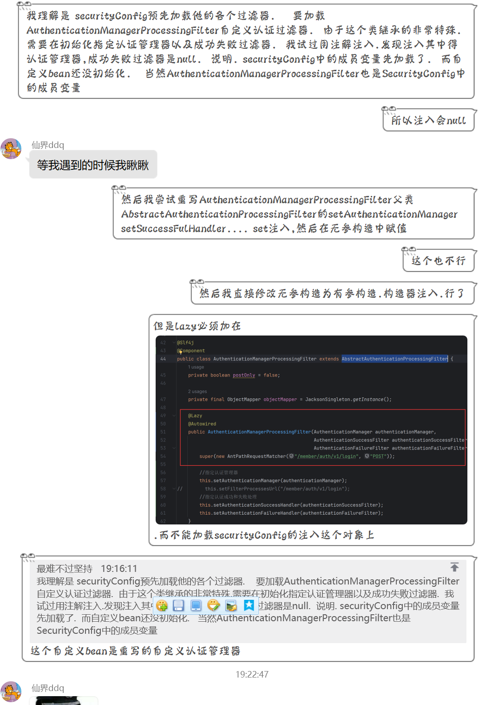
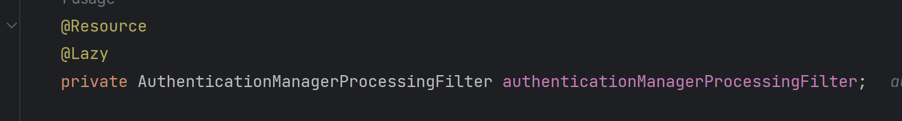
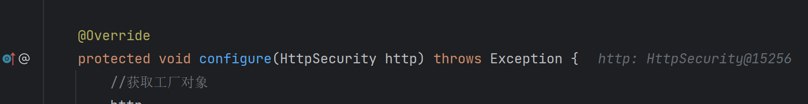
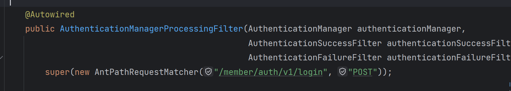
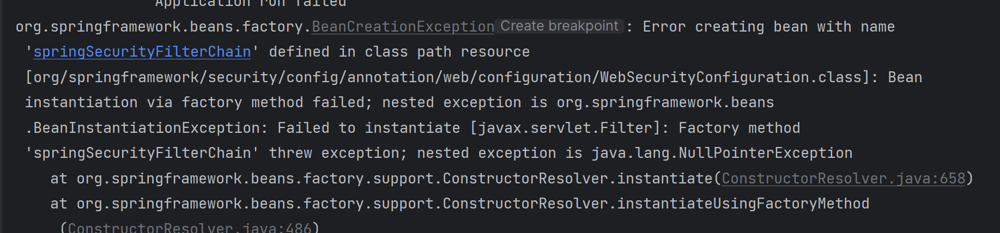

# SpringSecurity多源认证之全部交给spring容器

[[TOC]]

---

## 一. 前言

相关文章:
[认证/支付/优惠劵策略模式-security多源认证](https://blog.csdn.net/m0_50913327/article/details/129925618)  这篇文章没有将自定义的认证管理器注入容器.

[spring-security2.6.3+JWT认证授权](https://blog.csdn.net/m0_50913327/article/details/126443532) 这篇文章描述了基本security架构.
如今这篇是全部交由spring security托管.但博主依然有一个问题不太清楚.放在文末.本篇文章基于`认证/支付/优惠劵策略模式-security多源认证`文章继续讲解

---

## 二. 配置流程

### 2.1 SecurityConfig.class

5.7版和旧版换汤不换药.我们以旧版继承WebSecurityConfigAdapter讲解.

```java
/**
 * @Description: spring security 配置类
 */
@Configuration //配置类
// 开启注解 @PreAuthorize @PostAuthorize @Secured
@EnableGlobalMethodSecurity(prePostEnabled = true, securedEnabled = true, jsr250Enabled = true)
public class SecurityConfig extends WebSecurityConfigurerAdapter {

    //    // 授权处理器
//    @Resource
//    private AccessDeniedHandlerImpl accessDeniedHandler;
    // jwt过滤器
    @Resource
    private JwtAuthenticationTokenFilter jwtAuthenticationTokenFilter;

    // 手机号短信登录
    @Lazy
    @Resource
    private SmsCodeAuthenticationProvider smsCodeAuthenticationProvider;
    // 手机号账号登录
    @Lazy
    @Resource
    private MobileAccountAuthenticationProvider mobileAccountAuthenticationProvider;
    // 微信登录
    @Lazy
    @Resource
    private WeChatAuthenticationProvider weChatAuthenticationProvider;
    @Resource
    private DataSource dataSource;

    @Resource
    private AuthenticationManagerProcessingFilter authenticationManagerProcessingFilter;

    //把AuthenticationManager暴露到工厂里面，就可以在任何位置注入,如果想暴露一定要把这个方法给注入到容器中
    @Bean
    @Override
    //自定义登录过滤器交给工厂
    public AuthenticationManager authenticationManagerBean() throws Exception {
        return super.authenticationManagerBean();
    }

    @Bean
    public PasswordEncoder passwordEncoder() {
        return new BCryptPasswordEncoder();
    }

    //自定义AuthenticationManagerBuilder来选择自己的认证方式  推荐，AuthenticationManager并没有在工厂中暴露出来想使用得把她暴露之后再注入
    @Override
    protected void configure(AuthenticationManagerBuilder auth) throws Exception {
//        auth.userDetailsService(userDetailService); 不采用默认username认证方式
        auth
                .authenticationProvider(smsCodeAuthenticationProvider)
                .authenticationProvider(mobileAccountAuthenticationProvider)
                .authenticationProvider(weChatAuthenticationProvider);
    }

    // 配置拦截规则 也可以在AuthenticationManagerAuthenticationProcessingFilter中配置
//    private AuthenticationManagerProcessingFilter authenticationManagerProcessingFilter() throws Exception {
//        AuthenticationManagerProcessingFilter authenticationManagerProcessingFilter =
//                new AuthenticationManagerProcessingFilter();
//        //指定认证管理器
//        authenticationManagerProcessingFilter.setAuthenticationManager(authenticationManagerBean());
//        authenticationManagerProcessingFilter.setFilterProcessesUrl("/member/auth/v1/login");
//        //指定认证成功和失败处理
//        authenticationManagerProcessingFilter.setAuthenticationSuccessHandler(authenticationSuccessFilter);
//        authenticationManagerProcessingFilter.setAuthenticationFailureHandler(authenticationFailureFilter);
//        return authenticationManagerProcessingFilter;
//    }


    /**
     * anyRequest          |   匹配所有请求路径
     * access              |   SpringEl表达式结果为true时可以访问
     * anonymous           |   匿名可以访问
     * denyAll             |   用户不能访问
     * fullyAuthenticated  |   用户完全认证可以访问（非remember-me下自动登录）
     * hasAnyAuthority     |   如果有参数，参数表示权限，则其中任何一个权限可以访问
     * hasAnyRole          |   如果有参数，参数表示角色，则其中任何一个角色可以访问
     * hasAuthority        |   如果有参数，参数表示权限，则其权限可以访问
     * hasIpAddress        |   如果有参数，参数表示IP地址，如果用户IP和参数匹配，则可以访问
     * hasRole             |   如果有参数，参数表示角色，则其角色可以访问
     * permitAll           |   用户可以任意访问
     * rememberMe          |   允许通过remember-me登录的用户访问
     * authenticated       |   用户登录后可访问
     */
//    @Override
//    public void configure(WebSecurity web) {
//        // 放行路径,不走过滤器链
//        web.ignoring().antMatchers(
//                "/member/**");
//    }
    @Override
    protected void configure(HttpSecurity http) throws Exception {
        //获取工厂对象
        http
                .authorizeRequests()
                .mvcMatchers("/a/auth/**").permitAll()
                .mvcMatchers("/test/**").permitAll()
                .mvcMatchers("/a/book/v1/book/**").permitAll()
                .mvcMatchers("/b/user/v1/list/**").permitAll()
                .anyRequest().authenticated() // 除上述放行的url,其余全部鉴权认证
                .and()
                .cors()
                .and()
                .rememberMe()//记住我功能开启
                .rememberMeParameter("remember")//修改请求表单中的的记住我标签name属性
                .rememberMeServices(rememberMeServices())//指定remember的实现方式后端通过json
                .tokenRepository(persistentRememberMeToken())
                //用数据库的形式记住cookie
                .and()
                // 关闭csrf
                .csrf().disable();

//        http.exceptionHandling()
//                .accessDeniedHandler(accessDeniedHandler);
        http.addFilterBefore(authenticationManagerProcessingFilter,
                        UsernamePasswordAuthenticationFilter.class)
                .addFilterBefore(jwtAuthenticationTokenFilter,
                        AuthenticationManagerProcessingFilter.class);
    }

    //数据库实现记住我
    @Bean
    public PersistentTokenRepository persistentRememberMeToken() {
        JdbcTokenRepositoryImpl tokenRepository = new JdbcTokenRepositoryImpl();
        tokenRepository.setDataSource(dataSource);
        tokenRepository.setCreateTableOnStartup(false);
        return tokenRepository;
    }

    //自定义记住我操作主要是前后端分离使用
    @Bean
    public RememberMeServices rememberMeServices() {
        return new RememberConfig(UUID.randomUUID().toString(), userDetailsService(), persistentRememberMeToken());
    }

}
```

上述几个重要的配置

|                                              | 描述                                                         |
| -------------------------------------------- | ------------------------------------------------------------ |
| authenticationManagerBean()                  | 暴露认证管理器对象.使其可以被其他类注入                      |
| passwordEncoder()                            | 使用BCryptPasswordEncoder加密                                |
| configure(AuthenticationManagerBuilder auth) | 自定义AuthenticationManagerBuilder来选择自己的认证方式或者配置自定义认证处理类 |
| configure(HttpSecurity http)                 | 配置拦截路径以及过滤器顺序                                   |

---

### 2.2  JwtAuthenticationTokenFilter

JwtAuthenticationTokenFilter 第一个过滤器.用来判断用户是否登录

```java
@Component
@Slf4j
public class JwtAuthenticationTokenFilter extends OncePerRequestFilter {
    @Resource
    private RedissonCache redisCache;

    @Resource
    private JwtUtil jwtUtil;

    @Override
    protected void doFilterInternal(HttpServletRequest request, HttpServletResponse response, FilterChain filterChain) throws ServletException, IOException {
        // 重复可读request
        RepeatedlyRequestWrapper repeatedlyRequestWrapper =
                new RepeatedlyRequestWrapper(request, response);
        //获取token
        String token = repeatedlyRequestWrapper.getHeader(JwtUtil.JWT_HEADER);
        if (StringUtils.isBlank(token)) {
            //放行
            filterChain.doFilter(repeatedlyRequestWrapper, response);
            return;
        }
        //解析token
        token = token.replace(JwtUtil.JWT_TOKEN_PREFIX, "");
        Claims claims = null;
        String userId = null;
        try {
            claims = jwtUtil.parseJWT(token);
            //获取userId
            userId = claims.getSubject();
        } catch (Exception e) {
            e.printStackTrace();
            throw new BadCredentialsException(HttpCodeEnum.TOKEN_ERROR.getMsg());
        }
        //从redis中获取用户信息
        String redisKey = CacheConstants.LOGIN_TOKEN_KEY + userId;
        UserAuth userAuth = redisCache.getCacheObject(redisKey);
        if (Optional.ofNullable(userAuth).isEmpty()) {
            throw new UsernameNotFoundException(HttpCodeEnum.TOKEN_EXPIRED.getMsg());
        }
        // 用户信息续期
        redisCache.setCacheObject(redisKey, userAuth, SystemConstants.TOKEN_EXPIRE_TIME, TimeUnit.MILLISECONDS);
        //存入SecurityContextHolder   token都一样,但要区别认证方式
        MobileAccountAuthenticationToken mobileAccountAuthenticationToken =
                new MobileAccountAuthenticationToken(userAuth, userAuth.getAuthorities());
        SecurityContextHolder.getContext()
                .setAuthentication(mobileAccountAuthenticationToken);
        //放行
        filterChain.doFilter(repeatedlyRequestWrapper, response);
    }
}
```

### 2.3 AuthenticationManagerProcessingFilter

AuthenticationManagerProcessingFilter是最重要的多源认证接口.他拦截指定路径请求. 可以通过此处分配不同的认证处理

```java
@Slf4j
@Component
public class AuthenticationManagerProcessingFilter extends AbstractAuthenticationProcessingFilter {
    private boolean postOnly = false;
    private final ObjectMapper objectMapper = JacksonSingleton.getInstance();
    @Resource
    private JwtUtil jwtUtil;
    @Resource
    private RedissonCache redissonCache;
    @Resource
    private AuthStrategyContent authStrategyContent;
    @Resource
    private SecurityThreadPoolConfig securityThreadPoolConfig;
    @Lazy
    @Autowired
    public AuthenticationManagerProcessingFilter(AuthenticationManager authenticationManager,
                                                 AuthenticationSuccessFilter authenticationSuccessFilter,
                                                 AuthenticationFailureFilter authenticationFailureFilter) {
        super(new AntPathRequestMatcher("/a/auth/v1/login", "POST"));

        //指定认证管理器
        this.setAuthenticationManager(authenticationManager);
//        this.setFilterProcessesUrl("/member/auth/v1/login");
        //指定认证成功和失败处理
        this.setAuthenticationSuccessHandler(authenticationSuccessFilter);
        this.setAuthenticationFailureHandler(authenticationFailureFilter);
    }

    /**
     * 使用相同的凭证执行身份验证
     *
     * @param request  从中提取参数并执行身份验证
     * @param response 如果实现必须将重定向作为多阶段身份验证过程的一部分(例如OpenID)，则可能需要此响应。
     * @return 通过身份验证的用户。返回的对象必须是Authentication的实现
     */
    @Override
    public Authentication attemptAuthentication(HttpServletRequest request, HttpServletResponse response)
            throws AuthenticationException, IOException {
        if (postOnly && !request.getMethod().equals("POST")) {
            throw new AuthenticationServiceException(
                    "Authentication method not supported: " + request.getMethod());
        }
        // 获取用户信息
        UserLogin userLogin = getUserByRequest(request);
        if (userLogin == null) {
            throw new AuthenticationServiceException(HttpCodeEnum.BAD_REQUEST.getMsg() + "用户信息不能为空!");
        }
        // 验证用户信息
        Authentication authentication = verifyAuthInfo(userLogin);

        UserAuth userAuth = (UserAuth) authentication.getPrincipal();
        if (userAuth == null) {
            throw new AuthenticationServiceException(HttpCodeEnum.LOGIN_ERROR.getMsg());
        }

        // 登录成功后将密码置空
        userAuth.setPassword(null);
        // 统计登录次数
        loginCount(request, userAuth);
        //获取userId
        Long id = userAuth.getId();
        try {
            redissonCache.setCacheObject(CacheConstants.LOGIN_TOKEN_KEY + id,
                    userAuth,
                    jwtUtil.getExpire(),
                    TimeUnit.MILLISECONDS);
        } catch (Exception e) {
            log.error("redisson初始化失败", e);
            throw new AuthenticationServiceException(HttpCodeEnum.SYSTEM_ERROR.getMsg());
        }
        //通过后用userid生成一个jwt存入ResponseResult
        String jwt = jwtUtil.createJWT(String.valueOf(id));
        userAuth.setTokenHead(JwtUtil.JWT_TOKEN_PREFIX);
        userAuth.setToken(jwt);
        return authentication;
    }

    /**
     * 获取request中的json用户信息
     *
     * @param request 请求
     * @return 用户信息
     * @throws IOException IO异常
     */
    private UserLogin getUserByRequest(HttpServletRequest request) throws IOException {
        StringBuffer sb = new StringBuffer();
        InputStream is = request.getInputStream();
        InputStreamReader isr = new InputStreamReader(is);
        BufferedReader br = new BufferedReader(isr);
        String s = "";
        while ((s = br.readLine()) != null) {
            sb.append(s);
        }
        String userInfo = sb.toString();
        UserLogin userLogin = null;
        try {
            userLogin = objectMapper.readValue(userInfo, UserLogin.class);
        } catch (JsonProcessingException e) {
            log.info("json转换异常: {}", e.getMessage());
            throw new AuthenticationServiceException(HttpCodeEnum.BAD_REQUEST.getMsg() + "json转换异常");
        }
        return userLogin;
    }

    /**
     * 验证用户信息
     *
     * @param userLogin 用户信息
     * @return 认证信息
     */
    private Authentication verifyAuthInfo(UserLogin userLogin) {
        String authType = userLogin.getAuthType();
        // 认证策略模式
        AuthEnums enumerateInstances = AuthEnums.getEnum(authType);
        if (enumerateInstances == null) {
            throw new AuthenticationServiceException(HttpCodeEnum.BAD_REQUEST.getMsg() + "authType认证方式错误!");
        }
        return authStrategyContent.authType(enumerateInstances, userLogin, this.getAuthenticationManager());
    }

    /**
     * 登录次数统计
     */
    private void loginCount(HttpServletRequest request, UserAuth userAuth) {
        Executor asyncExecutor = securityThreadPoolConfig.getAsyncExecutor();
        CompletableFuture.runAsync(() -> {
            try {
                log.info("当前线程id: {},当前线程名称: {}",
                        Thread.currentThread().getId(),
                        Thread.currentThread().getName());
                // 登录次数统计 联网查询ip地址
                String ip = IpUtil.getIp(request);
                String ipAddr = String.valueOf(IpUtil.getIpAddr(ip));
                userAuth.setIpAddr(ipAddr);
                userAuth.setStatus(SystemLogConstants.USER_LOGIN_STATUS_VALUE);
                log.info("{}", objectMapper.writeValueAsString(userAuth));
            } catch (JsonProcessingException e) {
                log.error("登录次数统计异常: {}", e.getMessage());
            }
        }, asyncExecutor);
    }
}
```


上述代码种`attemptAuthentication(HttpServletRequest request, HttpServletResponse response)`方法就是执行认证的入口.

这部分也是将起注入容器的重要部分.  `如图的策略模式认证流程可以在开头的第一篇文章看到`

## 疑问

那么我的疑惑是 为什么@Lazy注解不能反过来标记

如果反过来
SecurityConfig.class

SecurityConfig.class

AuthenticationManagerProcessingFilter.class

这样就会报错
